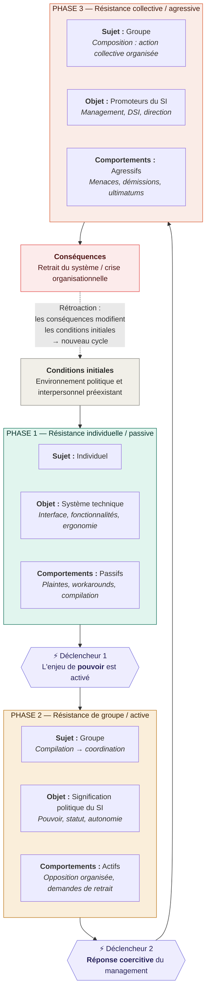
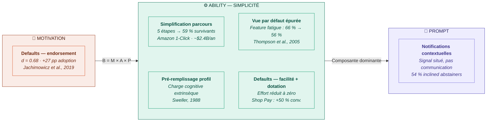
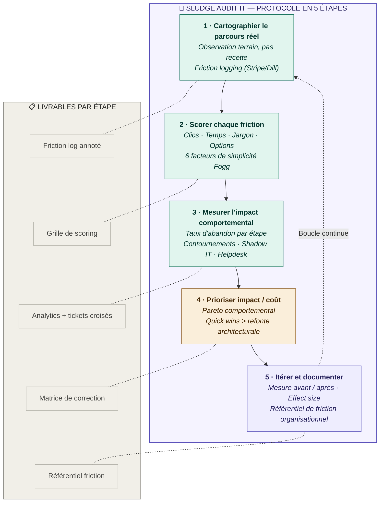

## ABSTRACT

Cet article introduit et formalise le construit d'_illusion de livraison_, défini comme la croyance organisationnelle systémique selon laquelle la mise à disposition technique d'un système d'information, combinée à sa communication aux utilisateurs, constitue une condition suffisante de son adoption effective. Ce construit n'est pas un défaut managérial corrigible par la bonne volonté : c'est un biais structurel à trois dimensions — cognitive (la malédiction de la connaissance et l'illusion de transparence rendent les experts structurellement incapables d'évaluer l'écart entre leur compréhension du système et celle des utilisateurs finaux), organisationnelle (la culture _delivery_ et les métriques de pilotage capturent le déploiement sans capturer l'adoption, produisant un aveuglement métrologique auto-stabilisant) et comportementale (la friction d'usage, le biais du statu quo et l'_intention-behavior gap_ convertissent les bonnes intentions en non-usage en l'absence de Prompt contextuel). Le cadre intégrateur mobilisé est le modèle Fogg B=MAP, articulé avec les construits du TAM et de l'UTAUT et ancré dans la littérature en économie comportementale, qui subsume les modèles canoniques d'adoption technologique tout en comblant leur lacune architecturale majeure — l'absence de construit de déclenchement — et en fournissant un levier prescriptif qu'ils ne donnent pas : augmenter l'Ability est systématiquement plus efficace que tenter d'augmenter la Motivation. Les conséquences documentées de l'illusion de livraison sont massives : le Shadow IT comme signal d'échec d'adoption absorbant 30 à 40 % des dépenses IT, le paradoxe de productivité comme déconnexion persistante entre investissement informatique et valeur produite, l'escalade de la résistance comme dynamique politique que les équipes projet ne sont pas outillées pour percevoir, et un déficit de −56 % de valeur livrée par rapport aux prévisions sur les projets IT à grande échelle. La thèse prescriptive de l'article est que l'adhésion est prédictible — l'UTAUT explique 70 % de la variance de l'intention d'usage (Venkatesh et al., 2003), les méta-analyses TAM confirment la primauté du chemin facilité→utilité (β = 0,479, King & He, 2006), les defaults produisent un effet moyen de d = 0,68 sur 73 675 participants (Jachimowicz et al., 2019) — et donc ingéniable via des instruments opérationnels formalisés : _sludge audits_ IT, _friction logging_, defaults comportementaux et Prompts contextuels. La contribution est double : d'une part, la formalisation d'un construit absent de la littérature académique en systèmes d'information — aperçu par Markus et Keil (1994) et Markus et Benjamin (1997) mais jamais défini, opérationnalisé ni mesuré — et d'autre part, la proposition d'un cadre diagnostique opérationnel qui traduit trente ans de recherche en adoption technologique, en psychologie cognitive et en économie comportementale en une discipline de conception transmissible d'un projet à l'autre.

**Mots-clés** : illusion de livraison, adoption technologique, charge cognitive extrinsèque, Shadow IT, digital nudging, architecture de choix, friction comportementale, appropriation des SI

---

## INTRODUCTION

Cet article part d'un constat de praticien et le transforme en programme de recherche. Le constat est simple : nos organisations confondent systématiquement déployer un système d'information et le faire adopter, et cette confusion n'est ni accidentelle ni corrigible par la seule bonne volonté managériale — elle est structurellement inscrite dans nos biais cognitifs, dans nos métriques de pilotage et dans notre ignorance des mécanismes comportementaux qui gouvernent l'usage réel. L'introduction ancre d'abord cette thèse dans l'expérience vécue, en contrastant un déploiement institutionnel classique avec un outil qui a atteint 30 000 utilisateurs mensuels par la seule force de sa conception centrée sur la friction. Elle nomme ensuite le phénomène — _l'illusion de livraison_ — et montre que si la croyance a été aperçue par Markus et Keil dès 1994 et par Markus et Benjamin en 1997, elle n'a jamais été formalisée en construit académique. Elle pose enfin la question de recherche et justifie le choix du modèle Fogg B=MAP comme cadre intégrateur, avant d'annoncer les cinq axes de l'article.

### Deux outils, deux destins : quand la friction fait la différence entre livrer et faire adopter

En 2019, nous avons assisté au déploiement d'un outil de gestion documentaire dans un organisme de protection sociale — plusieurs centaines d'agents concernés, un budget confortable, un calendrier tenu. Le projet a coché toutes les cases : infrastructure provisionnée dans les délais, campagne de communication multicanal, sessions de formation dispensées à l'ensemble des services, support de premier niveau opérationnel dès le jour J. Trois mois après la mise en production, le comité de pilotage s'est félicité d'un taux de connexion de 78 %. Le projet était « réussi ». Il suffisait pourtant de descendre d'un cran dans l'analyse pour découvrir un paysage radicalement différent : la moitié des connexions comptabilisées correspondaient à des sessions de moins de deux minutes — le temps d'ouvrir l'application, de constater qu'elle ne répondait pas au besoin immédiat, et de la refermer. Les agents continuaient à s'échanger des documents par messagerie, à stocker leurs fichiers de travail sur des lecteurs réseau personnels, et trois services avaient adopté, en toute discrétion, un outil SaaS non référencé qui faisait en deux clics ce que l'outil officiel exigeait en neuf. Le projet était « réussi » selon les KPI projet. C'était un échec selon toute autre mesure. À la même période, nous avons conçu depotdoc.fr — une plateforme de dépôt de documents dématérialisés destinée au réseau de la protection sociale. Cet outil a atteint 30 000 utilisateurs mensuels sans campagne de communication institutionnelle, sans formation obligatoire, sans comité de pilotage. La différence tenait en une seule variable : la conception partait de la friction utilisateur — le nombre de clics, la clarté du libellé, la suppression de toute étape non indispensable — et non de la spécification fonctionnelle validée en comité. Le premier outil avait été livré. Le second avait été adopté. Ce scénario n'est pas une anecdote. Il est le symptôme d'un phénomène systémique que cet article propose de nommer, de formaliser et de combattre.

### Un biais aperçu depuis trente ans, jamais formalisé : le gap que cet article entend combler

Nous appelons ce phénomène _l'illusion de livraison_ : la croyance systémique selon laquelle rendre un outil disponible et en informer ses destinataires suffit à produire son adoption. Cette croyance n'est pas nouvelle. Markus et Keil (1994), dans un article fondateur de la _Sloan Management Review_ intitulé « If We Build It, They Will Come », avaient identifié le syndrome avec une précision remarquable : nos organisations conçoivent des systèmes d'information en présumant que la qualité technique et la complétude fonctionnelle garantissent l'usage, alors même que le non-usage s'explique le plus souvent par un défaut de conception orientée utilisateur que ni la qualité du code ni l'effort de conduite du changement ne peuvent compenser. Trois ans plus tard, Markus et Benjamin (1997) ont prolongé le diagnostic en identifiant, toujours dans la _Sloan Management Review_, ce qu'ils ont nommé la _magic bullet theory_ — un ensemble de croyances dysfonctionnelles selon lesquelles la technologie transforme à elle seule les organisations et les individus, le concepteur est un agent de changement par le seul fait qu'il construit un système puissant, et l'usage du système produit automatiquement les résultats escomptés. Leur métaphore est restée célèbre : cette théorie suppose que le fusil se tire tout seul, dispensant ceux qui y adhèrent de toute compétence en gestion du changement. Mais ces deux contributions, aussi lucides soient-elles, partageaient une limite commune : elles étaient des articles praticiens, fondés sur des cas illustratifs et des cadres conceptuels, sans définition formelle du construit, sans opérationnalisation, sans instrument de mesure. Trente ans plus tard, ce biais n'a toujours pas de nom dans la littérature académique en systèmes d'information. Aucun construit formel, aucun instrument de mesure, aucune opérationnalisation. C'est ce gap que cet article entend combler.

### Fogg B=MAP comme cadre intégrateur : subsumer TAM et UTAUT, combler la brèche du Prompt

La question de recherche qui structure notre démarche est tripartite : par quels mécanismes cognitifs et organisationnels l'illusion de livraison se constitue-t-elle, pourquoi résiste-t-elle à l'évidence empirique, et comment la recherche en sciences comportementales permet-elle de la transformer en discipline de conception ? Pour y répondre, nous mobilisons le modèle comportemental de Fogg (2009), formulé sous l'équation B=MAP — _Behavior_ = _Motivation_ × _Ability_ × _Prompt_ —, comme cadre intégrateur. Ce choix n'est pas arbitraire. Le modèle Fogg subsume les construits centraux du TAM et de l'UTAUT — sa composante Motivation correspond à la _Perceived Usefulness_ de Davis (1989) et à la _Performance Expectancy_ de Venkatesh et al. (2003), sa composante Ability correspond à la _Perceived Ease of Use_ et à l'_Effort Expectancy_ — tout en ajoutant une composante que ces modèles canoniques ignorent : le _Prompt_, le déclencheur contextuel et temporel sans lequel le comportement ne se produit pas, même lorsque la motivation et la capacité sont réunies. Cette lacune architecturale a des conséquences mesurables : si l'UTAUT explique 70 % de la variance de l'intention d'usage (Venkatesh et al., 2003) et que la méta-analyse de Sheeran (2002), portant sur 422 études et 82 107 participants, établit que l'intention n'explique qu'environ 28 % de la variance du comportement réel, alors le modèle prédictif dominant de notre discipline ne prédit indirectement qu'environ 20 % de l'usage effectif par la voie intentionnelle. Fogg comble cette brèche en ciblant directement les _inclined abstainers_ — ceux qui veulent agir mais n'agissent pas — et en fournissant un levier prescriptif que le TAM ne donne pas : augmenter l'Ability est structurellement plus efficace que tenter d'augmenter la Motivation, parce que la simplicité produit simultanément un effet direct sur le comportement et un effet indirect sur la perception d'utilité. Nous montrerons que ce principe est validé par 35 ans de méta-analyses TAM.

### Cinq axes pour anatomiser l'illusion et la combattre

L'article se déploie en cinq sections suivies d'une discussion. La première section pose le cadre théorique en articulant trois traditions de recherche — psychologie cognitive des biais, modèles post-adoption en systèmes d'information, économie comportementale — et formalise le construit d'illusion de livraison en trois dimensions (cognitive, organisationnelle, comportementale) avec sa validité discriminante. La deuxième section documente l'écart entre usage apparent et adhésion réelle, des six stades de Cooper et Zmud (1990) aux contournements comme pratiques situées, en passant par la structuration adaptative et l'_effective use_. La troisième section identifie la friction comme mécanisme proximal de l'échec d'adoption et en quantifie les effets à travers les méta-analyses TAM, la théorie de l'_information foraging_, la charge cognitive et le biais du statu quo. La quatrième section mesure les coûts concrets de l'échec d'adoption silencieux — Shadow IT, paradoxe de productivité, escalade de la résistance — et les consolide autour du chiffre de −56 % de valeur livrée par rapport aux prévisions. La cinquième section renverse la perspective en montrant que l'adhésion est une discipline de conception, outillée par le _digital nudging_, les _sludge audits_ IT et le _friction logging_, et documentée par des cas où la suppression de micro-frictions a produit des effets d'adoption massifs. La discussion examine les _boundary conditions_ du construit — contextes _mandatory_ versus _voluntary_, limites du cadre Fogg, _feature fatigue_ — et propose un agenda de recherche structuré autour de l'opérationnalisation du construit, du test empirique comparatif des _sludge audits_ et de l'étude des conditions de modération.

---

## CADRE THÉORIQUE

### Trois traditions, un angle mort commun

Trois traditions de recherche ont, chacune indépendamment, documenté un fragment du phénomène que nous proposons de nommer _illusion de livraison_ — mais aucune n'a articulé l'ensemble. La première tradition, celle de la psychologie cognitive des biais, explique _pourquoi_ les experts sont structurellement aveugles à l'écart entre leur compréhension d'un système et celle de ses utilisateurs. Camerer, Loewenstein et Weber (1989) ont démontré expérimentalement que des agents informés sont incapables d'ignorer leur information privée lorsqu'ils tentent de prédire le comportement d'agents non informés : dans leur protocole à deux étapes mené auprès de 51 étudiants MBA de Wharton, les prix de marché des traders informés se sont systématiquement situés entre la prédiction non biaisée et la prédiction entièrement « maudite », les mécanismes de marché réduisant le biais d'environ 50 % sans jamais l'éliminer. Ni les incitations financières ni le feedback n'ont produit de correction significative — seule l'agrégation par le marché, où des traders moins biaisés exploitaient leur avantage, a partiellement corrigé la distorsion. Gilovich, Savitsky et Medvec (1998) ont prolongé ce résultat du domaine propositionnel au domaine phénoménologique avec l'illusion de transparence : à travers sept études, les participants ont systématiquement surestimé la lisibilité de leurs états internes par autrui, les menteurs estimant que 48,8 % des observateurs détecteraient leur mensonge alors que le taux réel n'était que de 25,6 % (_p_ &lt; .001). L'étude 1c, introduisant des observateurs « appariés » disposant de la même information propositionnelle mais n'ayant pas vécu l'acte de mentir, a confirmé que l'illusion dépasse la simple malédiction de la connaissance : c'est l'expérience vécue de son propre état interne qui gonfle l'ancrage (_p_ &lt; .005 pour la différence entre menteurs et observateurs appariés). Ces deux biais fournissent le mécanisme cognitif proximal qui rend l'illusion de livraison invisible à ceux-là mêmes qui la produisent. Cependant, cette tradition ne dit rien de l'écart entre usage et adoption dans les systèmes d'information, ni des conditions organisationnelles qui amplifient ces biais individuels.

La deuxième tradition, celle des modèles post-adoption en systèmes d'information, documente _ce que_ produit l'illusion — la routinisation sans infusion — sans expliquer le mécanisme comportemental qui la maintient. Cooper et Zmud (1990) ont proposé un modèle en six stades de l'implémentation IT — initiation, adoption, adaptation, acceptation, routinisation et infusion — dont le dernier seul correspond à une utilisation compréhensive et intégrative génératrice de valeur organisationnelle. Saga et Zmud (1994) ont confirmé que la majorité des organisations se stabilisent à la routinisation sans jamais atteindre l'infusion, ce qui signifie que l'illusion de livraison revient à confondre le stade 3 (adaptation/déploiement) avec le stade 6. DeSanctis et Poole (1994) ont introduit la théorie de la structuration adaptative pour expliquer pourquoi un même système produit des résultats radicalement différents selon les groupes : leur distinction entre appropriation fidèle — conforme à l'esprit de conception du système — et appropriation ironique — contraire à l'intention des concepteurs — invalide frontalement l'idée qu'un déploiement unique produise un résultat unique. Burton-Jones et Grange (2013) ont formalisé le concept d'_effective use_ en trois dimensions hiérarchiques — interaction transparente, fidélité représentationnelle et action informée — dont seule la troisième prédit la performance organisationnelle, alors que les métriques d'usage courantes (connexions, durée de session) ne capturent, au mieux, que la première. Jasperson, Carter et Zmud (2005) ont synthétisé l'ensemble de ces travaux en un constat empirique brutal : la majorité des utilisateurs n'exploitent qu'une bande étroite de fonctionnalités, opèrent à des niveaux faibles d'utilisation de ces fonctionnalités et initient rarement des extensions de celles disponibles. Cette tradition cartographie avec précision l'anatomie structurelle de l'écart déploiement-adoption, mais n'explique pas pourquoi cet écart persiste face aux frictions comportementales quotidiennes que vivent les utilisateurs.

La troisième tradition, celle de l'économie comportementale, fournit le _comment_ — le mécanisme de friction qui convertit de bonnes intentions en non-usage — sans l'ancrer dans les spécificités des systèmes d'information. Samuelson et Zeckhauser (1988) ont établi le biais du statu quo comme préférence disproportionnée pour l'état actuel des choses, identifiant trois mécanismes explicatifs : l'aversion à la perte (les pertes pèsent environ deux fois plus que les gains équivalents), l'engagement psychologique (coûts irrécupérables, effet de dotation, réduction de la dissonance cognitive) et l'évitement du regret (le regret ressenti pour les conséquences négatives d'une action est plus intense que celui ressenti pour les conséquences de l'inaction). Bertrand, Mullainathan et Shafir (2006) ont introduit le concept de _hassle factors_ — ces frictions administratives ou procédurales apparemment insignifiantes qui dissuadent l'action de manière disproportionnée par rapport à leur coût objectif — en montrant, dans la lignée de l'étude classique de Leventhal, Singer et Jones (1965) sur la vaccination antitétanique, que la suppression d'un seul facteur de friction (fournir un plan du campus et demander de choisir un créneau horaire) augmentait massivement le taux de passage à l'acte. Sunstein (2020) a formalisé cette intuition sous le concept de _sludge_ — les frictions excessives ou injustifiées qui coûtent du temps ou de l'argent, compliquent la navigation dans les processus et finissent par priver les individus de l'accès aux biens, opportunités et services auxquels ils ont droit — en rapportant que les Américains consacrent 11,4 milliards d'heures par an aux seules formalités administratives fédérales, et qu'un passage de l'opt-in à l'inscription automatique pour les messages scolaires fait bondir la participation de 1 % à 96 %. Weinmann, Schneider et vom Brocke (2016) ont jeté le pont entre économie comportementale et conception SI en définissant le _digital nudging_ comme l'utilisation d'éléments de design d'interface pour guider le comportement dans les environnements de choix numériques, établissant qu'il n'existe pas de présentation neutre des choix et que chaque décision de conception d'interface constitue _de facto_ une architecture de choix qui influence le comportement. Cette tradition fournit le coefficient de perte comportemental qui explique comment de micro-frictions tuent l'adoption, mais sans ancrage dans les spécificités des systèmes d'information d'entreprise ni articulation avec les mécanismes cognitifs qui rendent ces frictions invisibles aux concepteurs. L'illusion de livraison est le point de convergence où ces trois traditions se rencontrent et s'éclairent mutuellement.

### Fogg B=MAP comme architecture intégratrice

Le modèle comportemental de Fogg (2009), formulé sous l'équation B=MAP (Behavior = Motivation × Ability × Prompt), offre l'architecture théorique qui intègre ces trois traditions en un cadre unique. Pour que le comportement se produise, trois composantes doivent converger _simultanément_ : une motivation suffisante, une capacité suffisante et un déclencheur qui survient au moment précis où les deux premières sont au-dessus du seuil d'activation. Le mapping avec les modèles canoniques d'adoption technologique est structurellement net. La composante Motivation de Fogg — organisée en trois paires de motivateurs : plaisir/douleur, espoir/peur, acceptation sociale/rejet — correspond à la Perceived Usefulness du TAM (Davis, 1989), à la Performance Expectancy de l'UTAUT (Venkatesh et al., 2003) et à l'avantage relatif de Rogers (2003). Dans tous les cas, il s'agit de la croyance de l'utilisateur que la technologie produit des résultats qu'il valorise. La composante Ability — que Fogg redéfinit comme _simplicité_, décomposée en six facteurs liés entre eux comme les maillons d'une chaîne (temps, argent, effort physique, cycles cognitifs, déviance sociale, rupture de routine) — correspond à la Perceived Ease of Use du TAM, à l'Effort Expectancy de l'UTAUT et à l'inverse de la complexité dans la typologie de Rogers. La composante Prompt, en revanche, n'a pas d'équivalent dans le TAM, qui ne contient aucun construit de déclenchement, et ne correspond que partiellement aux Facilitating Conditions de l'UTAUT : celles-ci renvoient à des croyances sur l'infrastructure organisationnelle et technique de support, pas au signal contextuel et temporel qui initie le comportement _à un instant donné_. Cette lacune architecturale a des conséquences quantifiables : Sheeran (2002), dans une méta-analyse portant sur 422 études et 82 107 participants, a établi que la corrélation moyenne pondérée entre intention et comportement subséquent est de r = 0,53, ce qui signifie que l'intention n'explique qu'environ 28 % de la variance du comportement. Si l'UTAUT explique 70 % de la variance d'intention et que l'intention n'explique que 28 % du comportement, l'UTAUT ne prédit indirectement qu'environ 20 % de l'usage réel par la voie intentionnelle — un chiffre qui devrait donner à réfléchir pour le modèle prédictif dominant du domaine. Le construit Prompt de Fogg cible directement ce que Sheeran identifie comme les « inclined abstainers » — les individus qui ont pleinement l'intention d'agir mais ne passent pas à l'acte.

L'insight le plus important de Fogg pour notre propos est sa redéfinition de la capacité : la simplicité est fonction de la ressource la plus rare de l'utilisateur _à l'instant du déclenchement_. Ce que le TAM traite comme un construit perceptuel stable (la facilité d'utilisation perçue est mesurée une fois, par questionnaire, hors contexte), Fogg le traite comme une variable contextuelle et dynamique. Un système qui exige trois clics en période calme peut devenir infranchissable pour le même utilisateur en situation de surcharge cognitive — la capacité a changé, pas le système. Cette reconceptualisation explique pourquoi les méta-analyses TAM trouvent un effet direct faible de la facilité d'utilisation perçue sur l'intention d'usage tout en trouvant un effet indirect substantiel via l'utilité perçue : un système plus simple n'est pas seulement plus facile — il est _perçu comme plus utile_ parce que l'utilisateur accède effectivement à ses fonctionnalités au lieu de plafonner à la surface. Ce mapping n'est pas une spéculation théorique : il est validé par les méta-analyses TAM que nous mobiliserons en section 3.

---
### ENCADRÉ — Définition formelle du construit : l'illusion de livraison

Nous définissons **l'illusion de livraison** comme la croyance organisationnelle systémique selon laquelle la mise à disposition technique d'un système d'information, combinée à sa communication aux utilisateurs, constitue une condition suffisante de son adoption effective. Cette croyance n'est ni consciente ni délibérée : elle émerge de la convergence de trois mécanismes documentés dans des littératures distinctes et opère en deçà de la réflexion stratégique, ce qui la rend particulièrement résistante à la correction. Le construit se compose de trois dimensions interdépendantes dont aucune, prise isolément, ne suffit à produire l'illusion — mais dont la conjonction la rend systémique et auto-stabilisante.

### (1) Dimension cognitive — la cécité experte

La malédiction de la connaissance (Camerer, Loewenstein & Weber, 1989) et l'illusion de transparence (Gilovich, Savitsky & Medvec, 1998) constituent le socle cognitif de l'illusion de livraison. Camerer et al. ont établi que les agents informés sont structurellement incapables d'ignorer leur information privée lorsqu'ils tentent de prédire le jugement d'agents non informés : dans leur protocole expérimental, les mécanismes de marché réduisent le biais d'environ 50 % mais ne l'éliminent jamais, et ni les incitations financières ni le feedback ne produisent de correction significative. Gilovich et al. ont prolongé ce résultat en montrant que les individus surestiment massivement la lisibilité de leurs propres états internes par autrui — les menteurs estimant que 48,8 % des observateurs détecteraient leur mensonge quand le taux réel n'était que de 25,6 % (_p_ &lt; .001) — et que cette surestimation excède la simple malédiction informationnelle puisqu'elle est ancrée dans l'expérience phénoménologique vécue, pas seulement dans la connaissance propositionnelle.

Transposés au contexte des systèmes d'information, ces deux biais signifient que les concepteurs, chefs de projet et décideurs IT qui valident un parcours fonctionnel sont saturés d'une compréhension qu'ils ne peuvent pas « désapprendre ». Ils ont navigué dans l'interface, compris la logique métier, internalisé la terminologie, mémorisé les raccourcis. Cette expérience vécue produit un ancrage phénoménologique puissant : ils « voient » un parcours clair parce qu'ils projettent leur propre compréhension sur l'utilisateur final, et l'ajustement qu'ils opèrent vers la perspective non informée est systématiquement insuffisant. L'implication est directe : aucune procédure de recette interne, aucune revue de comité de pilotage, aucune démonstration à un sponsor ne permet d'évaluer correctement ce que l'utilisateur réel percevra — parce que tous les participants à ces rituels de validation partagent le même biais informationnel.

### (2) Dimension organisationnelle — l'aveuglement métrologique

La culture _delivery_ qui structure la gestion de projet informatique — et que le triptyque coût-délai-périmètre incarne depuis les standards du Project Management Institute — exclut structurellement l'appropriation réelle de son périmètre de mesure. Un projet est « réussi » lorsqu'il est livré dans les délais, dans le budget et conforme aux spécifications fonctionnelles. La question de savoir si les utilisateurs utilisent effectivement le système, et _comment_ ils l'utilisent, ne fait partie ni des critères de succès ni des jalons de clôture. Cette omission n'est pas accidentelle : elle reflète la division institutionnelle entre les équipes projet (responsables de la livraison) et les équipes opérationnelles (responsables de l'exploitation), une frontière organisationnelle qui crée une zone aveugle précisément à l'endroit où la valeur se réalise — ou ne se réalise pas.

Cet aveuglement est rendu auto-stabilisant par le mécanisme décrit par Strathern (1997) dans sa reformulation de la loi de Goodhart : « lorsqu'une mesure devient un objectif, elle cesse d'être une bonne mesure » (p. 308). Appliqué aux SI, le mécanisme opère en trois temps. D'abord, l'organisation choisit des métriques accessibles — nombre de connexions, taux de déploiement des postes, pourcentage de comptes activés — parce qu'elles sont simples à collecter et à présenter dans un tableau de bord. Ensuite, ces métriques deviennent les indicateurs de succès par lesquels le projet est évalué et les parties prenantes rassurées. Enfin, l'amélioration de ces métriques devient l'objectif opérationnel, découplant définitivement la mesure de ce qu'elle était censée approximer — l'usage effectif au sens de Burton-Jones et Grange (2013), c'est-à-dire une interaction transparente avec le système produisant des représentations fidèles du domaine et conduisant à des actions informées. Les métriques de connexion confirment que « l'adoption » a eu lieu, supprimant l'urgence d'investiguer si une valeur a été produite. L'illusion se boucle sur elle-même.

### (3) Dimension comportementale — la friction invisible

La troisième dimension du construit repose sur la sous-estimation systématique de la friction comme déterminant de l'adoption, amplifiée par trois mécanismes convergents. Le biais du statu quo (Samuelson & Zeckhauser, 1988) crée une préférence disproportionnée pour les pratiques existantes — même objectivement inférieures — par le jeu combiné de l'aversion à la perte, de l'effet de dotation et de l'évitement du regret. L'_intention-behavior gap_ documenté par Sheeran (2002) — la corrélation moyenne entre intention et comportement n'est que de r = 0,53, soit environ 28 % de variance expliquée — signifie que même les utilisateurs qui déclarent vouloir utiliser le nouveau système ne passeront pas nécessairement à l'acte. Et l'absence de Prompt au sens de Fogg (2009) — le signal contextuel qui doit survenir au moment précis où la motivation et la capacité sont simultanément au-dessus du seuil d'activation — laisse le comportement en suspens indéfiniment, même lorsque les conditions seraient réunies.

Les _hassle factors_ (Bertrand, Mullainathan & Shafir, 2006) et le _sludge_ (Sunstein, 2020) fournissent le mécanisme concret : des frictions procédurales apparemment insignifiantes — une authentification supplémentaire, un formulaire non prérempli, un menu déroulant à 86 options, un libellé jargonnant — produisent des effets d'abandon disproportionnés par rapport à leur coût objectif. Chaque élément de design d'interface constitue une architecture de choix qui oriente le comportement (Weinmann, Schneider & vom Brocke, 2016). En l'absence de conception délibérée, cette architecture produit des anti-nudges qui tuent silencieusement l'adoption — non par malveillance, mais par indifférence. Les équipes projet ne conçoivent pas d'obstacles : elles omettent simplement de concevoir des facilitateurs.

### Discriminant validity — ce que l'illusion de livraison n'est pas

L'illusion de livraison se distingue de deux construits apparentés par son niveau d'opération et par la spécificité de son mécanisme explicatif.

Elle se distingue d'abord du _pro-innovation bias_ de Rogers (2003, p. 106) — la présomption implicite dans la recherche sur la diffusion selon laquelle une innovation _devrait_ être adoptée par tous les membres du système social, qu'elle devrait l'être rapidement, et qu'elle ne devrait être ni réinventée ni rejetée. Le _pro-innovation bias_ opère au niveau **normatif** : il postule que l'adoption est souhaitable. L'illusion de livraison opère au niveau **descriptif** : elle postule que l'adoption _a eu lieu_ parce que le déploiement a été réalisé. Le premier est un jugement de valeur sur ce qui devrait advenir ; la seconde est une erreur factuelle sur ce qui s'est passé. Un décideur peut parfaitement rejeter le _pro-innovation bias_ — accepter que certains utilisateurs aient des raisons légitimes de ne pas adopter — tout en étant pris dans l'illusion de livraison, convaincu que ceux qui « devraient » adopter l'ont effectivement fait.

Elle se distingue ensuite de la _magic bullet theory_ de Markus et Benjamin (1997) — la croyance selon laquelle la technologie cause à elle seule la transformation organisationnelle, que « le fusil se tire tout seul ». La _magic bullet theory_ identifie une erreur d'attribution causale au niveau organisationnel : les managers attribuent au système technique un pouvoir transformateur autonome. L'illusion de livraison intègre cette erreur mais la complète par le mécanisme cognitif individuel — la malédiction de la connaissance et l'illusion de transparence — qui explique _pourquoi_ cette croyance persiste chez les experts eux-mêmes, y compris ceux qui rejettent intellectuellement le déterminisme technologique. Un DSI peut parfaitement savoir, dans l'abstrait, que la technologie ne suffit pas à produire le changement. Il peut l'enseigner, l'écrire, le présenter en conférence. Et simultanément, il peut être incapable de percevoir que l'interface de son dernier déploiement pose problème — parce que la malédiction de la connaissance opère en deçà de la réflexion consciente, au niveau de la perception elle-même. C'est cette dimension individuelle, cognitive et non volontaire, qui fait de l'illusion de livraison un construit distinct et qui explique sa remarquable résistance à l'évidence empirique.

---

## Schéma intégrateur — Modèle complet de l'illusion de livraison

```mermaid
flowchart LR

    subgraph DIM["🔍 TROIS DIMENSIONS"]
        direction TB
        D1["<b>Cognitive</b><br/><i>Curse of knowledge</i><br/><i>Illusion de transparence</i>"]
        D2["<b>Organisationnelle</b><br/><i>Culture delivery</i><br/><i>Métriques aveugles</i>"]
        D3["<b>Comportementale</b><br/><i>Friction + statu quo</i><br/><i>Absence de Prompt</i><br/><i>Intention ≠ action</i>"]
        D1 ~~~ D2 ~~~ D3
    end

    subgraph BMAP["⚙️ MÉCANISMES VIA FOGG B=MAP"]
        direction TB
        M1["<b>Ability surestimée</b><br/><i>Experts ≠ utilisateurs</i>"]
        M2["<b>Ability non mesurée</b><br/><i>Hors périmètre projet</i>"]
        M3["<b>Ability insuffisante</b><br/><i>Friction non détectée</i>"]
        M4["<b>Prompt absent</b><br/><i>Comportement jamais déclenché</i>"]
        M1 ~~~ M2 ~~~ M3 ~~~ M4
    end

    subgraph CSQ["⚠️ CONSÉQUENCES"]
        direction TB
        C1["<b>Usage superficiel</b><br/><i>Routinisation sans infusion</i>"]
        C2["<b>Shadow IT</b><br/><i>Signal d'échec adoption</i>"]
        C3["<b>Paradoxe de productivité</b><br/><i>IT ×100, valeur stagne</i>"]
        C4["<b>Escalade de la résistance</b><br/><i>Compliance → rejet</i>"]
        C1 ~~~ C2 ~~~ C3 ~~~ C4
    end

    subgraph LEV["✅ LEVIERS DE RUPTURE"]
        direction LR
        L1["Sludge audit IT"]
        L2["Defaults & nudges"]
        L3["Friction logging"]
        L4["Métriques d'<i>effective use</i>"]
    end

    D1 -->|"produit"| M1
    D2 -->|"produit"| M2
    D3 -->|"produit"| M3
    D3 -->|"produit"| M4

    M1 --> C1
    M2 --> C2
    M3 --> C3
    M4 --> C4

    C4 -. "🔄 Boucle de renforcement :<br/>les métriques de connexion<br/>confirment « l'adoption »" .-> D1

    LEV -. "Rompre le cycle" .-> BMAP

    style DIM fill:none,stroke:#7F77DD,stroke-width:2px
    style BMAP fill:none,stroke:#BA7517,stroke-width:2px
    style CSQ fill:none,stroke:#A32D2D,stroke-width:2px
    style LEV fill:none,stroke:#639922,stroke-width:2px,stroke-dasharray:5 5

    style D1 fill:#EEEDFE,stroke:#534AB7,color:#3C3489
    style D2 fill:#FAECE7,stroke:#993C1D,color:#712B13
    style D3 fill:#E1F5EE,stroke:#0F6E56,color:#085041

    style M1 fill:#FAEEDA,stroke:#854F0B,color:#633806
    style M2 fill:#FAEEDA,stroke:#854F0B,color:#633806
    style M3 fill:#FAEEDA,stroke:#854F0B,color:#633806
    style M4 fill:#FAEEDA,stroke:#854F0B,color:#633806

    style C1 fill:#FCEBEB,stroke:#A32D2D,color:#791F1F
    style C2 fill:#FCEBEB,stroke:#A32D2D,color:#791F1F
    style C3 fill:#FCEBEB,stroke:#A32D2D,color:#791F1F
    style C4 fill:#FCEBEB,stroke:#A32D2D,color:#791F1F

    style L1 fill:#EAF3DE,stroke:#3B6D11,color:#27500A
    style L2 fill:#EAF3DE,stroke:#3B6D11,color:#27500A
    style L3 fill:#EAF3DE,stroke:#3B6D11,color:#27500A
    style L4 fill:#EAF3DE,stroke:#3B6D11,color:#27500A
```

**Lecture du schéma** : Les trois dimensions de l'illusion (colonne gauche, en violet, corail et vert) alimentent les mécanismes via le cadre Fogg B=MAP (colonne centrale, en ambre), qui produisent quatre conséquences documentées (colonne droite, en rouge). La flèche de rétroaction en pointillés (du bas-droit vers le haut-gauche) matérialise la boucle auto-stabilisante : les métriques de connexion issues du Shadow IT et de l'usage superficiel confirment « l'adoption », renforçant les trois dimensions. Les leviers de rupture (en vert, en base) — sludge audit IT, defaults et nudges, friction logging, métriques d'_effective use_ — constituent les points d'intervention pour briser ce cycle.

---

# SECTION 1 — La confusion déploiement-adoption : un angle mort cognitif et organisationnel

Le cadre théorique a identifié trois traditions de recherche — psychologie cognitive des biais, modèles post-adoption en systèmes d'information, économie comportementale — dont chacune documente un fragment du phénomène que nous proposons de nommer illusion de livraison, et un cadre intégrateur (Fogg B=MAP) qui les articule. Il reste à démontrer comment ces mécanismes opèrent concrètement dans le contexte des projets IT et, surtout, pourquoi ils forment un système auto-stabilisé qui résiste à la correction. C'est l'objet de cette section. Nous montrons d'abord que la malédiction de la connaissance constitue un biais cognitif que ni les incitations financières ni le feedback ne parviennent à éliminer — et dont les rituels standards de validation projet ne contiennent aucun correctif structurel. Nous montrons ensuite que l'illusion de transparence aggrave ce mécanisme en y ajoutant une dimension phénoménologique qui fait de l'expertise un amplificateur du biais plutôt qu'un remède. Nous établissons alors que l'organisation, loin de compenser ces biais individuels, les rend invisibles par un aveuglement métrologique dont l'ampleur — 59 points de pourcentage d'écart sur la mesure du succès projet selon la définition retenue — est documentée mais rarement confrontée. Enfin, nous montrons que le _pro-innovation bias_ verrouille l'ensemble en décourageant structurellement le questionnement, formant avec les deux premiers mécanismes un système à trois verrous dont aucun ne peut être desserré isolément.

### La malédiction de la connaissance : un biais que ni les incitations ni le feedback ne corrigent

Tout responsable informatique qui a vu un utilisateur échouer sur une interface qu'il trouvait limpide a vécu la malédiction de la connaissance sans la nommer. Le phénomène documenté par Camerer, Loewenstein et Weber (1989) ne décrit pas un défaut de diligence mais une impossibilité cognitive : les agents informés sont structurellement incapables d'ignorer leur information privée lorsqu'ils tentent de prédire le jugement d'agents non informés — un résultat qui viole la loi des espérances itérées, pilier de la rationalité bayésienne. Le protocole est rigoureux : dans une première phase, 51 étudiants MBA de Wharton prédisent le bénéfice par action 1980 de huit entreprises à partir de rapports Value Line _sans_ connaître les résultats réels ; dans une seconde phase, des groupes de neuf traders expérimentés disposent des mêmes rapports _plus_ les résultats réels et négocient dans des enchères doubles orales, sachant que le dividende versé sera égal à la prédiction moyenne du groupe non informé. Deux groupes contrôles (n = 14 et n = 17) prédisant sans information supplémentaire confirment que la tâche est réalisable sans biais. Le résultat central est formalisé par un paramètre de contamination _w_ sur une échelle de 0 (aucun biais) à 1 (biais total) : les auteurs rejettent formellement les deux hypothèses extrêmes — le marché ne corrige jamais totalement le biais (_w_ = 0 rejeté), mais le biais ne domine jamais complètement non plus (_w_ = 1 rejeté). Plus troublant encore : ni les incitations financières (1 dollar par estimation à 10 % près), ni le feedback explicite (révélation de la moyenne non informée après chaque jugement) n'ont produit de réduction significative du biais — les deux conditions n'ont montré aucune différence statistique et ont été agrégées (Camerer et al., 1989, p. 1240). Seule l'agrégation par le marché a corrigé la distorsion d'environ 50 %, et le mécanisme est instructif : ce ne sont ni le feedback ni la faillite des traders biaisés qui corrigent le prix, mais l'activité disproportionnée des traders moins biaisés, qui disposent d'un _self-insight_ remarquable (corrélations de rang de .58 à .99 entre performance prédite et réelle) et interviennent plus tôt et plus fréquemment, tirant les prix vers la valeur non biaisée (Camerer et al., 1989, p. 1247). Ce résultat a une implication directe et rarement tirée dans le domaine des systèmes d'information : il signifie qu'aucune procédure de sensibilisation individuelle — aucun atelier d'empathie utilisateur, aucune injonction managériale à « se mettre à la place de l'utilisateur final » — ne peut corriger le biais chez un développeur, un chef de projet ou un DSI qui a participé à la conception d'un système. La connaissance accumulée au fil des mois de spécification, de développement et de recette s'est déposée dans leur appareil cognitif comme un sédiment que la volonté ne peut pas dissoudre. Lorsqu'ils valident un parcours fonctionnel en comité de pilotage, lorsqu'ils déroulent une démonstration devant un sponsor, lorsqu'ils rédigent un guide utilisateur, ils opèrent depuis un état informationnel radicalement différent de celui de l'utilisateur cible — et le seul correctif documenté est un mécanisme d'agrégation qui n'a pas d'équivalent dans les rituels de validation projet, où _tous les participants partagent le même biais informationnel_. Il n'existe pas, dans un comité de pilotage, de « trader moins biaisé » dont l'activité disproportionnée corrigerait le jugement collectif. La correction exige un dispositif structurel — l'observation d'utilisateurs réels en situation réelle — que les procédures standards de gestion de projet n'incluent pas.

### L'illusion de transparence : quand l'expertise amplifie la projection au lieu de la corriger

L'illusion de transparence documentée par Gilovich, Savitsky et Medvec (1998) aggrave ce mécanisme en y ajoutant une dimension phénoménologique que la seule malédiction informationnelle ne capture pas. Dans le cadre théorique, nous avons établi le résultat central de leur étude 1a : les menteurs estimaient que 48,8 % des observateurs détecteraient leur mensonge quand le taux réel n'était que de 25,6 % (_p_ &lt; .001, _t_(7) = 5,41). Mais ce résultat, loin d'être isolé, se réplique à travers sept études couvrant des domaines phénoménologiques distincts. L'étude 1b, avec un protocole modifié, reproduit l'écart : 50 % estimé contre 27 % réel (_t_(7) = 6,56, _p_ &lt; .0005). Les études 2a et 2b déplacent le domaine émotionnel du mensonge au dégoût (participants dissimulant leur réaction à des boissons à l'acide citrique) et retrouvent le même biais de surestimation. Les études 3a et 3b l'étendent à l'intervention sociale (participants ressentant de la culpabilité à ne pas intervenir dans une situation d'urgence simulée) avec des résultats convergents. Cette convergence transdomaine est importante : elle établit que l'illusion de transparence n'est pas un artefact de la situation de mensonge mais une propriété générale de la cognition sociale dès qu'un état interne intense est en jeu. Le mécanisme identifié est un ancrage sur l'expérience phénoménologique vécue suivi d'un ajustement insuffisant vers la perspective d'autrui (Gilovich et al., 1998, p. 332), et deux résultats convergents le confirment. D'une part, l'étude 1c introduit des observateurs « appariés » qui disposent de la même information propositionnelle que les menteurs (ils savent qui ment) mais n'ont pas _vécu_ l'acte de mentir : ces observateurs n'estiment qu'à 25,3 % le taux de détection, significativement moins que les menteurs eux-mêmes (_p_ &lt; .005), ce qui confirme que l'excès de projection dépend de l'expérience vécue, pas de la simple connaissance. D'autre part, la corrélation significative entre la conscience de soi privée et l'amplitude de l'illusion (r = .41, _p_ &lt; .01) confirme que plus un individu est attentif à ses propres états internes, plus il surestime leur visibilité — l'introspection renforce l'ancrage au lieu de le corriger. Appliqué aux équipes projet, ce double résultat signifie que la clarté ressentie en naviguant dans une interface que l'on a conçue n'est pas un indicateur de la clarté qu'un utilisateur non initié percevra — et que l'expertise, loin de protéger contre ce biais, l'amplifie. L'équipe projet ne projette pas seulement sa _connaissance_ sur l'utilisateur : elle projette son _expérience de compréhension_, la sensation phénoménologique d'évidence qui accompagne la maîtrise d'un système familier. C'est la raison pour laquelle un testeur en recette peut déclarer un parcours « intuitif » en toute sincérité : il ne ment pas, il est ancré sur sa propre expérience de facilité et ajuste insuffisamment vers celle d'un agent non informé. Et plus il est consciencieux — plus il a parcouru l'interface en profondeur, internalisé la logique métier, mémorisé les enchaînements d'écrans — plus son ancrage phénoménologique est fort, et plus son ajustement est insuffisant. Ces biais individuels seraient gérables s'ils n'étaient pas amplifiés par l'organisation elle-même.

### L'aveuglement métrologique : 59 points d'écart sur la même question

Le passage du niveau individuel au niveau organisationnel révèle un aveuglement métrologique qui ne se contente pas d'ignorer le problème — il le rend structurellement invisible. Burton-Jones et Straub (2006) ont conduit l'analyse la plus systématique de l'état de la mesure de l'usage dans la recherche en systèmes d'information, en cataloguant quarante-huit études publiées entre 1977 et 2005 dans les revues majeures du domaine. Leur inventaire identifie plus de quatorze mesures distinctes réparties en deux catégories conceptuellement différentes : trois mesures de l'usage de l'_information_ issue d'un SI (étendue, nature et fréquence des rapports demandés) et onze mesures de l'usage _du SI lui-même_ (méthode d'utilisation, étendue — nombre de systèmes, sessions ou fonctionnalités —, proportion d'utilisation, durée de connexion, fréquence d'accès, décision binaire d'utiliser ou non, caractère volontaire, variété, spécificité, pertinence et dépendance). Leur constat est sans appel : à l'exception de travaux anciens en théorie du traitement de l'information, aucune étude ne reposait sur une base théorique explicite pour justifier le choix de sa mesure, aucune ne proposait de définition acceptée de l'usage, et la validation du construit était quasi inexistante (Burton-Jones & Straub, 2006, p. 230). L'implication empirique de cette anarchie métrologique est le résultat le plus frappant de l'article : dans leur propre protocole (N = 171 étudiants réalisant des analyses financières sous Excel), la mesure « pauvre » de l'usage — la durée de connexion — produit une relation _négative_ significative avec la performance (B = −0,29, _t_ = −4,00, R² = 0,087), tandis que les mesures « riches » intégrant l'absorption cognitive et l'utilisation des structures profondes du système produisent une relation _positive_ qui explique près de trois fois plus de variance (R² = 0,264). Comme les auteurs le formulent eux-mêmes, l'erreur d'inclusion est si forte qu'elle inverse la direction de la relation estimée entre usage et performance — des conclusions diamétralement opposées tirées de la même population, du même système et de la même tâche (Burton-Jones & Straub, 2006, p. 241). Ce résultat illustre en miniature le mécanisme que Strathern (1997, p. 308) a formalisé dans sa reformulation de la loi de Goodhart : « lorsqu'une mesure devient un objectif, elle cesse d'être une bonne mesure ». Les organisations ne manquent pas d'information sur leurs projets IT — elles mesurent activement la mauvaise chose, et cette mesure active construit une réalité fictive qui se substitue à l'observation directe. Le contraste entre les rapports CHAOS du Standish Group et l'étude de Varajão et Trigo (2024) illustre l'ampleur du phénomène à l'échelle du secteur. Le Standish Group, utilisant une classification ternaire où le succès exige la satisfaction _conjointe_ des trois critères coût-délai-périmètre, établit un taux de succès de 31 % — un chiffre remarquablement stable depuis 1994. Varajão et Trigo, utilisant une échelle de perception globale à sept niveaux intégrant la valeur métier délivrée, la satisfaction client, l'usage effectif des livrables et le renouvellement de la relation contractuelle, trouvent que 90,16 % des projets se situent au-dessus du seuil médian, dont 61,66 % aux deux niveaux les plus élevés. L'écart de 59 points de pourcentage sur la _même question_ — les projets IT réussissent-ils ? — ne reflète pas une réalité ambiguë : il reflète cinq différences structurelles dans la manière de poser la question. Le type de mesure (ternaire vs continue), le seuil de succès (critères conjoints vs seuil médian), l'objet mesuré (conformité au plan vs valeur délivrée), le traitement du succès partiel (un projet livrant une valeur métier considérable mais dépassant le budget de 10 % est « challenged » chez Standish, probablement noté 6 ou 7 chez Varajão), et la catégorie absorbante des projets « challenged » — qui représente 50 % du total chez Standish et contient vraisemblablement l'essentiel des projets que Varajão classe au-dessus du seuil médian — produisent mécaniquement cet écart. Le résultat est un théâtre de succès auto-référentiel dans lequel chaque indicateur confirme les autres : les tableaux de bord de connexion, les taux de déploiement des postes et les pourcentages de comptes activés se renforcent mutuellement sans qu'aucun ne capture l'usage effectif au sens de Burton-Jones et Grange (2013) — une interaction transparente avec le système produisant des représentations fidèles du domaine et conduisant à des actions informées. La question n'est pas : pourquoi les projets IT échouent-ils ? La question est : pourquoi croit-on qu'ils réussissent ?

### Le pro-innovation bias comme troisième verrou : un système auto-stabilisé

La réponse tient dans un troisième mécanisme qui verrouille l'ensemble : le _pro-innovation bias_ identifié par Rogers (2003) comme la présomption normative, implicite dans la majorité de la recherche sur la diffusion, selon laquelle une innovation devrait être adoptée par tous les membres du système social, qu'elle devrait l'être rapidement, et qu'elle ne devrait être ni réinventée ni rejetée. Ce biais est le premier des quatre que Rogers identifie dans le chapitre 3 de _Diffusion of Innovations_ — avec le _individual-blame bias_, le _recall problem_ et la question de l'inégalité — et il est structurant parce qu'il contamine la méthodologie elle-même : les chercheurs étudient les innovations qui réussissent et leurs adoptants, négligent le rejet, la discontinuité et la réinvention, et construisent un vocabulaire normatif où les innovateurs sont « aventureux » et les retardataires « traditionnels », pathologisant le scepticisme délibéré et les barrières systémiques comme des déficits individuels. Rogers lui-même en tire une conclusion dont l'ironie n'est pas perdue : l'étude de l'innovation est elle-même remarquablement traditionnelle dans ses méthodes et ses présupposés. Dans le cadre théorique, nous avons distingué ce biais de l'illusion de livraison : le premier opère au niveau normatif (l'adoption _devrait_ advenir), la seconde au niveau descriptif (l'adoption _a eu lieu_). Mais cette distinction analytique ne doit pas masquer leur interaction dynamique dans les organisations IT. Le _pro-innovation bias_ fonctionne comme un présupposé d'arrière-plan qui décourage structurellement le questionnement du bien-fondé d'un déploiement : remettre en cause l'adoption d'un outil déjà validé, financé et livré revient à contester une décision d'investissement, à fragiliser la légitimité de la direction de programme, à s'exposer au soupçon de résistance au changement — ce soupçon étant lui-même un produit du biais, qui pathologise la non-adoption comme un défaut de l'individu plutôt que comme un signal sur le système. Ce biais interagit avec la malédiction de la connaissance et l'aveuglement métrologique pour former un système auto-stabilisé à trois verrous. Le _pro-innovation bias_ décourage de questionner le projet : poser la question « les utilisateurs adoptent-ils réellement cet outil ? » est socialement coûteux dans une organisation qui présuppose que l'innovation est bonne et que l'adoption est normale. La _curse of knowledge_ empêche de percevoir le problème : même le décideur qui oserait poser la question ne percevrait pas les frictions que vivent les utilisateurs, parce qu'il ne peut pas « désapprendre » ce qu'il sait du système. Et les métriques aveugles empêchent de mesurer l'échec : même le décideur qui percevrait le problème ne trouverait pas de données pour l'étayer, parce que les indicateurs disponibles — connexions, comptes activés, postes déployés — confirment mécaniquement le « succès ». Chaque verrou renforce les deux autres. Un décideur qui douterait de l'adoption effective est dissuadé d'investiguer par la norme pro-innovation ; s'il passait outre, sa propre expertise l'empêcherait de percevoir les difficultés de l'utilisateur final ; et s'il parvenait malgré tout à poser la question, les métriques disponibles lui confirmeraient que tout fonctionne. C'est cette mécanique d'auto-stabilisation que nous nommons illusion de livraison. Elle ne se corrige pas par un rappel à l'ordre : elle requiert un changement de cadre.

---

## SECTION 2 — L'écart entre usage apparent et adhésion réelle

La section précédente a établi que l'illusion de livraison repose sur un système auto-stabilisé à trois verrous — cognitif, métrologique, normatif — qui rend l'écart entre déploiement et adoption structurellement invisible à ceux qui le produisent. Mais cette invisibilité ne signifie pas que l'écart soit indocumenté. Depuis plus de trente ans, la littérature en systèmes d'information en a cartographié l'anatomie avec une précision croissante — cartographie que la section présente entend restituer pour montrer que le fossé n'est ni accidentel, ni conjoncturel, ni corrigible par le temps : il est le fonctionnement normal des systèmes d'information déployés sans discipline d'adoption.

### Les six stades de Cooper et Zmud : quand le plateau de routinisation devient une destination finale

Le modèle en six stades de Cooper et Zmud (1990), esquissé dans notre cadre théorique, mérite un développement approfondi car il contient, dans sa structure même, le diagnostic de l'illusion. Les six stades — initiation, adoption organisationnelle, adaptation, acceptation, routinisation et infusion — ne sont pas une simple séquence linéaire : ils décrivent un processus d'assimilation dont les stades terminaux exigent des dynamiques qualitativement différentes de celles qui ont porté les stades initiaux. L'initiation (stade 1) couple le scan des problèmes organisationnels avec les solutions IT disponibles pour produire une pression au changement ; l'adoption organisationnelle (stade 2) mobilise des négociations rationnelles et politiques pour sécuriser les ressources ; l'adaptation (stade 3) installe l'application, révise les procédures et forme les utilisateurs (Cooper & Zmud, 1990, p. 124). Ce troisième stade est le point de convergence naturel de la gestion de projet classique : c'est le moment où le budget est consommé, le planning atteint et le rapport de recette signé. L'acceptation (stade 4) engage les mécanismes de persuasion et d'incitation pour obtenir l'engagement des utilisateurs ; la routinisation (stade 5) intègre l'usage dans les activités quotidiennes au point qu'il n'est plus perçu comme extraordinaire et que les systèmes de gouvernance sont ajustés en conséquence. L'infusion (stade 6), définie par Cooper et Zmud comme l'utilisation du système « à son plein potentiel, de manière compréhensive et intégrée, pour augmenter l'efficacité organisationnelle » (Cooper & Zmud, 1990, p. 125), exige en revanche une reconceptualisation des processus de travail par les utilisateurs eux-mêmes — un investissement cognitif que ni le chef de projet, ni le plan de formation, ni le sponsor ne peuvent accomplir par délégation. Cooper et Zmud eux-mêmes ont produit un résultat empirique qui préfigure cette distinction : dans leur étude des systèmes MRP (_Material Requirements Planning_) dans les entreprises manufacturières américaines, l'interaction des tâches managériales affectait significativement l'adoption mais _pas_ l'infusion — preuve empirique que les dynamiques politiques et rationnelles qui suffisent à porter les stades initiaux sont inopérantes pour atteindre le dernier (Cooper & Zmud, 1990). Saga et Zmud (1994) ont décomposé cette infusion en trois voies distinctes : l'usage étendu (_extended use_), où l'utilisateur exploite davantage de fonctionnalités pour couvrir un ensemble plus large de tâches ; l'usage intégratif (_integrative use_), où il utilise la technologie pour établir ou renforcer des liens entre différentes tâches de travail ; et l'usage émergent (_emergent use_), où il identifie des usages qui n'étaient ni réalisables ni envisagés avant l'application de la technologie à son système de travail (Saga & Zmud, 1994, p. 80). Chacune de ces voies suppose un engagement cognitif actif — l'utilisateur doit explorer, expérimenter, reconcevoir sa propre pratique. Or la trajectoire la plus fréquente documentée par Saga et Zmud est le plateau de routinisation : après l'acceptation initiale, l'usage devient répétitif et habituel, la cognition active cesse, et l'utilisateur se stabilise sur un sous-ensemble de fonctionnalités qu'il maîtrise suffisamment pour accomplir ses tâches immédiates. Saga et Zmud ont proposé que l'usage étendu et intégratif est principalement induit par la connaissance que l'utilisateur a de la technologie et par sa capacité à reconceptualiser ses processus de travail — et que ce n'est qu'avec le temps et l'accumulation d'usages étendus et intégratifs que l'usage émergent peut éventuellement apparaître. La progression n'est pas automatique. Purvis, Sambamurthy et Zmud (2001) ont confirmé empiriquement cette dynamique dans leur étude de l'assimilation des technologies CASE (_Computer-Aided Software Engineering_) dans des projets de développement : ils ont démontré qu'il ne suffit pas d'adopter et de déployer une plateforme technologique — celle-ci doit être assimilée dans les processus de travail en cours — et ils ont établi qu'un écart significatif sépare systématiquement l'adoption des technologies complexes de leur assimilation effective. Résultat particulièrement pertinent pour notre propos : l'expérience méthodologique antérieure des utilisateurs constituait un _frein_ plutôt qu'un levier d'assimilation, les pratiques établies rendant les utilisateurs moins enclins à reconceptualiser leurs processus — les forces institutionnelles (championnat managérial, ancrage des connaissances dans les référentiels, compatibilité méthodologique) jouaient un rôle déterminant, mais pas toujours dans la direction attendue (Purvis et al., 2001). L'illusion de livraison trouve ici sa traduction processuelle la plus précise : elle consiste à confondre le stade 3 — le système est installé, les utilisateurs formés, les procédures documentées — avec le stade 6 — le système est exploité de manière compréhensive, intégrative et émergente. Le constat de Jasperson, Carter et Zmud (2005) synthétise trente ans de recherche en une phrase qui devrait figurer dans chaque bilan de projet : la majorité des utilisateurs n'exploitent qu'une bande étroite de fonctionnalités, opèrent à des niveaux faibles d'utilisation de ces fonctionnalités et initient rarement des extensions de celles disponibles (Jasperson et al., 2005, p. 525). Jasperson et al. ont organisé les comportements post-adoptifs en trois catégories analytiques distinctes — les _décisions d'adoption de fonctionnalités_ (accepter ou rejeter une fonctionnalité spécifique), les _comportements d'utilisation de fonctionnalités_ (comment, combien et à quelle profondeur une fonctionnalité adoptée est mobilisée), et les _comportements d'extension de fonctionnalités_ (tenter d'étendre les fonctionnalités disponibles au-delà de leur périmètre initial) — un grain d'analyse au niveau de la fonctionnalité, et non du système, qui est indispensable pour comprendre pourquoi un système peut être « adopté » au sens macro (le compte est créé, l'utilisateur se connecte) et simultanément sous-utilisé au sens micro (seules trois fonctionnalités sur trente sont mobilisées, superficiellement, sans extension). Le mécanisme identifié est redoutable : lorsque les comportements post-adoptifs entrent dans un état d'usage routinisé ou habitualisé, la cognition active cesse et l'utilisation devient plus spontanée que réflexive. Les auteurs identifient le _technology sensemaking_ — le processus par lequel les utilisateurs construisent une interprétation de ce que la technologie est, de ce qu'elle fait et de ce qu'elle pourrait faire — comme un précurseur encore insuffisamment compris des interventions d'apprentissage, et insistent sur la nécessité d'analyser les patterns d'usage d'une communauté à un niveau de détail suffisamment fin pour exposer les _expectation gaps_ nécessaires à la conception d'interventions ciblées (Jasperson et al., 2005, p. 544, 549). L'implication est directe : en l'absence de _technology-triggered learning interventions_ délibérées, le plateau de routinisation n'est pas un point d'étape — c'est une destination finale.

### Appropriation fidèle et ironique : neuf mouvements par lesquels un même système produit des résultats divergents

La théorie de la structuration adaptative de DeSanctis et Poole (1994) et le cadre des _technologies-in-practice_ d'Orlikowski (2000) viennent fragiliser un deuxième pilier implicite de l'illusion de livraison : l'idée qu'un déploiement unique produise un résultat unique. DeSanctis et Poole ont distingué les _caractéristiques structurelles_ d'une technologie — « les types spécifiques de règles et de ressources, ou de capacités, offerts par le système » (DeSanctis & Poole, 1994, p. 126) — de son _esprit_ — « l'intention générale en matière de valeurs et d'objectifs qui sous-tend un ensemble donné de caractéristiques structurelles » (p. 126), identifié en traitant la technologie comme un « texte » à partir de trois sources : la métaphore de conception, la nature des fonctionnalités, et les matériaux de formation fournis. L'_appropriation_ désigne le processus par lequel « les individus sélectionnent activement la manière dont les structures technologiques sont utilisées » (p. 129). Le cadre identifie une typologie de neuf _mouvements d'appropriation_ par lesquels les groupes interagissent avec les structures technologiques : préserver, substituer, combiner, élargir, contraster, contraindre, affirmer, nier — et les combinaisons de ces mouvements (DeSanctis & Poole, 1994, p. 135). Lorsque l'appropriation est _fidèle_ — « conforme à l'esprit et à la conception des caractéristiques structurelles » (p. 130) — les résultats tendent à correspondre aux objectifs visés. Lorsqu'elle est _ironique_ — mobilisant ou adaptant les structures de manière inconsistante avec ou contraire à l'esprit et à la conception — les résultats divergent, parfois de manière spectaculaire. La fidélité est descriptive, pas évaluative : un groupe peut s'approprier ironiquement une technologie et produire des résultats positifs, ou fidèlement avec des résultats médiocres. DeSanctis et Poole formalisent cette complexité dans sept propositions, dont deux sont directement pertinentes pour notre propos : la proposition P6 stipule que les groupes avec un consensus plus élevé sur l'appropriation de la technologie atteignent de meilleurs résultats décisionnels ; la proposition P7 stipule que l'appropriation fidèle est associée aux résultats souhaités, mais conditionnellement à l'adéquation entre l'esprit et les caractéristiques du système d'une part, et la nature de la tâche d'autre part. Le suivi longitudinal de huit mois de trois équipes au sein du IRS-Minnesota Project utilisant un même système d'aide à la décision de groupe a démontré que même dans des environnements fortement structurés, les participants s'appropriaient les structures de manière inconsistante avec tout « type idéal » de processus (DeSanctis & Poole, 1994, p. 133-143). L'implication pour l'illusion de livraison est immédiate : la P7 signifie que même une appropriation fidèle — celle que les formations et les guides utilisateurs tentent de produire — ne garantit les résultats souhaités que si le système est adéquat à la tâche. Quand le système ne l'est pas, la fidélité produit de la conformité stérile, et l'ironie produit parfois de l'innovation. Le déploiement uniforme est doublement illusoire : il suppose une appropriation unique et il suppose que cette appropriation est souhaitable.

### Les technologies-en-pratique : trois enactments simultanés d'un même artefact chez Alpha Corporation

Orlikowski (2000) a radicalisé cette perspective en abandonnant l'idée que les structures sont incorporées dans la technologie en attente d'appropriation, au profit d'une conception où les structures émergent de l'interaction située entre utilisateurs et artefacts. Son concept de _technology-in-practice_ — défini comme « les ensembles de règles et de ressources qui sont (re)constitués dans l'engagement continu et situé des individus avec des technologies particulières » (Orlikowski, 2000, p. 408) — opère un déplacement théorique fondamental : là où DeSanctis et Poole parlent d'_appropriation_ de structures préexistantes, Orlikowski parle d'_enactment_ de structures émergentes. Une _technology-in-practice_ est « une version personnellement ordonnée et éditée de l'artefact technologique, vécue différemment par différents individus et différemment par les mêmes individus selon le moment ou les circonstances » (p. 407-408). Il n'existe pas de technologie-en-soi dont on pourrait décrire les effets indépendamment de la pratique dans laquelle elle s'inscrit. Son étude ethnographique de cinq mois chez Alpha Corporation — un grand cabinet de conseil en management, plus de quatre-vingt-dix entretiens non structurés, observation et analyse documentaire — sur l'utilisation de Lotus Notes a identifié trois types d'_enactment_ coexistant _simultanément_ au sein de la même organisation. L'_enactment d'inertie_ : les consultants, pris dans une culture de facturation individuelle, de compétition entre pairs et de pression « _up or out_ », utilisaient Notes de manière minimale — courrier électronique et référence personnelle — renforçant l'individualisme existant au lieu de le transformer ; la documentation collaborative restait « encore dans son emballage d'origine, dans les coins des bureaux ou sur le dessus des étagères ». L'_enactment d'application_ : chez Iris Associates (la société éditrice de Notes), les développeurs mobilisaient Notes pour enrichir leurs pratiques coopératives existantes, construisant une _technologie-en-pratique collaborative_ qui amplifiait sans transformer leur mode de travail déjà coopératif. L'_enactment de changement_ : les technologues d'Alpha — le support technique interne, non soumis à la culture de facturation, ni à la tension de carrière « _up or out_ », ni à la comptabilisation des heures facturables — utilisaient les propriétés collaboratives de Notes pour créer une _technologie-en-pratique de résolution collective de problèmes_ qui transformait substantiellement leurs pratiques de travail. Le même artefact technique, déployé dans la même organisation, le même mois, par le même projet, a produit trois technologies-en-pratique radicalement différentes — et la variable discriminante n'était pas la technologie mais les conditions institutionnelles dans lesquelles les utilisateurs opéraient. Orlikowski en tire une conclusion qui invalide le socle même de l'illusion : « il ne peut y avoir de technology-in-practice unique, invariante ou finale, seulement des enactments multiples, continus et situés, au sein desquels les utilisateurs ont à tout moment et dans les conditions et matériaux existants la possibilité de "choisir de faire autrement" avec la technologie disponible » (Orlikowski, 2000, p. 412). Lorsque nos comités de pilotage déclarent que « l'outil a été déployé à 100 % des utilisateurs cibles », cette phrase ne décrit pas un état d'adoption — elle décrit un acte logistique qui ne préjuge en rien de la nature, de la direction ou de la valeur des enactments qui émergeront.

### DeLone et McLean et l'effective use : six dimensions du succès dont aucune ne se réduit à la connexion

Le modèle de succès des systèmes d'information de DeLone et McLean (1992, 2003) fournit le cadre métrologique qui rend visible ce que nos tableaux de bord occultent. En passant en revue cent quatre-vingts articles publiés entre 1981 et 1987 dans sept revues majeures en systèmes d'information, DeLone et McLean (1992) ont identifié six dimensions interdépendantes du succès : la qualité du système (qualité technique du traitement informatique — précision, flexibilité, fiabilité, temps de réponse, facilité d'utilisation), la qualité de l'information (qualité sémantique des sorties — exactitude, actualité, complétude, pertinence, format), l'usage (fréquence, durée, nature, étendue et adéquation de l'utilisation effective), la satisfaction de l'utilisateur (qualifiée par les auteurs de « mesure unique du succès IS la plus largement utilisée »), l'impact individuel (effets sur le comportement du destinataire — apprentissage, qualité des décisions, productivité) et l'impact organisationnel (effets sur la performance organisationnelle — ratio coûts-bénéfices, efficacité des services, retour sur investissement). Ces dimensions ne sont pas des indicateurs alternatifs entre lesquels on peut choisir par commodité : elles sont liées par des relations causales et processuelles dans un modèle formel (DeLone & McLean, 1992, p. 87) où la qualité du système et de l'information alimentent l'usage et la satisfaction, qui alimentent à leur tour l'impact individuel puis organisationnel, avec une relation bidirectionnelle entre usage et satisfaction. Leur conclusion méthodologique est sans équivoque : « la nature multidimensionnelle et interdépendante du succès des SI exige une attention rigoureuse à la définition et à la mesure de chaque aspect de cette variable dépendante » — et mesurer simplement la durée d'utilisation ne capture pas la relation entre l'usage et la réalisation des résultats attendus (DeLone & McLean, 1992, p. 87-88). Dans leur mise à jour de 2003, fondée sur l'analyse de plus de cent articles et seize études de validation empirique — dont trente-six des trente-huit associations testées se sont révélées significatives (DeLone & McLean, 2003, p. 15) — trois modifications structurelles ont été apportées. L'ajout de la _qualité de service_ comme dimension à part entière, en citant Pitt et al. (1995) : les mesures courantes d'efficacité des SI se focalisent sur les produits plutôt que sur les services de la fonction informatique, ce qui expose les chercheurs et les praticiens au risque de sous-évaluer l'efficacité s'ils n'intègrent pas cette dimension (DeLone & McLean, 2003, p. 18-19). La fusion des impacts individuels et organisationnels en « bénéfices nets » : « plutôt que de compliquer le modèle avec davantage de mesures de succès, nous préférons aller dans la direction inverse et regrouper toutes les mesures d'"impact" dans une catégorie unique » — le qualificatif « nets » étant essentiel car aucun résultat n'est entièrement positif sans conséquences négatives (DeLone & McLean, 2003, p. 19, 22). Et la proposition de l'_intention d'utilisation_ comme alternative à l'usage dans certains contextes, reconnaissant les difficultés d'interprétation des aspects multidimensionnels de l'usage — obligatoire versus volontaire, informé versus non informé, effectif versus ineffectif (DeLone & McLean, 2003, p. 23). Sur l'insuffisance des métriques de fréquence, leur position s'est encore durcie : les mesures d'usage doivent capturer la richesse de l'utilisation comme phénomène systémique — la nature, le niveau et l'adéquation de l'usage — et non se contenter de la fréquence de connexion (DeLone & McLean, 2003, p. 28). Ils ajoutent un avertissement qui devrait interpeller tout responsable informatique en contexte _mandatory_ : rejeter l'usage comme variable de succès sous prétexte que le système est obligatoire est une erreur, car la variabilité dans la qualité et l'intensité de cet usage — même contraint — a un impact significatif sur la réalisation des bénéfices attendus (DeLone & McLean, 2003, p. 16-17). Burton-Jones et Grange (2013), déjà mobilisés dans notre cadre théorique et en section 1, ont traduit cette critique en un cadre opérationnel ancré dans la théorie de la représentation de Wand et Weber (1990, 1995) — la proposition selon laquelle un système d'information existe pour représenter fidèlement un domaine du monde réel afin que les utilisateurs puissent le comprendre sans observation directe. Leur concept d'_effective use_ — « utiliser un système de manière à atteindre les objectifs d'utilisation » (Burton-Jones & Grange, 2013, p. 633) — est un construit agrégat formé de trois dimensions hiérarchiques : l'interaction transparente (« le degré auquel un utilisateur accède aux représentations du système sans être entravé par ses structures de surface et physiques » — le niveau fondationnel, qui améliore principalement l'_efficience_ en économisant du temps), la fidélité représentationnelle (« le degré auquel un utilisateur obtient du système des représentations qui reflètent fidèlement le domaine représenté » — le niveau intermédiaire, qui améliore principalement l'_efficacité_ en renforçant la compréhension du domaine), et l'action informée (« le degré auquel un utilisateur agit sur les représentations fidèles obtenues du système pour améliorer sa situation » — le niveau le plus élevé). La hiérarchie est nécessaire mais non suffisante : l'interaction transparente est une condition de la fidélité représentationnelle, qui est une condition de l'action informée — chaque niveau s'appuie sur le précédent. Burton-Jones et Grange identifient deux familles de _drivers_ de l'effective use : les _actions d'adaptation_ (modifier les structures profondes, de surface ou physiques du système pour mieux le faire correspondre à la tâche) et les _actions d'apprentissage_ (apprendre le domaine, apprendre le système, ou apprendre le mapping entre les deux) — toutes supposant un engagement actif que l'usage routinisé ne produit pas (Burton-Jones & Grange, 2013, p. 644-645). Les tests empiriques ultérieurs, notamment ceux de Campbell et Roberts (2019), ont confirmé que seule l'action informée prédit significativement la performance professionnelle individuelle — l'interaction transparente et la fidélité représentationnelle n'ont pas d'effet direct significatif et n'opèrent que _via_ l'action informée, ce qui est théoriquement cohérent : les deux premiers niveaux sont des conditions habilitantes, pas des prédicteurs directs de performance. Or, nos métriques organisationnelles — nombre de connexions, durée de session, taux d'activation des comptes — ne capturent, dans le meilleur des cas, qu'une approximation dégradée de l'interaction transparente : le fait que l'utilisateur accède au système. Elles ne disent rien de la fidélité des représentations qu'il en tire, et rien de la qualité des actions qu'il fonde sur ces représentations. Le modèle de DeLone et McLean et la théorie de l'_effective use_ convergent sur un même constat opérationnel : les organisations mesurent le premier niveau et ignorent les deux suivants — précisément ceux qui prédisent la performance.

### L'intention-behavior gap : 54 % des intenders n'agissent pas, et l'acceptation ne garantit pas la continuité

Mais l'écart entre usage apparent et adhésion réelle ne se réduit pas à un déficit métrologique : il est aussi un phénomène comportemental actif, dans lequel les utilisateurs qui déclarent vouloir utiliser un système ne le font pas, et ceux qui sont contraints de l'utiliser développent des stratégies de contournement dont la sophistication croît avec le temps. La méta-analyse de Sheeran (2002), portant sur dix méta-analyses antérieures, 422 études et 82 107 participants, a établi que la corrélation moyenne pondérée entre intention et comportement subséquent n'est que de r = 0,53, soit environ 28 % de la variance du comportement expliquée. Ce chiffre, déjà mobilisé dans le cadre théorique pour calibrer la puissance prédictive indirecte de l'UTAUT, prend une dimension plus concrète lorsqu'on examine la matrice 2×2 que Sheeran construit en croisant l'intention (intend / don't intend) avec l'action (act / don't act). Deux cellules asymétriques éclairent le mécanisme. Les _inclined abstainers_ — ceux qui ont l'intention d'agir mais n'agissent pas — constituent le groupe principal responsable de l'_intention-behavior gap_ : dans le cas de l'activité physique, 54 % des personnes qui avaient l'intention de faire de l'exercice n'ont pas agi, alors que seulement 3 % de ceux qui n'en avaient pas l'intention ont fini par agir (Sheeran, 2002). L'écart n'est pas symétrique : il est massivement dominé par l'échec des intenders. Sheeran identifie quatre groupes de variables modératrices : le type de comportement, le type d'intention (les intentions contrôlées par les attitudes sont de meilleurs prédicteurs que celles contrôlées par les normes subjectives), les propriétés de l'intention (dont la _stabilité temporelle_, identifiée comme « le meilleur indicateur de la probabilité qu'une intention soit réalisée »), et les variables cognitives et de personnalité (schémas de soi, expérience, conscienciosité). Le rôle des habitudes et de l'automaticité est également documenté : les comportements fréquemment répétés passent sous contrôle habitualisé, réduisant l'impact des intentions conscientes — un mécanisme qui rejoint directement le plateau de routinisation de Cooper et Zmud. Ce chiffre de 28 % prend une signification pratique redoutable lorsqu'on le projette sur les résultats de Bhattacherjee (2001). En étudiant 122 utilisateurs de banque en ligne (sur un échantillon aléatoire de 1 000), Bhattacherjee a mis en évidence une anomalie que les modèles d'acceptation classiques ne pouvaient expliquer : des utilisateurs qui avaient initialement accepté un système le discontinuaient par la suite — ce qu'il nomme l'_anomalie acceptation-discontinuité_ (Bhattacherjee, 2001, p. 352). Les recherches antérieures traitaient la continuité comme une extension de l'acceptation, utilisant les mêmes variables pré-acceptation — et se trouvaient donc incapables d'expliquer pourquoi certains utilisateurs abandonnent un système après l'avoir initialement adopté. Son modèle de confirmation des attentes (_Expectation-Confirmation Model_, ECM), inspiré de la théorie d'Oliver (1980) en comportement du consommateur, articule quatre construits : l'intention de continuité, la satisfaction, l'utilité perçue _ex post_ et la confirmation (congruence perçue entre attentes et performance réelle). Les cinq hypothèses ont été confirmées, avec des résultats qui renversent la hiérarchie causale implicite des modèles d'acceptation : la satisfaction est le prédicteur dominant de l'intention de continuité (β = 0,57, _p_ &lt; .001), devant l'utilité perçue (β = 0,29, _p_ &lt; .001) ; la confirmation alimente la satisfaction (β = 0,53, _p_ &lt; .001) et l'utilité perçue (β = 0,45, _p_ &lt; .001) ; l'utilité perçue alimente la satisfaction (β = 0,23, _p_ &lt; .01). Le modèle explique 41 % de la variance de l'intention de continuité, dont 32 % par la satisfaction seule et seulement 9 % par l'utilité perçue. La conclusion est clinique : « la viabilité à long terme d'un SI et son succès final dépendent de son utilisation continue plutôt que de sa première utilisation » (Bhattacherjee, 2001, p. 351-352) — et surtout : « la _dis_satisfaction, et non l'utilité perçue, est la condition nécessaire de la discontinuité des SI » (p. 364). Un utilisateur peut continuer à percevoir un système comme utile _et_ l'abandonner parce que son expérience réelle n'a pas confirmé ses attentes initiales. L'illusion de livraison ignore ce mécanisme par construction : elle mesure l'acceptation initiale (le login, le compte activé) sans jamais mesurer la confirmation ou la disconfirmation qui détermine la trajectoire post-adoptive.

### La fragilité des leviers périphériques : quand la conduite du changement finance l'érosion

Bhattacherjee et Sanford (2006), en appliquant le modèle de vraisemblance d'élaboration (_Elaboration Likelihood Model_, ELM) de Petty et Cacioppo à l'acceptation d'un système de gestion documentaire à la mairie de L'viv en Ukraine (81 répondants, taux de réponse 62,3 %), ont montré que les deux voies d'influence produisent des effets structurellement différents. La voie centrale — la qualité argumentative des messages informationnels sur le système — façonne l'utilité perçue (β = 0,57, _p_ &lt; .001), un construit cognitif. La voie périphérique — la crédibilité perçue de la source — façonne l'attitude (β = 0,64, _p_ &lt; .001), un construit affectif. La crédibilité de la source jouait en outre un rôle « multiple » au sens de Petty et Wegener (1999), servant à la fois de cue périphérique pour les utilisateurs à faible élaboration et d'argument pertinent pour ceux à forte élaboration (β source credibility → perceived usefulness = 0,35, _p_ &lt; .001). Le modèle complet expliquait 69 % de la variance de l'intention d'usage — un R² impressionnant qui masque cependant une fragilité structurelle révélée par la mesure temporelle. Les attitudes façonnées par la voie périphérique déclinaient significativement sur trois mois (de 4,35 à 4,11, _p_ &lt; .01), tandis que l'utilité perçue, formée par la voie centrale, restait stable (4,81 à 4,83, n.s.) (Bhattacherjee & Sanford, 2006, p. 817-819). Ce résultat a une implication directe pour la conduite du changement telle qu'elle est pratiquée dans nos organisations : lorsque l'essentiel de l'effort d'adoption repose sur la communication institutionnelle, le parrainage managérial et la norme sociale — autant de leviers périphériques —, l'adhésion initiale est intrinsèquement fragile et sa dégradation n'est qu'une question de temps. L'adoption « mesurée » à trois mois est un mirage métrologique : les leviers qui l'ont produite se dégradent tandis que les indicateurs de connexion, insensibles à cette érosion affective, continuent d'afficher des chiffres rassurants.

### Les contournements comme pratiques situées : quand la standardisation produit plus de variance

L'écart entre usage apparent et adhésion réelle prend alors une forme encore plus insidieuse : le contournement. Alter (2014), dans une revue systématique de 289 publications, a défini le contournement comme « une adaptation orientée vers un objectif, une improvisation ou une autre modification d'un ou plusieurs aspects d'un système de travail existant, visant à surmonter, contourner ou minimiser l'impact d'obstacles, d'exceptions, d'anomalies, de mésaventures, de pratiques établies, d'attentes managériales ou de contraintes structurelles » qui empêchent l'atteinte de l'efficacité ou de l'efficience souhaitée (Alter, 2014, p. 1044). Son cadre, construit sur le modèle des cinq « voix » d'Orton et Weick (1990) sur le couplage lâche, organise la littérature en cinq dimensions : les phénomènes associés aux contournements (obstacles, agentivité, improvisation/bricolage, routines, travail d'articulation, misfits technologiques, design versus émergence, motifs et contrôle, connaissance, temporalité), les types de contournements (neuf catégories allant de la suppléance à une fonctionnalité IT inadéquate jusqu'à la conception de nouvelles ressources, en passant par le contournement d'obstacles processuels, les réponses rapides aux anomalies, la substitution de ressources indisponibles, la prévention de problèmes futurs, la façade de conformité, le bénéfice personnel par tromperie et la collusion), les effets directs (continuation du travail, création de dangers/inefficacités/erreurs, impact sur les activités subséquentes, conformité/non-conformité), les perspectives interprétatives (activités quotidiennes nécessaires, sources d'améliorations futures, actes créatifs, add-ons/shadow systems, « corrections rapides qui ne disparaissent pas », façades de conformité, inefficacités/dangers, résistance, distorsions/subterfuges), et les défis organisationnels (l'équilibre entre la capacité à opérer malgré les obstacles et les risques de l'émergence non contrôlée) (Alter, 2014, p. 1047-1058). L'apport le plus dérangeant d'Alter est sa démonstration que les contournements ne sont pas des phénomènes transitoires qui s'estomperaient avec la maturité du déploiement : sa théorie processuelle (p. 1056) trace la séquence contexte → besoin perçu → identification des contournements possibles → sélection → développement/exécution → conséquences locales et globales — un cycle qui se répète à mesure que de nouveaux obstacles émergent. Les contournements peuvent être temporaires (corrections de court terme), persistants (maintenus sur des périodes étendues) ou institutionnalisés (devenus partie intégrante de la pratique standard) — et la trajectoire la plus fréquente est l'institutionnalisation, les « corrections rapides qui ne disparaissent pas » cristallisant en procédures officieuses qui coexistent durablement avec le processus officiel (Alter, 2014, p. 1058). La littérature qu'il synthétise « identifie des limitations fondamentales dans les hypothèses qui sous-tendent les approches traditionnelles de l'analyse et de la conception organisationnelle et systémique — par exemple, que les processus métier prescrits seront suivis de manière cohérente ». Ferneley et Sobreperez (2006) ont proposé une typologie en trois catégories de conséquences — contournements _essentiels_ (indispensables à l'accomplissement de la tâche, inévitables et non planifiés), contournements _d'empêchement_ (qui facilitent le travail de l'utilisateur mais peuvent créer des problèmes en aval ou dans d'autres parties du processus) et contournements _inoffensifs_ (qui produisent des effets similaires à la méthode prescrite et n'ont pas d'impact significatif) — tout en distinguant les motivations sous-jacentes entre _résistance positive_, orientée vers l'amélioration du système ou du processus, et _résistance négative_, orientée vers l'opposition ou la tromperie. Leur modèle composite, développé à partir de deux études de cas, démontre que la relation entre motivations et conséquences est plus nuancée que le traitement binaire qui dominait la littérature antérieure, où les contournements étaient soit valorisés soit combattus. La dimension la plus paradoxale de l'écart a été documentée par Azad et King (2008) dans leur étude de cas par observation non participante d'un système de dispensation pharmaceutique (_Pharmacy Dispensing System_, PDS) dans un hôpital universitaire méditerranéen. Le système soutenait une politique d'approbation préalable pour les antimicrobiens à usage restreint — un garde-fou contre les bactéries résistantes aux médicaments. Conçu précisément pour standardiser les processus et réduire la variabilité, il a produit, par les contournements qu'il a générés, « une variabilité significative dans les rôles, les temporalités et les interactions ». Quatre pratiques de contournement distinctes se sont développées autour d'une seule fonction du système : un contournement d'approbation concomitante (déviation _de facto_ de la politique d'autorisation préalable, devenue une pratique négociée), un contournement habitualisé (les pharmaciens saisissent et dispensent les commandes même en l'absence des formulaires requis), un contournement par signature verbale (les médecins omettent le formulaire écrit, substituant des approbations téléphoniques), et une quatrième variante impliquant des déviations supplémentaires dans la chaîne d'approbation — chacune impliquant des négociations sociales spécifiques entre médecins, pharmaciens et système informatique, dans un « ordre négocié » au sens de Strauss et al. (1963) où l'environnement organisationnel permet une « flexibilité interprétative » au sein de laquelle les médecins étendent certaines règles en pratique tout en incitant d'autres acteurs à coopérer. Les systèmes les plus standardisants produisent paradoxalement le plus de variance — parce que la rigidité du système pousse les utilisateurs à inventer des voies alternatives dont la diversité, la complexité et l'imbrication excèdent celles des pratiques que le système était censé remplacer. Azad et King proposent d'« ouvrir la boîte noire des contournements informatiques et de les étudier comme des pratiques situées », rendant leur dynamique d'enactment collectif visible et transparente pour la recherche et la conception des SI. Si l'écart est structurel et documenté depuis trente ans dans des revues de premier plan — _Management Science_, _Organization Science_, _MIS Quarterly_, _ISR_, _EJIS_ —, pourquoi persiste-t-il ? Parce que les organisations commettent une erreur d'allocation systématique — elles investissent massivement dans la mauvaise variable du modèle comportemental.

---

## SECTION 3 — La friction comme mécanisme proximal : pourquoi Fogg B=MAP change la donne

La section précédente s'est conclue sur un constat d'erreur d'allocation systématique : les organisations investissent massivement dans la mauvaise variable du modèle comportemental. La présente section identifie cette variable, nomme le cadre qui permet de la diagnostiquer et en documente les effets avec la précision quantitative qu'exige un changement de paradigme. Le modèle Fogg B=MAP fournit l'architecture intégratrice ; les méta-analyses TAM portant sur 88 études et 693 articles en fournissent la validation empirique ; la théorie de l'_information foraging_ et la théorie de la charge cognitive en expliquent les mécanismes proximaux ; le biais du statu quo en quantifie la puissance ; et les données terrain — du milieu hospitalier au commerce en ligne — en révèlent les ordres de grandeur opérationnels. L'argument se déploie en cinq temps, du cadre théorique aux chiffres, pour établir une thèse simple mais lourde de conséquences : la friction est le prédicteur le plus fort de l'échec d'adoption, et c'est le levier le moins financé de nos projets.

### L'erreur d'allocation : quand la conduite du changement finance la mauvaise variable du modèle

La mauvaise variable, c'est la Motivation. Les budgets de conduite du changement — communication institutionnelle, campagnes d'adhésion, plans de formation, séminaires de sensibilisation — financent massivement la composante que le modèle comportemental de Fogg (2009) identifie comme la moins efficiente à manipuler. Dans le cadre B=MAP, le comportement ne se produit que lorsque trois composantes convergent _simultanément_ au-dessus d'un seuil d'activation : la Motivation, l'Ability et le Prompt. Or ces composantes sont compensatoires : un déficit de Motivation peut être compensé par un excès d'Ability, et inversement. L'insight décisif de Fogg — celui que trente ans de conduite du changement en systèmes d'information ont systématiquement ignoré — est que l'augmentation de l'Ability est structurellement plus efficace _et_ moins coûteuse que l'augmentation de la Motivation : les individus résistent naturellement aux tentatives de motivation externe, alors qu'ils accueillent naturellement la simplicité (Fogg, 2009, p. 2). Fogg (2019, p. 42) est explicite sur l'erreur d'allocation : la plupart des gens croient que la motivation est le vrai moteur du changement de comportement, et cette croyance, bien que compréhensible, est fausse. Sa séquence de diagnostic l'opérationnalise : vérifier d'abord si un Prompt existe, puis si l'Ability est suffisante, et seulement en dernier recours interroger la Motivation (Fogg, 2019, p. 33). Il résume la prescription en une formule : la simplicité change le comportement (Fogg, 2019, p. 77), et si l'on veut produire un comportement de manière consistante, c'est l'Ability qu'il faut ajuster parce que c'est la composante la plus fiable du modèle (Fogg, 2019, p. 77). Cette séquence inverse exactement la logique managériale dominante dans nos organisations, où la première réponse à un déficit d'adoption est une campagne de communication et la dernière — quand elle advient — est une refonte de l'interface. La raison de cette inversion tient dans la définition même de l'Ability : la simplicité est fonction de la ressource la plus rare de l'utilisateur _à l'instant du déclenchement_ (Fogg, 2009, p. 4). Les six éléments qui la composent — temps, argent, effort physique, cycles cognitifs, déviance sociale, rupture de routine — fonctionnent comme les maillons d'une chaîne dont la résistance est celle du maillon le plus faible. Un comportement qui exige du temps n'est pas simple pour qui n'en dispose pas ; un comportement qui impose de réfléchir intensément n'est pas simple pour un utilisateur déjà en surcharge ; un comportement socialement déviant — poser une question qui signale son incompétence devant ses pairs — n'est pas simple même s'il ne requiert qu'un clic (Fogg, 2009, p. 4). Un système qui exige trois clics en période calme peut devenir infranchissable pour le même utilisateur en surcharge cognitive — l'Ability a changé, pas le système. Fogg distingue en conséquence trois types de Prompts calibrés sur le diagnostic : le _Spark_, qui motive l'action quand l'Ability est haute mais la Motivation basse ; le _Facilitator_, qui facilite l'action quand la Motivation est haute mais l'Ability basse ; le _Signal_, simple rappel quand les deux composantes sont déjà suffisantes. En contexte enterprise, où les utilisateurs jonglent entre dix applications dans des environnements de travail interrompus, cette reconceptualisation de la capacité comme variable dynamique et contextuelle — et non comme trait perceptuel stable — transforme radicalement le diagnostic de l'échec d'adoption. Les budgets de conduite du changement financent des Sparks quand le problème est un déficit d'Ability — ils attaquent la mauvaise composante avec le mauvais outil.

### 88 études, 693 articles, 35 ans : la validation méta-analytique d'un levier sous-exploité

Les méta-analyses du Technology Acceptance Model fournissent la validation empirique de ce renversement de perspective avec une précision quantitative que Fogg lui-même ne fournit pas — son modèle fondateur de 2009 étant un papier conceptuel sans données empiriques, présenté en conférence Persuasive Technology. King et He (2006), dans leur méta-analyse de 88 études extraites de 178 articles SSCI et 11 EBSCO (140 retenus après filtrage, 67 échantillons indépendants, plus de 12 500 participants), ont établi les coefficients de chemin agrégés suivants sous le modèle Hedges-Olkin à effets aléatoires : l'utilité perçue prédit fortement l'intention d'usage (PU→BI β = 0.505, IC 95 % [0.458, 0.549], Z = 17.749, _p_ &lt; .001), la facilité d'utilisation perçue n'a qu'un effet direct faible sur l'intention (PEOU→BI β = 0.186, IC 95 % [0.145, 0.226], Z = 8.731, _p_ &lt; .001, médiane = 0.152), mais la facilité d'utilisation perçue prédit fortement l'utilité perçue (PEOU→PU β = 0.479, IC 95 % [0.415, 0.538], Z = 12.821, _p_ &lt; .001). Les corrélations d'ordre zéro corroborent cette structure : PU↔BI _r_ = .589 (k = 59, N = 12 657), PEOU↔BI _r_ = .429 (k = 56, N = 12 205), PEOU↔PU _r_ = .491 (k = 77, N = 16 123). Les fiabilités moyennes des construits sont élevées (PEOU α = .873, PU α = .895, BI α = .860), confirmant la solidité de la mesure. Le résultat le plus significatif pour notre propos est que 30 des 67 études rapportent le chemin PEOU→BI comme non significatif, confirmant que le TAM fonctionne comme un modèle de médiation complète : l'effet majeur de la facilité d'utilisation transite _via_ l'utilité perçue plutôt que directement sur l'intention (King & He, 2006, p. 751). Les analyses de modération révèlent en outre que l'effet direct de la facilité d'utilisation varie considérablement selon les populations : β = 0.168 pour les étudiants, β = 0.136 pour les professionnels, mais β = 0.321 pour les utilisateurs généraux — précisément ceux qui correspondent le mieux aux utilisateurs finaux de nos déploiements enterprise, non auto-sélectionnés et non formés (King & He, 2006). De même, le type d'application module l'effet : PEOU→BI β = 0.258 pour les applications Internet contre β = 0.098 pour les applications professionnelles, ce qui suggère que les systèmes professionnels induisent une telle friction de base que la variation de facilité perçue ne discrimine plus les intentions — un résultat qui ne contredit pas la thèse de la friction mais la radicalise en suggérant un effet de plafond. Ce qui semble à première lecture contredire la thèse de Fogg — la facilité d'utilisation n'a qu'un effet direct modeste sur l'intention — l'éclaire en réalité de manière décisive : réduire la friction n'agit pas seulement sur la perception de facilité, elle augmente _simultanément_ la perception d'utilité. Un système plus simple n'est pas seulement plus facile — il est perçu comme plus utile parce que l'utilisateur accède effectivement à ses fonctionnalités au lieu de plafonner à la surface. Marikyan, Papagiannidis et Stewart (2023), dans leur revue systématique de 693 articles identifiant 21 prédicteurs indépendants avec des effets différentiels sur l'attitude, l'intention et l'usage effectif, confirment que ces tailles d'effet n'ont pas connu de changement longitudinal significatif sur l'ensemble de la période couverte — un résultat remarquable qui signifie que les coefficients mesurés par Davis en 1989 sont essentiellement les mêmes que ceux mesurés trente-cinq ans plus tard, à travers des technologies, des contextes et des populations radicalement différents. Leur analyse détecte une variance significative entre types d'applications et entre revues de publication — la stabilité est temporelle mais pas contextuelle — ainsi qu'un biais de publication sans toutefois identifier de manipulation de _p_-values. L'UTAUT de Venkatesh et al. (2003) explique 70 % de la variance de l'intention d'usage — un pouvoir prédictif que peu de modèles en sciences sociales atteignent. Si la facilité d'utilisation est le levier indirect le plus puissant dans un modèle qui prédit 70 % de l'intention, quatre raisons convergent pour en faire le levier prioritaire en contexte enterprise : premièrement, la motivation est souvent exogène et non manipulable — dans un déploiement _mandatory_, les mandats managériaux fournissent la motivation, mais ne fournissent pas l'Ability ; deuxièmement, l'Ability est _designable_ — on peut modifier une interface, on ne peut pas modifier la motivation intrinsèque d'un agent ; troisièmement, les rendements marginaux de la réduction de friction sont élevés parce que le point de départ est généralement mauvais — la plupart des systèmes d'entreprise n'ont jamais fait l'objet d'une optimisation de l'Ability ; quatrièmement, l'Ability produit un effet indirect sur la Motivation elle-même via le chemin PEOU→PU (β = 0.479), ce qui signifie qu'investir dans la simplicité revient à investir simultanément dans les deux variables du modèle.

### Information foraging et charge cognitive : résoudre sans apprendre, naviguer sans trouver

Les mécanismes cognitifs sous-jacents à la friction — ceux qui expliquent _comment_ elle opère au niveau du traitement de l'information — sont documentés par deux traditions complémentaires. La théorie de l'_information foraging_ de Pirolli et Card (1999) applique le modèle écologique de la recherche alimentaire optimale au comportement de recherche d'information. Le concept central est l'_information scent_ — la perception imparfaite de la valeur, du coût ou du chemin d'accès d'une source d'information, obtenue à partir d'indices proximaux tels que les intitulés de liens, les titres de rubriques ou les icônes représentant les sources (Pirolli & Card, 1999, p. 643). L'utilisateur ne peut pas évaluer directement la pertinence d'une fonctionnalité enfouie dans un menu — il ne dispose que de la _trace olfactive_ que les éléments d'interface lui transmettent. Le modèle prédit, via le théorème de la valeur marginale de Charnov, que l'utilisateur quitte un _patch informationnel_ — un espace fonctionnel, un menu, un écran — lorsque le taux marginal de gain dans le patch courant descend au taux moyen de gain de l'environnement global : formellement, l'utilisateur quitte quand dg(t*)/dt = R, où g(t_W) est la fonction de gain cumulatif intra-patch et R le taux moyen de gain incluant le temps de transit inter-patches. Le modèle computationnel ACT-IF, fondé sur l'architecture cognitive ACT-R, calcule l'_information scent_ d'un lien par activation diffusante (Aᵢ = Bᵢ + Σⱼ(Wⱼ × Sⱼᵢ)) et a été validé empiriquement contre des données de navigation Scatter/Gather (χ² _p_ &lt; .0001). Son successeur SNIF-ACT, validé sur des données de navigation web, confirme que les liens à scent élevé sont choisis significativement plus souvent, avec un ajustement au comportement observé de χ²(30) = 18 589.45, _p_ &lt; .0001 (Pirolli & Fu, 2003). La prédiction la plus pertinente pour les systèmes d'information d'entreprise est que plus les alternatives sont accessibles — internet rapide, applications concurrentes, Shadow IT — plus le temps de transit inter-patches diminue, plus le seuil d'abandon s'abaisse et plus l'utilisateur devient « impatient » face à un patch à faible scent. La théorie de la charge cognitive (Sweller, 1988 ; Sweller, Ayres & Kalyuga, 2011) fournit le second mécanisme. Sweller (1988) a démontré expérimentalement, dans un protocole avec 24 élèves en trigonométrie utilisant un paradigme de double tâche, que la stratégie de résolution moyens-fins — qui semble efficace parce qu'elle résout le problème — impose une charge cognitive si élevée qu'elle empêche l'acquisition de schémas. Son modèle computationnel PRISM quantifie l'écart : la stratégie moyens-fins exige quatre productions actives simultanément contre une seule pour la stratégie à objectif non spécifique, 29 conditions testées contre 17, et cinq cycles contre trois. Résultat empirique : aucune différence significative sur la résolution elle-même (F(1, 22) = 0.17 pour le temps, F(1, 22) = 0 pour les erreurs), mais le groupe à objectif non spécifique commet significativement moins d'erreurs sur les dimensions structurellement importantes de la tâche secondaire de reproduction — erreurs de position angulaire U(12, 12) = 29, _p_ &lt; .05, erreurs de valeur de côté U(12, 12) = 27, _p_ &lt; .05, erreurs de solution U(12, 12) = 17.5, _p_ &lt; .05. Owen et Sweller (1985) ont confirmé ce résultat avec un ratio plus spectaculaire : le groupe conventionnel fait quatre à six fois plus d'erreurs mathématiques par côté calculé. L'effet des exemples résolus (Sweller & Cooper, 1985) amplifie le constat : les apprenants qui étudient des exemples résolus traitent ensuite les problèmes en deux fois moins de temps avec environ un cinquième des erreurs — la suppression de la charge extrinsèque libère les ressources pour l'apprentissage. Sweller, Ayres et Kalyuga (2011) ont mis à jour le cadre en ancrant la théorie dans l'architecture évolutive de la cognition humaine, via cinq principes informationnels (Information Store, Borrowing & Reorganising, Randomness as Genesis, Narrow Limits of Change, Environmental Organising & Linking), et en identifiant l'interactivité des éléments comme concept unificateur : c'est le nombre d'éléments devant être traités _simultanément_ en mémoire de travail, limitée à environ quatre éléments pour l'information nouvelle selon Cowan (2001), qui détermine la charge. La distinction fondamentale entre connaissances biologiquement primaires — acquises sans effort, comme la parole ou la reconnaissance faciale — et connaissances secondaires — nécessitant une instruction explicite, comme la lecture ou les mathématiques — ancre le domaine d'application : la CLT ne s'applique qu'aux secondes, dont l'utilisation d'un système d'information fait partie. L'édition 2011 reconceptualise en outre la charge germane non plus comme une source additive séparée mais comme les ressources de mémoire de travail effectivement consacrées au traitement de la charge intrinsèque, faisant évoluer le cadre vers un modèle dual (intrinsèque + extrinsèque) où la charge extrinsèque ne manifeste ses effets délétères que lorsque la charge intrinsèque est déjà élevée — c'est-à-dire précisément dans les tâches complexes qui caractérisent le travail dans nos organisations. Transposé aux systèmes d'information, ce résultat explique le paradoxe de la routinisation sans infusion documenté par Jasperson, Carter et Zmud (2005) : un utilisateur peut utiliser un système quotidiennement pendant des années sans jamais découvrir ses fonctionnalités avancées, parce que la charge cognitive extrinsèque imposée par l'interface — terminologie opaque, menus à 86 options, parcours non linéaires — consomme intégralement les ressources qui auraient été nécessaires à l'exploration et à l'apprentissage. L'utilisateur résout ses tâches immédiates mais n'apprend pas le système, exactement comme les sujets de Sweller résolvent le problème mais n'acquièrent pas les schémas. Dans le cadre B=MAP, l'_information scent_ constitue un proxy de l'Ability perceptuelle : un système à faible scent est un système dont l'Ability perçue est basse non pas parce que l'interaction est objectivement complexe mais parce que l'utilisateur ne perçoit pas qu'une interaction productive est _possible_. L'absence de scent ne produit pas un échec d'exécution — elle produit un échec de représentation qui empêche même la formation de l'intention d'agir.

### La friction domine la valeur : quand les coûts de transition prédisent 62 % de la résistance

Les _hassle factors_ de Bertrand, Mullainathan et Shafir (2006) et le _sludge_ de Sunstein (2020), déjà mobilisés dans notre cadre théorique, prennent dans cette section leur pleine signification quantitative lorsqu'ils sont articulés avec les données de Kim et Kankanhalli (2009). Rappelons que Sunstein rapporte que les Américains consacrent 11,4 milliards d'heures par an aux seules formalités administratives fédérales, et qu'un passage de l'opt-in à l'inscription automatique pour les messages scolaires fait bondir la participation de 1 % à 96 %. Ces chiffres illustrent un principe que l'économie comportementale a documenté avec une régularité embarrassante pour les décideurs : les frictions apparemment insignifiantes produisent des effets disproportionnés par rapport à leur coût objectif. Kim et Kankanhalli (2009) fournissent la quantification la plus directe de ce mécanisme dans le contexte spécifique des systèmes d'information. Dans leur étude de 202 utilisateurs d'un portail d'entreprise intégrant des fonctionnalités de gestion des connaissances — une entreprise de services IT de plus de 5 800 employés, enquête réalisée par questionnaire Likert à sept points durant les cinq derniers jours précédant le déploiement, avec un taux de réponse de 40,4 % sur 500 questionnaires distribués dans 10 unités commerciales — le modèle structurel fondé sur le biais du statu quo, estimé par LISREL, explique 62 % de la variance de la résistance utilisateur (CFI = 0.98, RMSEA = 0.047, NFI = 0.95, χ²/dl = 1.44). Le résultat le plus frappant est la hiérarchie des prédicteurs : les coûts de transition — définis comme les coûts procéduraux, les coûts d'incertitude et les coûts irrécupérables associés au changement de système — constituent le prédicteur le plus fort de la résistance (β = 0.64, _p_ &lt; .001), plus du double de l'effet de la valeur perçue (β = −0.30, _p_ &lt; .001), et le soutien organisationnel n'a qu'un effet marginal (β = −0.19, _p_ &lt; .05). L'auto-efficacité et l'opinion des collègues — deux leviers classiques de la conduite du changement — n'ont pas d'effet direct significatif sur la résistance. Les chemins indirects révèlent en outre que les coûts de transition réduisent eux-mêmes la valeur perçue (β = −0.45, _p_ &lt; .05), créant un cercle vicieux : la friction ne se contente pas de bloquer l'adoption, elle dégrade la perception même de la valeur du système — un résultat qui converge remarquablement avec le chemin PEOU→PU de King et He, mais par la voie négative. L'opinion des collègues, bien que sans effet direct sur la résistance, influence significativement les coûts de transition perçus (β = −0.23, _p_ &lt; .05) et les bénéfices de transition perçus (β = 0.75, _p_ &lt; .001) — autrement dit, le levier social opère _via_ la perception de friction et non directement sur la résistance, confirmant une fois encore que c'est la friction, pas la motivation, qui est la variable proximale. Huit hypothèses sur onze sont soutenues par les données. Ce résultat converge avec les trois mécanismes du biais du statu quo identifiés par Samuelson et Zeckhauser (1988) — l'aversion à la perte, l'engagement psychologique et l'évitement du regret — pour établir que changer d'outil n'est pas une décision rationnelle de comparaison coûts-bénéfices : c'est un acte de transgression psychologique où les pertes perçues pèsent environ deux fois plus que les gains équivalents. Nos plans de conduite du changement se concentrent sur les bénéfices du nouveau système en supposant que les utilisateurs opèrent un calcul rationnel. Kim et Kankanhalli démontrent qu'ils opèrent un calcul biaisé dans lequel la friction _domine_ la valeur — et que c'est la friction, pas le déficit de motivation, qui prédit la résistance.

### Un clic, des millions : l'impact unitaire de la friction en données réelles

Les données empiriques sur l'impact unitaire de la friction transforment ces mécanismes théoriques en ordres de grandeur opérationnels. Le cas le mieux documenté est celui de l'authentification. Une étude du Ponemon Institute (2011), portant sur 404 praticiens IT de santé aux États-Unis, établit que le déploiement du Single Sign-On économise 9,51 minutes par jour et par clinicien — soit 122 heures par an, trois semaines de travail — en éliminant la gestion de 6,4 mots de passe quotidiens, pour une économie estimée de 2 675 dollars par clinicien et par an. Pour un hôpital de 700 cliniciens ETP, l'économie dépasse 1,88 million de dollars annuels. Une étude publiée dans l'_International Journal of Medical Informatics_, portant sur 19 hôpitaux du réseau CHRISTUS Health, confirme ces ordres de grandeur avec une réduction de 69,9 % du temps de reconnexion — de 29,3 secondes à 8,9 secondes par événement d'authentification — et une économie annuelle de 3,2 millions de dollars pour l'ensemble du réseau, soit 49 056 heures cliniques libérées. Les réinitialisations de mot de passe — un acte de friction élémentaire — coûtent environ 70 dollars par incident selon les estimations de Forrester Research et représentent entre 20 et 50 % de l'ensemble des appels au helpdesk (Gartner ; Witty & Brittain, 2002). Le Ponemon Institute et Yubico (2019), dans une enquête sur les comportements d'authentification, établissent que les employés perdent en moyenne 12,6 minutes par semaine — soit 10,9 heures par an — en gestion de mots de passe, ce qui représente une perte de productivité estimée à 5,2 millions de dollars annuels pour une organisation de 15 000 employés. Dans le domaine du commerce en ligne, la suppression d'étapes de checkout produit des effets de magnitude comparable. Le système Shop Pay de Shopify — qui compte plus de 100 millions d'utilisateurs et réduit le processus de paiement à un clic pour les clients récurrents, le rendant quatre fois plus rapide qu'un checkout invité — augmente le taux de conversion de 18 % pour les clients récurrents et jusqu'à 50 % par rapport au processus invité standard, selon une étude indépendante de 2023 commanditée à un cabinet de conseil de premier rang ; la seule présence du bouton Shop Pay sur la page de checkout, indépendamment de son utilisation, augmente la conversion lower-funnel de 5 % (Shopify, 2023). L'étude quasi-expérimentale de Park et Unal (2021), publiée par le Marketing Science Institute et mobilisant l'inférence causale par forêts aléatoires généralisées sur un retailer en ligne asiatique, confirme rigoureusement ce mécanisme : l'introduction de l'achat en un clic a augmenté les visites de 18,5 %, les pages vues de 7,3 % et le temps passé de 9,4 %, avec un impact plus fort sur les clients à faible valeur — précisément ceux que la friction excluait silencieusement. Le Baymard Institute, dans sa méta-analyse de plus de 49 études, établit que le taux moyen d'abandon de panier en ligne s'élève à 70,19 %, dont 17 à 22 % sont directement attribuables à un processus de checkout jugé trop long ou trop complexe — soit, selon leurs estimations, 260 milliards de dollars de commandes récupérables par une meilleure conception du parcours d'achat aux États-Unis et en Europe. Le nombre moyen de champs dans un checkout a diminué de 14,88 en 2016 à 11,3 en 2024 — signe que l'industrie a commencé à intégrer la leçon de la friction —, mais Baymard estime qu'une optimisation complète du parcours d'achat pourrait encore augmenter les conversions de 35,26 %. La convergence de ces données — hospitalières, enterprise, e-commerce — pose une question que chaque responsable informatique devrait soumettre à son prochain comité de direction : si la suppression d'un seul point de friction — une authentification, un clic, un champ de formulaire — produit des effets de cette magnitude, combien de valeur est silencieusement détruite, chaque jour, par les dizaines de frictions non diagnostiquées d'un ERP, d'un intranet ou d'un système métier typique ?

---

## SECTION 4 — Les coûts concrets de l'échec d'adoption silencieux

Les trois sections précédentes ont documenté les mécanismes — cognitifs, organisationnels, comportementaux — par lesquels l'illusion de livraison se constitue et se maintient. Cette section en examine les conséquences. Si l'illusion était bénigne, si la confusion entre déploiement et adoption ne produisait qu'un inconfort intellectuel, le construit resterait une curiosité académique. Il n'en est rien. L'échec d'adoption silencieux génère des coûts massifs, documentés par des littératures distinctes qui, à notre connaissance, n'ont jamais été articulées autour d'un construit unificateur. Le Shadow IT constitue un signal de marché que nos organisations traitent comme une menace alors qu'il devrait être lu comme un diagnostic. Le paradoxe de productivité informatique — puissance de calcul multipliée par cent, productivité stagnante — trouve dans l'illusion de livraison l'un de ses mécanismes explicatifs les plus directs. La résistance des utilisateurs, loin d'être un événement ponctuel que la contrainte peut résoudre, escalade selon une dynamique politique que les équipes projet ne sont pas outillées pour percevoir. Et les études à grande échelle convergent vers un chiffre qui devrait hanter chaque comité de pilotage : −56 % de valeur livrée par rapport aux prévisions.

### Le Shadow IT comme signal de marché : quand 30 à 40 % du budget IT vote contre la solution officielle

Le Shadow IT est conventionnellement traité dans nos organisations comme une menace sécuritaire — un comportement déviant qu'il convient de détecter, de sanctionner et d'éliminer. Ce cadrage est compréhensible du point de vue de la gouvernance des risques, mais il occulte un signal que la théorie de l'innovation par les utilisateurs rend parfaitement lisible. Von Hippel (1986) a établi que les _lead users_ — ces utilisateurs qui anticipent les besoins du marché et qui ont un intérêt significatif à obtenir une solution — constituent la source la plus fertile de concepts de produits novateurs, précisément parce qu'ils vivent les contraintes avant le reste de la population. La raison en est que les utilisateurs typiques souffrent de fixité fonctionnelle : imprégnés du présent, ils sont peu susceptibles de générer des concepts qui entrent en conflit avec le familier (Von Hippel, 1986). Les _lead users_, eux, opèrent en amont de la tendance et fonctionnent comme un laboratoire vivant des besoins émergents. Les données empiriques antérieures de Von Hippel, compilées dans son article théorique (tableau 2), documentent des taux d'innovation par les utilisateurs de l'ordre de 80 % en instrumentation scientifique et de 67 % en équipement de fabrication de semi-conducteurs. L'étude empirique d'Urban et Von Hippel (1988), portant sur 136 utilisateurs de logiciels de conception de circuits imprimés (PC-CAD) lors d'un salon professionnel, a identifié par analyse en clusters un groupe de _lead users_ (n = 38) dont 87 % avaient développé ou modifié eux-mêmes le logiciel qu'ils utilisaient, contre seulement 1 % des utilisateurs ordinaires (n = 98) — un résultat dont l'analyse discriminante a confirmé la robustesse avec 95,6 % de classification correcte, la variable « construction de son propre système » s'établissant comme le discriminateur le plus puissant. Dans le contexte des systèmes d'information d'entreprise, les utilisateurs qui déploient du Shadow IT présentent exactement le profil de ces _lead users_ : ils perçoivent un besoin que le système officiel ne satisfait pas, et ils ont suffisamment de compétence et de motivation pour construire ou acquérir leur propre solution. Haag et Eckhardt (2017), dans leur synthèse multidimensionnelle publiée dans _Business & Information Systems Engineering_ — un cadre conceptuel articulant le Shadow IT selon les dimensions de causes (personne/situation), d'usage (ouvert/clandestin), de conséquences (favorables/défavorables), de niveaux (individuel à sociétal) et de gouvernance —, confirment que le déterminant situationnel principal du Shadow IT est la perception que les contraintes IT entravent la performance professionnelle — pas la malveillance, pas l'ignorance, mais la friction. Ils estiment, en s'appuyant sur les données de Corbin (2015), que l'étendue réelle du Shadow IT est dix fois supérieure à ce que les DSI soupçonnent, et que 80 % des utilisateurs finaux et 90 % des managers fonctionnels déploient des solutions non référencées (Segal, 2016, cité par Haag & Eckhardt). Le cercle vicieux qu'ils identifient est particulièrement instructif : bloquer ou restreindre le Shadow IT ne réduit pas le phénomène mais le pousse dans la clandestinité — les employés qui utilisent déjà du Shadow IT parce qu'ils perçoivent l'IT officiel comme un obstacle se trouvent face à un obstacle plus grand encore si l'organisation bloque leur solution de contournement, ce qui renforce l'usage clandestin plutôt que de le limiter. Bygstad (2017), dans son étude qualitative de quatre implémentations e-santé au Danemark, en Norvège et au Japon — 42 entretiens semi-directifs conduits dans un cadre réaliste critique avec analyse Contexte-Mécanisme-Résultat, déployée itérativement en cinq phases de 2009 à 2016 —, a montré que l'IT _heavyweight_ — ce régime de connaissance piloté par les professionnels IT, fondé sur la spécification systématique et la sécurité, réalisé par l'ingénierie logicielle et centré sur la documentation back-end — et l'IT _lightweight_ — ce régime piloté par les utilisateurs compétents, porté par la consumérisation et l'expérimentation, centré sur les processus de travail front-end — génèrent de l'innovation précisément lorsqu'ils interagissent en couplage lâche, et que la sur-intégration inhibe la créativité en multipliant les dépendances. L'intégration, conclut Bygstad, est une arme à double tranchant : elle permet une coopération étroite mais accroît la complexité en établissant de nombreuses dépendances. De cette analyse émergent trois principes de conception qui devraient guider toute DSI confrontée au Shadow IT : le couplage lâche _technique_ (l'IT lightweight doit faire ses preuves avant d'être intégrée), le couplage lâche _en standards_ (la standardisation prématurée étouffe l'innovation) et le couplage lâche _organisationnel_ (la gouvernance heavyweight appliquée à l'IT lightweight étouffe l'innovation). Un entrepreneur-fournisseur interviewé par Bygstad résume la tension avec une lucidité qui devrait interpeller : son équipe priorise l'utilité immédiate et pense à l'intégration et à la sécurité ensuite, tandis que les grands fournisseurs font exactement l'inverse. Gregory, Kaganer, Henfridsson et Ruch (2018), dans leur étude longitudinale d'une grande banque mondiale publiée dans _MIS Quarterly_ — 39 entretiens semi-directifs d'environ 75 minutes chacun générant plus de 550 pages de transcription, données de terrain couvrant 2013–2017 avec des données rétrospectives sur cinq années supplémentaires, analyse par théorie enracinée (codage ouvert, comparaison constante, échantillonnage théorique) dans un cadre d'équilibre ponctué —, documentent le processus séquentiel par lequel la consumérisation des technologies transforme la gouvernance IT à travers trois dimensions : le _focus_ (des actifs IT organisationnels vers l'écosystème de plateformes numériques), le _scope_ (au-delà de la fonction IT, vers des frontières organisationnelles élargies) et les _patterns_ (de l'équilibre centralisation/décentralisation vers des mécanismes de gouvernance par la plateforme). Les croyances que les auteurs nomment _everyone's IT_ — un nouvel ensemble de croyances partagées parmi les consommateurs qui met en avant l'accès démocratisé et l'usage individualisé de l'IT — modifient les attentes tant des _consumer-workers_ (les employés façonnés par la technologie personnelle) que des _consumer-customers_ (les clients façonnés par la technologie personnelle), au point que des managers séniors établissent des « régimes spéciaux » permettant à des groupes de contourner la DSI et de travailler directement avec des partenaires technologiques externes — un contournement de la gouvernance fonctionnelle qui, loin d'être une anomalie, constitue l'étape nécessaire de démantèlement ponctué menant à un nouvel équilibre de gouvernance par la plateforme. Ferneley et Sobreperez (2006), dans leur étude de deux cas analysés par chaînes d'évidence publiée dans l'_European Journal of Information Systems_, ont formalisé le _workaround_ comme une catégorie d'engagement distincte de la résistance et de la conformité, comblant un vide que les auteurs identifient explicitement : la recherche antérieure avait « largement échoué à adresser les relations entre les motivations des divergences par rapport aux procédures et les activités de contournement associées » et tendait vers une approche binaire traitant les contournements comme soit précieux soit menaçants. Leur modèle Conformité-Résistance-Workaround (CRW) propose un processus en deux phases : d'abord une phase cognitive et émotionnelle produisant une décision de non-adoption, puis une manifestation comportementale prenant trois formes possibles — résistance ouverte, conformité apparente, ou contournement. Les contournements eux-mêmes sont classés par conséquence : _essentiels_ (nécessaires à l'accomplissement de la tâche), _entravants_ (créant des problèmes ou des risques) et _inoffensifs_. L'implication pour l'illusion de livraison est directe : la conformité apparente peut masquer un échec caché lorsque les utilisateurs se conforment en surface tout en contournant systématiquement le système, minant la qualité des données et l'intégrité des processus — les contournements sont, selon les termes de Ferneley, Wilson et Sobreperez (2004), des manifestations du désengagement des employés vis-à-vis de la technologie de suivi, un désengagement qui menace la capture fidèle des données. Gartner estime que le Shadow IT représente 30 à 40 % des dépenses IT dans les grandes organisations — un flux financier considérable qui constitue, en pratique, un vote de défiance silencieux envers les solutions officielles. Gartner projette en outre que d'ici 2027, 75 % des employés acquerront ou modifieront de la technologie en dehors du champ de visibilité de la DSI, tandis que IDC rapporte déjà que 70 % des achats applicatifs proviennent des budgets métiers et non des budgets IT. Une DSI qui détecte une instance de Shadow IT devrait se poser la question : qu'est-ce que cet outil fait mieux que notre solution officielle ? Dans le cadre B=MAP, la réponse est presque toujours la même : il réduit la friction ou fournit un Prompt que le système officiel ne fournit pas.

### Le paradoxe de productivité : puissance ×100, productivité stagnante, et 1 dollar qui en vaut 10 — ou rien

Le paradoxe de productivité informatique fournit la perspective macroéconomique de cette destruction silencieuse de valeur. Brynjolfsson (1993), dans sa revue de synthèse publiée dans _Communications of the ACM_ après un dépouillement systématique de 30 revues majeures en systèmes d'information et en économie, a posé le constat fondateur : la puissance de calcul délivrée dans l'économie américaine a augmenté de plus de deux ordres de grandeur depuis 1970, et pourtant la productivité — en particulier dans le secteur des services, qui absorbe plus de 80 % des dépenses IT — est restée stagnante. La formule de Robert Solow, prix Nobel d'économie, que Brynjolfsson place en exergue de son analyse, résume le paradoxe avec une élégance cruelle : on voit des ordinateurs partout sauf dans les statistiques de productivité. L'étude de Roach qu'il mobilise est particulièrement saisissante : la production par travailleur de production a augmenté de 16,9 % entre le milieu des années 1970 et 1986, tandis que la production par travailleur de l'information a _diminué_ de 6,6 % — un résultat qui concentre le paradoxe exactement là où les investissements IT se concentrent. Morrison et Berndt (1990), cités par Brynjolfsson, ont même estimé que chaque dollar investi en IT ne produisait que 0,80 dollar de valeur marginale. Et le résultat de Cron et Sobol (1983), également mobilisé par Brynjolfsson, révèle une distribution bimodale : les entreprises investissant le plus en IT figurent à la fois parmi les plus performantes _et_ parmi les moins performantes de leur secteur — ce qui suggère que l'IT amplifie la qualité du management existant plutôt que de l'améliorer automatiquement. Un bon management tirant parti de l'IT produit des résultats exceptionnels ; un management médiocre équipé de la même technologie ne fait qu'accélérer ses propres erreurs. Parmi les quatre explications que Brynjolfsson propose — défaut de mesure, délais de maturation, redistribution sans création, mauvaise gestion —, la deuxième introduit une analogie historique éclairante : les gains majeurs de productivité liés à l'électrification des usines ne sont apparus que vingt ans après l'introduction du moteur électrique, le temps que les architectures industrielles soient repensées autour de la nouvelle source d'énergie au lieu de simplement remplacer les machines à vapeur par des moteurs électriques en conservant l'agencement existant. La conclusion centrale de Brynjolfsson est que le déficit de productivité informatique est autant imputable aux déficiences de nos outils de mesure et de notre appareil méthodologique qu'à la mauvaise gestion par les développeurs et les utilisateurs de l'IT — et que la mise en œuvre réussie de l'IT ne doit pas simplement superposer une nouvelle technologie sur d'anciens processus. Brynjolfsson et Hitt (1998, 2000), dans leurs analyses économétriques portant sur plus de 600 entreprises entre 1987 et 1994 et mobilisant des fonctions de production de type Cobb-Douglas, ont partiellement résolu le paradoxe en démontrant que chaque dollar investi en matériel informatique est associé à environ 10 dollars de valeur boursière — un ratio que les études ultérieures situent entre 5 et 20 dollars pour les entreprises du Fortune 1000, le raffinement de Brookings (Brynjolfsson, Hitt & Yang, 2002) l'estimant à 11,8 dollars (ET = 4,025) — _mais uniquement lorsque cet investissement est combiné avec un changement organisationnel complémentaire_. La valeur « cachée » provient des actifs intangibles que l'investissement IT catalyse : pour chaque dollar de capital IT, l'entreprise typique a également accumulé entre 4 et 19 dollars d'actifs intangibles complémentaires — nouveaux processus métier, bases de données exploitables, compétences nouvelles, transformation organisationnelle. Et le coût du traitement automatisé de l'information a chuté de plus de 99,9 % depuis les années 1960, ce qui rend d'autant plus saisissant le fait que cette réduction spectaculaire ne se traduise pas automatiquement en gains de productivité. Les entreprises qui couplent investissement IT et pratiques de travail décentralisées sont environ 5 % plus productives que celles qui ne font ni l'un ni l'autre — mais celles qui investissent dans la technologie sans transformer les pratiques de travail peuvent se retrouver en situation _pire_ qu'avant l'investissement. Les bénéfices à long terme sont de deux à huit fois supérieurs aux bénéfices à court terme, ce qui signifie que des investissements complémentaires massifs mettent des années à se matérialiser — une temporalité qui reproduit, dans le domaine informatique, le décalage de vingt ans observé pour l'électrification industrielle. Le cas de l'entreprise MacroMed que Brynjolfsson et Hitt décrivent illustre parfaitement le mécanisme : les ouvriers utilisaient un équipement de fabrication flexible et intégré par ordinateur pour reproduire les anciens processus — non par sabotage conscient, mais simplement parce qu'ils avaient trop d'habitudes ancrées. Ce n'est que sur un site vierge (_greenfield_), avec des employés jeunes sélectionnés pour leur absence d'expérience des anciennes pratiques, que le système a produit les bénéfices attendus. L'illusion de livraison est le mécanisme cognitif et organisationnel qui explique pourquoi les organisations qui ne font que déployer — sans transformer les pratiques, sans réduire la friction, sans architecturer les choix — ne captent qu'une fraction marginale de cette valeur potentielle. Elles investissent dans le matériel et le logiciel, déclarent le projet réussi, et ne mesurent jamais l'écart entre la valeur potentielle et la valeur réalisée. Comme l'établit la distribution bimodale de Cron et Sobol, le même investissement peut produire l'excellence ou l'échec — la différence tient dans le changement complémentaire, c'est-à-dire, pour l'essentiel, dans l'adoption effective.

### L'escalade de la résistance : quand le problème cesse d'être technique et que personne ne s'en aperçoit

La résistance à un système d'information n'est pas un événement ponctuel mais un processus dynamique qui s'intensifie selon une logique que nos équipes projet ne sont pas formées à percevoir. Lapointe et Rivard (2005), dans leur étude multi-niveaux longitudinale de trois implémentations de systèmes d'information clinique en milieu hospitalier publiée dans _MIS Quarterly_ — une recherche qualitative mobilisant l'induction analytique en deux phases (analyse sémantique des modèles de résistance existants pour en identifier les composantes nucléaires, puis induction analytique à travers les trois cas), avec une collecte de données par entretiens en échantillonnage boule de neige, observations et analyse documentaire —, ont construit un modèle d'escalade à cinq composantes — les comportements de résistance, l'objet de la résistance, le sujet résistant, les menaces perçues et les conditions initiales — qui documente une trajectoire en trois phases dont la dynamique est auto-renforçante. Dans la première phase, les utilisateurs individuels évaluent les caractéristiques du système par rapport à leurs pratiques de travail : la résistance est individuelle et passive, elle se manifeste par des plaintes et des contournements mineurs, et son objet est le système technique lui-même — ses fonctionnalités, son ergonomie, ses limites. La résistance de groupe, à ce stade précoce, relève de ce que Lapointe et Rivard nomment la _compilation_ : des comportements individuels indépendants qui coïncident temporellement sans coordination. Dans la deuxième phase, un événement déclencheur — une action des promoteurs du système, une réponse à la résistance initiale, une décision managériale — modifie les conditions initiales de telle sorte que, si ce déclencheur affecte une condition initiale impliquant l'_équilibre de pouvoir_ entre le groupe et d'autres groupes d'utilisateurs, l'objet de la résistance se déplace du système technique vers sa _signification politique_ — ce que les auteurs nomment le _system significance_. Ce déplacement est le point de basculement que nos équipes IT, focalisées sur la résolution de tickets et l'optimisation fonctionnelle, ne perçoivent presque jamais : le problème a cessé d'être technique pour devenir politique, mais le diagnostic reste technique. Dans la troisième phase, lorsque les conditions impliquent le pouvoir du groupe résistant vis-à-vis des promoteurs du système, la résistance se collectivise, s'organise et cible directement les personnes — les promoteurs du système, le management, la DSI elle-même. La résistance de groupe, à ce stade tardif, relève de la _composition_ : les comportements individuels convergent en une action collective organisée, portée par des perceptions de menace partagées — un mécanisme qualitativement distinct de la simple agrégation de résistances indépendantes. Lapointe et Rivard décrivent un processus cyclique dans lequel les conséquences de l'utilisation du système sont réinjectées dans les conditions initiales comme de nouveaux déclencheurs, relançant l'intégralité du cycle d'escalade — un cycle dans lequel les réponses coercitives à la résistance alimentent systématiquement l'escalade plutôt que de la contenir. Dans deux de leurs trois cas hospitaliers, la résistance a escaladé au point que les systèmes ont été retirés ; dans un cas, le conseil d'administration a refusé les privilèges d'admission à six médecins non conformes, ce qui a transformé l'objet de la résistance — les promoteurs du système eux-mêmes sont devenus la cible. Des médecins ont menacé de rompre leur association avec l'hôpital, certains ont démissionné, le service des urgences ne pouvait plus fonctionner, et des inquiétudes ont émergé quant à la fermeture possible de l'établissement.

**Figure 1 — Modèle d'escalade de la résistance (adapté de Lapointe & Rivard, 2005)**

_Le déplacement vertical de l'objet de résistance — du système technique vers ses implications politiques, puis vers les personnes qui l'ont imposé — constitue le mécanisme central que les équipes IT ne perçoivent pas. La flèche de rétroaction en pointillés matérialise le caractère cyclique et auto-renforçant du processus : chaque réponse coercitive alimente l'escalade au lieu de la contenir._

Ce résultat converge avec celui de Malhotra et Galletta (2005), dont l'étude longitudinale de 714 utilisateurs de systèmes d'information et de communication non obligatoires, publiée dans le _Journal of Management Information Systems_, a établi — en mobilisant le cadre d'influence sociale de Kelman (1958) qui distingue compliance (conformité extrinsèque à la pression externe), identification (comportement motivé par l'appartenance à un groupe valorisé) et internalisation (comportement congruent avec les valeurs personnelles) — que l'engagement de type _compliance_ exerce un effet _négatif_ soutenu sur le comportement d'usage, de l'adoption initiale jusqu'à l'usage étendu à six mois, tandis que seul l'engagement affectif — fondé sur l'internalisation et l'identification — produit un effet positif durable. Le modèle, estimé par équations structurelles en données transversales et intra-sujets à deux points de mesure, explique entre 44,1 % et 58,5 % de la variance du comportement d'adoption. L'engagement de compliance était mesuré par des items tels que « j'aurai des problèmes si je n'utilise pas le système », « c'est ce que je suis censé faire », « mes supérieurs attendent de moi que je l'utilise ». Le résultat est sans ambiguïté : plus on force l'adoption par la contrainte, plus on dégrade la relation au système sur le long terme — un résultat qui inverse frontalement la logique managériale habituelle selon laquelle l'obligation d'usage, renforcée par des rappels et des sanctions, finira par produire l'habitude. Comme le formule Malhotra (2004) dans un texte connexe, malgré la disponibilité de la meilleure technologie ou l'accès aux entrepôts d'information les plus riches, c'est la motivation et l'engagement des travailleurs du savoir qui déterminent en dernière instance le succès ou l'échec des systèmes de gestion des connaissances. Le commentaire éditorial du _JMIS_ souligne la portée de ce renversement : l'utilisateur devient le lieu actif de causalité plutôt qu'un terrain de jeu de forces essentiellement externes. En contexte _mandatory_ — le cas dominant dans nos déploiements enterprise —, cette dynamique crée les conditions parfaites de l'illusion : les métriques de connexion « prouvent » l'adoption puisque les utilisateurs n'ont pas le choix de se connecter, tout en masquant un processus de dégradation silencieuse de l'engagement, de routinisation sans infusion au sens de Saga et Zmud (1994), et de résistance latente qui, comme le démontre le modèle de Lapointe et Rivard, attend son déclencheur pour se collectiviser et changer de cible — du système vers ceux qui l'ont imposé.

### 5 400 projets, −56 % de valeur : l'indicateur que les métriques de livraison ne mesurent pas

L'ampleur agrégée de ces coûts est documentée par des études à grande échelle dont les résultats sont aussi convergents que préoccupants. L'étude conjointe de McKinsey et du BT Centre for Major Programme Management de l'Université d'Oxford (Bloch, Blumberg & Laartz, 2012), portant sur une base de données de plus de 5 400 projets IT dont le budget initial dépassait 15 millions de dollars et mobilisant la méthodologie de _reference-class forecasting_ développée par Bent Flyvbjerg, a établi les ordres de grandeur suivants : les grands projets IT dépassent en moyenne leur budget de 45 %, dépassent leurs délais de 7 %, et — c'est le chiffre le plus significatif pour notre propos — livrent 56 % de valeur en moins par rapport aux prévisions. Les projets logiciels portent le risque le plus élevé de dépassement de coût et de calendrier, et chaque année supplémentaire de durée de projet accroît les dépassements de coût de 15 %. Dix-sept pour cent de ces projets dérivent au point de menacer l'existence même de l'entreprise, avec des dépassements de budget pouvant atteindre 400 % — un phénomène de « cygne noir » qui survient, selon les auteurs, significativement plus souvent que ne le prédirait une distribution normale, ce qui signifie que les modèles de risque classiques sous-estiment structurellement la probabilité de ces catastrophes. Le dépassement total cumulé sur l'ensemble de la base s'élève à 66 milliards de dollars — davantage que le PIB du Luxembourg. Dwivedi et al. (2015), dans leur article réflexif publié dans _Information Systems Frontiers_ et rassemblant les perspectives de neuf chercheurs éminents en systèmes d'information à l'issue d'une session de l'IFIP Working Group 8.6 à Bangalore dont le thème était précisément « Grands succès et échecs en IT : secteurs public et privé », synthétisent le constat en une formule lapidaire : malgré les efforts déployés pour comprendre les facteurs sous-jacents, le taux d'échec des SI reste obstinément élevé. Les données sectorielles sur les CRM illustrent cette persistance avec une précision particulière : les rapports analystes — Gartner (50 %+ d'échec, 2001), Butler Group (70 %, 2002), AMR Research (18 %, 2005), Forrester (47 %, 2009) — convergent vers une fourchette d'échec de 20 à 70 % selon les définitions retenues et les secteurs étudiés, avec un taux d'adoption effective moyen de l'ordre de 26 % des fonctionnalités disponibles. Le −56 % de valeur livrée documenté par McKinsey-Oxford est l'indicateur le plus direct de l'illusion de livraison — il mesure exactement ce que les métriques de livraison occultent. Un projet peut être livré dans les délais, dans le budget et conforme aux spécifications fonctionnelles, et néanmoins détruire plus de la moitié de la valeur attendue. Les métriques de livraison captent les 45 % de dépassement de coût, parce que le coût est mesurable et visible. Elles ne captent pas les 56 % de déficit de valeur, parce que la valeur dépend de l'adoption effective — et l'adoption effective n'est pas mesurée, n'est pas dans le périmètre du projet, n'est la responsabilité de personne. C'est dans cet écart — entre la visibilité du coût et l'invisibilité de la valeur manquée — que l'illusion de livraison prospère et se reproduit de projet en projet, de budget en budget, de comité de pilotage en comité de pilotage. Les données de McKinsey-Oxford, croisées avec le paradoxe de productivité de Brynjolfsson, le modèle d'escalade de Lapointe et Rivard et le signal de marché du Shadow IT, dessinent un tableau cohérent : le problème n'est pas que nos projets IT échouent au sens classique du terme — ils sont, pour beaucoup, livrés. Le problème est que la livraison est devenue la métrique de succès, et que cette métrique est structurellement aveugle à la dimension qui détermine la valeur — l'adoption effective, au sens de Burton-Jones et Grange (2013), c'est-à-dire une interaction transparente avec le système produisant des représentations fidèles du domaine et conduisant à des actions informées. Tant que nos organisations continueront de confondre la livraison et l'adoption, les 56 % de valeur manquée resteront non seulement non captés, mais invisibles.

---

## SECTION 5 — L'adhésion comme discipline de conception

Les sections précédentes ont établi un diagnostic en quatre temps : l'illusion de livraison repose sur un système auto-stabilisé à trois verrous — cognitif, métrologique, normatif — qui rend l'écart entre déploiement et adoption structurellement invisible (section 1) ; cet écart est documenté avec une précision croissante par trente ans de recherche post-adoptive qui cartographie le fossé entre usage apparent et adhésion réelle (section 2) ; le modèle comportemental de Fogg B=MAP identifie la friction comme mécanisme proximal qui convertit de bonnes intentions en non-usage, et la méta-analyse TAM confirme que la réduction de la friction est systématiquement plus efficace que l'augmentation de la motivation (section 3) ; enfin, les coûts concrets de cet échec silencieux — Shadow IT, paradoxe de productivité, escalade de la résistance, destruction de 56 % de la valeur attendue — sont massifs, documentés et largement ignorés (section 4). Le diagnostic est complet. La question qui en découle est la suivante : si le problème est si bien documenté, pourquoi ne le résout-on pas ? La réponse tient en partie dans l'absence d'un cadre prescriptif qui traduise ces constats en discipline opérationnelle. C'est cette traduction que la présente section propose d'opérer.

### L'adoption est prédictible, donc designable

Le premier résultat à intégrer est que l'adoption technologique n'est pas un phénomène aléatoire, culturel ou irréductiblement contextuel — elle est prédictible avec une précision quantifiable. Davis (1989), dans l'étude fondatrice du Technology Acceptance Model conduite auprès de 152 utilisateurs au laboratoire de développement d'IBM Canada à Toronto — une étude de terrain portant sur 120 utilisateurs de PROFS (messagerie) et XEDIT (éditeur de fichiers) avec un taux de réponse de 93 %, complétée par une étude de laboratoire de 40 participants évaluant deux applications graphiques —, a établi des corrélations entre l'utilité perçue et l'usage réel de r = 0,63 en étude de terrain (usage courant) et r = 0,85 en étude de laboratoire (usage futur prédit), avec des fiabilités d'échelle exceptionnelles (α = 0,98 pour l'utilité perçue, α = 0,94 pour la facilité d'utilisation perçue). Le test de corrélations dépendantes confirme la primauté structurelle de l'utilité sur la facilité : t₁₈₁ = 3,69, _p_ &lt; .001 dans l'étude 1 — l'utilité perçue est un prédicteur significativement meilleur que la facilité d'utilisation perçue, et cette différence n'est pas marginale. Il convient de noter que le r = 0,85 de l'étude 2 est transversal (mesuré simultanément), ce qui peut gonfler la corrélation ; l'étude longitudinale compagnon de Davis, Bagozzi et Warshaw (1989, _Management Science_), portant sur 107 étudiants MBA suivis pendant quatorze semaines, a trouvé des corrélations de r = 0,35 et r = 0,63 entre l'intention comportementale et l'usage réel à deux points de mesure — des chiffres plus conservateurs mais qui restent remarquablement élevés pour les sciences sociales. La méta-analyse de King et He (2006), publiée dans _Information & Management_ et portant sur exactement 88 études empiriques du TAM sélectionnées parmi 178 résultats SSCI initiaux et analysées par un modèle à effets aléatoires selon la technique de Hedges-Olkin, a confirmé et précisé ces résultats à travers un corpus de plus de 12 000 participants. Les corrélations moyennes à effets aléatoires (Table 3 de King & He) s'établissent comme suit : utilité perçue et intention comportementale, r = 0,589 (IC 95 % : 0,546–0,628, k = 59, N = 12 657) ; facilité d'utilisation perçue et intention, r = 0,429 (IC 95 % : 0,372–0,483, k = 56, N = 12 205) ; facilité d'utilisation perçue et utilité perçue, r = 0,491 (IC 95 % : 0,440–0,539, k = 77, N = 16 123). Les coefficients de régression standardisés moyens (Table 4) révèlent le rapport de force réel dans le modèle complet : β = 0,505 (IC 95 % : 0,458–0,549) pour le chemin utilité perçue → intention comportementale, contre β = 0,186 (IC 95 % : 0,145–0,226) pour le chemin facilité d'utilisation perçue → intention — un rapport de presque trois pour un. Mais le chemin le plus important pour notre propos est le chemin indirect : β = 0,479 (IC 95 % : 0,415–0,538) pour facilité → utilité, ce qui signifie que la facilité d'utilisation n'agit pas tant en rendant le système « plus agréable » qu'en rendant l'utilisateur capable d'accéder effectivement aux fonctionnalités qui fondent l'utilité perçue — confirmant, à travers 88 études indépendantes, l'insight central de Fogg selon lequel augmenter l'Ability change la perception de la Motivation. King et He soulignent un résultat qui renforce ce constat : sur les 67 études rapportant le coefficient du chemin facilité → intention, 30 — soit près de 45 % — trouvent un effet _non significatif_ au seuil de 5 %. Ce n'est pas que la facilité ne compte pas — c'est qu'elle opère indirectement, _via_ l'utilité, et que les études qui la mesurent comme prédicteur direct passent à côté du mécanisme causal réel. Les fiabilités moyennes des construits à travers les 88 études sont élevées et stables : α = 0,895 pour l'utilité perçue, α = 0,873 pour la facilité d'utilisation perçue, α = 0,860 pour l'intention comportementale — preuve que les instruments de mesure sont robustes et que la variance expliquée ne souffre pas d'une atténuation systématique par l'erreur de mesure. La conclusion de King et He mérite d'être restituée dans sa force : le TAM est un modèle prédictif puissant et robuste, rigoureusement validé par la méta-analyse, et si l'on ne pouvait mesurer qu'une seule variable indépendante, l'utilité perçue serait le choix évident (King & He, 2006, p. 751). Venkatesh, Morris, Davis et Davis (2003), en synthétisant huit modèles d'acceptation — TRA, TAM, modèle motivationnel, TPB, TAM-TPB combiné, modèle d'utilisation du PC, théorie de la diffusion de l'innovation et théorie sociocognitive, totalisant 32 construits — en un cadre unifié à quatre construits (la performance attendue, l'effort attendu, l'influence sociale et les conditions facilitantes) modérés par quatre variables (genre, âge, expérience et volontariat), ont conduit une étude longitudinale dans quatre organisations (divertissement, télécommunications, banque, administration publique) auprès de 215 participants mesurés à trois reprises sur six mois — après la formation, puis à un mois et trois mois post-implémentation — dans des contextes à la fois volontaires et obligatoires. Les huit modèles individuels expliquaient entre 17 % et 53 % de la variance de l'intention comportementale ; l'UTAUT, sur les données d'origine, atteint un R² ajusté de 69 %, et en validation croisée sur deux nouvelles organisations, un R² ajusté de 70 %. Il est important de noter que ce chiffre de 70 % porte sur l'_intention_ comportementale, pas sur l'usage effectif, pour lequel la variance expliquée est de l'ordre de 50 % — un écart qui est exactement l'_intention-behavior gap_ documenté par Sheeran (2002) et que nous avons analysé en section 3. La performance attendue est le prédicteur le plus fort dans tous les contextes étudiés. Le résultat central reste néanmoins saisissant : si 70 % de la variance de l'intention d'usage est explicable par quatre construits identifiés, mesurables et manipulables, l'adoption n'est pas un mystère — c'est un problème d'ingénierie. Ce qui est prédictible est concevable. La question n'est plus « pourquoi les utilisateurs n'adoptent-ils pas ? » mais « comment concevons-nous des environnements qui produisent l'adoption ? »

### Le digital nudging et l'effet des défauts

La réponse la mieux documentée à cette question provient d'un domaine que la littérature en systèmes d'information n'a intégré que tardivement : l'architecture de choix. Thaler et Sunstein (2008) ont formalisé le concept d'architecture de choix comme le contexte inévitable dans lequel les décisions se prennent, et celui de _nudge_ comme toute modification de cette architecture qui altère le comportement de manière prévisible sans interdire aucune option et sans modifier significativement les incitations économiques — une intervention qui doit être facile et peu coûteuse à ignorer pour compter comme un simple nudge. L'architecte de choix est la personne responsable de l'organisation du contexte dans lequel les individus prennent leurs décisions — et l'insight fondamental de Thaler et Sunstein est qu'il n'existe pas de conception neutre : tout contexte décisionnel influence le comportement, et l'absence de conception délibérée ne produit pas une neutralité mais un nudge accidentel dont la direction n'est pas maîtrisée. Le biais du statu quo documenté par Samuelson et Zeckhauser (1988) en constitue le mécanisme central : les individus ont une tendance générale à s'en tenir à leur situation actuelle, et l'aversion à la perte — les pertes pesant environ deux fois plus que les gains équivalents — amplifie cette inertie en rendant tout écart par rapport au défaut psychologiquement coûteux. Weinmann, Schneider et vom Brocke (2016), dans le premier article à formaliser le pont entre économie comportementale et conception SI — un article conceptuel de quatre pages publié dans _Business & Information Systems Engineering_ qui a posé le terme et le programme de recherche —, ont défini le _digital nudging_ comme l'utilisation d'éléments de design d'interface pour guider le comportement dans les environnements de choix numériques. Leur contribution est double. D'une part, ils établissent qu'il n'existe pas de présentation neutre des choix dans les interfaces numériques — chaque formulaire, chaque écran de paramétrage, chaque page d'accueil constitue _de facto_ une architecture de choix qui oriente le comportement, que le concepteur en ait l'intention ou non. D'autre part, ils proposent un processus de conception du nudge numérique en cinq étapes : identifier l'environnement de choix numérique, comprendre les heuristiques et biais pertinents, sélectionner les principes de nudge, concevoir le nudge numérique, et évaluer l'impact. Leur conclusion est formulée avec une précision qui interpelle directement les responsables informatiques : l'ingénieur logiciel est un architecte de choix, et chaque décision de conception d'interface — la position d'un bouton, l'ordre des options dans un menu, la valeur préremplie d'un champ, le libellé d'une étiquette — constitue un nudge implicite dont l'effet est mesurable. L'exemple qu'ils mobilisent — l'application de paiement mobile Square dont l'option de pourboire par défaut a significativement augmenté les montants moyens — illustre le mécanisme à l'état pur : un seul choix de design modifie un comportement économique à grande échelle, sans formation, sans communication, sans incitation financière.

Parmi tous les leviers documentés de l'architecture de choix, l'effet des défauts (_defaults_) est le plus puissant et le mieux répliqué. Johnson et Goldstein (2003), dans leur étude publiée dans _Science_, ont mobilisé trois types de preuves convergentes pour établir ce résultat. L'expérience en ligne (N = 161) montre un différentiel massif selon le régime par défaut : 42 % de consentement au don d'organes en condition opt-in, 82 % en condition opt-out, et 79 % en condition neutre (sans défaut). Mais le résultat le plus frappant est la comparaison transnationale de onze pays européens, dont les taux de consentement se répartissent en deux groupes sans aucun chevauchement. Les quatre pays en régime d'opt-in affichent des taux de 4,25 % (Danemark), 12,0 % (Allemagne), 17,17 % (Royaume-Uni) et 27,5 % (Pays-Bas). Les sept pays en régime d'opt-out affichent des taux de 85,9 % (Suède), 98,0 % (Belgique), 99,5 % (Pologne), 99,64 % (Portugal), 99,91 % (France), 99,97 % (Hongrie) et 99,98 % (Autriche). L'écart entre le pays le plus élevé en opt-in (Pays-Bas, 27,5 %) et le pays le plus bas en opt-out (Suède, 85,9 %) est de 58,4 points de pourcentage — un fossé que ni la culture, ni la religion, ni le niveau d'éducation, ni la richesse nationale ne parviennent à combler. L'analyse de régression en séries temporelles sur la période 1991–2001, contrôlant l'infrastructure de transplantation, les variables économiques, éducatives, religieuses et l'effet année, confirme une augmentation de 16,3 % du taux de don effectif lorsque le don est le défaut (de 14,1 à 16,4 par million, _P_ &lt; 0,02) — preuve que l'effet ne se limite pas au consentement déclaré mais se traduit en comportements réels mesurés. Johnson et Goldstein identifient trois mécanismes explicatifs dont l'articulation avec le cadre B=MAP est structurellement nette. Le premier est l'_endorsement_ — le défaut est perçu comme une recommandation implicite du décideur, un signal que l'option par défaut est la « bonne » option — ce qui correspond à un mécanisme de Motivation dans le cadre de Fogg (validation sociale). Le deuxième est la _facilité_ — accepter le défaut ne requiert aucun effort, toute déviation en requiert un — ce qui correspond directement à la composante Ability (l'effort est réduit à zéro). Le troisième est la _dotation_ — le défaut constitue le statu quo, et l'aversion à la perte rend son abandon psychologiquement coûteux — ce qui exploite le biais du statu quo documenté par Samuelson et Zeckhauser (1988). La puissance de l'effet des défauts est confirmée avec une précision remarquable par la méta-analyse de Jachimowicz, Duncan, Weber et Johnson (2019), publiée dans _Behavioural Public Policy_, qui synthétise 58 études totalisant 73 675 participants. L'effet moyen à effets aléatoires s'établit à d = 0,68 (IC 95 % : 0,53–0,83, _p_ &lt; .001), avec un modèle à trois niveaux produisant un d = 0,63 (IC 95 % : 0,47–0,80). Pour les études à variable dépendante binaire — le format le plus pertinent pour le contexte IT (l'utilisateur adopte ou n'adopte pas une fonctionnalité, complète ou abandonne un parcours) —, l'effet moyen est une augmentation de 27,24 points de pourcentage en faveur du défaut. Ce résultat prend sa pleine dimension lorsqu'on le situe dans le paysage des interventions comportementales : les nudges alimentaires atteignent un d = 0,23 (Cadario & Chandon, 2018, _Marketing Science_), les interventions fondées sur les normes sociales un d = 0,32 (Jachimowicz, Hauser et al., 2018, _Nature Human Behaviour_), le cadrage des choix risqués un d = 0,31 (Kühberger, 1998, _Organizational Behavior and Human Decision Processes_). L'effet des défauts est donc deux à trois fois supérieur à celui des autres interventions les mieux documentées — et il est, par construction, le plus simple à implémenter puisqu'il ne requiert qu'un choix de configuration initiale, pas une intervention continue. Les analyses de modération de Jachimowicz et al. révèlent un résultat inattendu qui a des implications directes pour la conception IT : parmi les trois mécanismes de Johnson et Goldstein, l'endorsement (b = 0,32, _p_ = .038) et la dotation (b = 0,31, _p_ = .044) sont les mécanismes significativement associés à des effets plus forts, tandis que la facilité ne l'est pas (b = −0,05, _p_ = .75). Cela signifie que le défaut n'opère pas simplement en rendant l'action plus facile — il opère en modifiant le cadre de référence de l'utilisateur : en signalant la norme (endorsement) et en créant un point d'ancrage dont l'abandon est psychologiquement coûteux (dotation). L'hétérogénéité substantielle (I² = 98 %) et l'étendue des effets — de d ≈ −0,5 à d ≈ 2,0 — confirment que les défauts ne sont pas une panacée universelle mais un levier dont l'efficacité dépend du contexte, du mécanisme dominant et du domaine d'application. Les effets sont significativement plus forts dans les domaines de consommation que dans les domaines environnementaux, ce qui suggère que les contextes où la motivation individuelle est déjà présente — comme l'usage d'un outil professionnel que l'utilisateur perçoit comme potentiellement utile — constituent le terrain le plus favorable. L'application aux systèmes d'information d'entreprise est immédiate et largement inexploitée : pré-cocher une option dans un formulaire, pré-remplir un champ par la valeur la plus fréquente pour un profil métier donné, configurer un écran d'accueil avec les fonctionnalités les plus pertinentes plutôt qu'un tableau de bord générique, positionner le bouton d'action prioritaire en premier dans la hiérarchie visuelle — chacune de ces interventions constitue un défaut qui, si l'on extrapole à partir de l'effet méta-analytique, déplace l'adoption de l'ordre de 27 points de pourcentage sans dépense de communication, sans campagne de conduite du changement, sans formation supplémentaire. Et chacune d'entre elles est, dans nos déploiements actuels, laissée au hasard ou à la configuration standard du progiciel — un défaut par défaut qui n'a fait l'objet d'aucune réflexion comportementale.

### Schéma intégrateur — Mapping B=MAP × interventions du praticien

**Lecture du schéma** : Le schéma cartographie les cinq interventions prescriptives de la section sur les trois composantes du modèle B=MAP de Fogg (2009). La bande Ability (en vert) concentre quatre des cinq interventions — confirmant le résultat méta-analytique central : augmenter la capacité est systématiquement plus efficace que renforcer la motivation. Les defaults opèrent simultanément sur deux composantes (Motivation via endorsement, Ability via facilité et dotation), ce qui explique leur taille d'effet exceptionnelle (d = 0,68). Le Prompt (en violet) est le construit absent du TAM et de l'UTAUT, ciblant les 54 % d'_inclined abstainers_ de Sheeran (2002). Les chiffres entre parenthèses renvoient aux données méta-analytiques et aux cas documentés dans le texte.

### Au-delà des defaults : la boîte à outils du praticien

Les défauts sont le levier le plus puissant mais ne sont pas le seul. Le cadre B=MAP suggère quatre interventions complémentaires dont chacune cible un facteur spécifique de l'équation comportementale, et dont la littérature documente les effets avec une précision croissante. La première intervention est la simplification des parcours — la réduction du nombre d'étapes nécessaires pour accomplir une tâche. Chaque étape constitue un point d'attrition potentiel, et l'effet est multiplicatif, pas additif : si chaque étape retient 90 % des utilisateurs — un taux de conversion par étape que la plupart des responsables IT considéreraient comme excellent —, un parcours en cinq étapes ne conserve que 59 % de la cohorte initiale (0,9⁵), un parcours en dix étapes 35 % (0,9¹⁰), et un parcours en quinze étapes 21 % (0,9¹⁵). L'analogie structurelle la plus documentée est le taux d'abandon de panier en e-commerce, que le Baymard Institute situe en moyenne à environ 70 % sur la base de 49 études — un chiffre qui mesure exactement la perte comportementale produite par un parcours dont chaque étape est individuellement raisonnable mais dont l'accumulation excède le seuil de capacité de l'utilisateur au sens de Fogg. Dans le cadre B=MAP, chaque étape supplémentaire consomme un _cycle cognitif_ — un des six facteurs de simplicité — et peut constituer une _rupture de routine_ si elle exige de l'utilisateur qu'il quitte l'application en cours pour chercher une information dans un autre système, un email ou un document papier. L'effet comportemental de la suppression d'une seule étape est documenté de manière spectaculaire par le cas Amazon 1-Click (brevet US 5,960,411, déposé en 1997, expiré en 2017) : une estimation d'analyste largement citée dans l'industrie évalue à environ 2,4 milliards de dollars annuels le revenu supplémentaire produit par la suppression d'une seule étape de validation de commande, sur la base d'une hypothèse conservatrice de 5 % d'augmentation de conversion appliquée au chiffre d'affaires 2011 d'Amazon (Arsenault, 2012). Le chiffre exact est invérifiable — Amazon n'a jamais divulgué l'impact spécifique du 1-Click — mais le principe sous-jacent est solidement établi : Apple a acquis une licence du brevet pour iTunes, iPhoto et l'App Store, et Amazon a obtenu une injonction préliminaire contre Barnes & Noble pour une fonctionnalité similaire, deux comportements de marché qui suggèrent que la valeur économique de la suppression d'une seule étape de friction est considérable. De même, Shopify rapporte que Shop Pay — son système de paiement accéléré qui sauvegarde les informations de paiement et d'expédition à travers un réseau de plus de 150 millions d'acheteurs, réduisant le checkout mobile à un seul clic — produit des taux de conversion jusqu'à 50 % supérieurs au checkout standard selon une étude commanditée à un cabinet de conseil de premier plan (avril 2023), et jusqu'à 18 % supérieurs selon les données agrégées de Shopify, avec un effet mesurable même lorsque l'option n'est pas utilisée : sa simple présence augmente les conversions en fin de parcours de 5 %, probablement par un mécanisme de facilité perçue qui réduit l'anxiété anticipée. La conclusion opérationnelle est la même dans les trois cas : la valeur marginale de la suppression d'une étape de friction excède, et de loin, la valeur marginale de l'ajout d'une fonctionnalité.

La deuxième intervention est le pré-remplissage intelligent par profil métier, qui cible la charge cognitive extrinsèque au sens de Sweller (1988). La charge cognitive extrinsèque est celle qui ne contribue pas à la tâche elle-même mais est imposée par le format de présentation — un formulaire qui exige de l'utilisateur qu'il saisisse des informations que le système pourrait déduire de son profil, de son historique ou de son contexte métier. Chaque champ non prérempli constitue un cycle cognitif supplémentaire — un des six facteurs de simplicité de Fogg — qui rapproche l'utilisateur du seuil en deçà duquel le comportement ne se produit plus. Dans le cadre de Fogg, la simplicité est fonction de la ressource la plus rare de l'utilisateur _à l'instant du déclenchement_ : un formulaire à dix champs qui serait parfaitement remplissable en période calme peut devenir infranchissable pour le même utilisateur en situation de surcharge cognitive — la capacité a changé, pas le formulaire.

La troisième intervention cible un mécanisme que Thompson, Hamilton et Rust (2005) ont formalisé dans le _Journal of Marketing Research_ sous le concept de _feature fatigue_ : le biais temporel systématique par lequel les utilisateurs pondèrent la richesse fonctionnelle avant l'usage et l'usabilité après l'usage. Dans leur protocole expérimental — trois études portant sur des lecteurs audio/vidéo numériques déclinés en versions à sept, quatorze ou vingt et une fonctionnalités —, 66 % des consommateurs préféraient le produit le plus riche en fonctionnalités _avant_ utilisation, mais ce rapport s'inversait _après_ usage : 56 % préféraient alors un modèle plus simple. Le renversement est fondé théoriquement dans la théorie de la construal temporelle de Liberman et Trope (1998) : les évaluations à distance temporelle sont abstraites et favorisent la désirabilité (la richesse fonctionnelle), tandis que les évaluations concrètes — celles de l'utilisateur devant son écran — favorisent la faisabilité (l'usabilité). Le modèle analytique développé par Thompson et al. produit un résultat dont les implications pratiques sont radicalement contre-intuitives : si les fonctionnalités sont suffisamment nombreuses, des fonctionnalités supplémentaires ne devraient pas être ajoutées _même si elles sont gratuites_, parce que leur coût en usabilité excède leur bénéfice en capacité perçue — et à mesure que l'accent est mis sur les ventes répétées et l'usage futur plutôt que sur la première acquisition, le nombre optimal de fonctionnalités _diminue_. Mercedes-Benz a tiré les conséquences pratiques de ce résultat en supprimant plus de 600 fonctions électroniques de ses véhicules, une décision directement informée par cette recherche (Rust, Thompson & Hamilton, 2006, _Harvard Business Review_). L'intervention qui en découle pour les SI d'entreprise est la suppression des options rarement utilisées de la vue par défaut — non leur suppression du système, mais leur relégation dans un niveau d'accès secondaire qui préserve la puissance fonctionnelle pour les utilisateurs avancés tout en réduisant la surcharge cognitive pour la majorité. Le cas des dossiers médicaux électroniques (EHR) documenté par Ratwani et al. (2018, _Health Affairs_) illustre ce qu'il advient lorsque cette intervention n'est pas pratiquée : dans leur analyse de 9 000 rapports de sécurité patient issus de trois institutions utilisant les systèmes Epic ou Cerner, 3 243 (36 %) impliquaient un problème d'utilisabilité contribuant à l'événement médicamenteux, dont 609 (18,8 % des 3 243) pouvaient avoir entraîné un préjudice pour le patient. Le problème d'utilisabilité le plus fréquent — les défaillances de feedback du système (82,4 % des cas) — est un problème de conception, pas de compétence. Et le chiffre le plus parlant, rapporté par Ratwani dans des publications connexes, est celui de la prescription de Tylenol : un médecin se voit présenter 86 options distinctes dans le menu déroulant (formulations, dosages, voies d'administration), la tâche requiert jusqu'à 62 clics dans certaines configurations, et le facteur entre implémentations atteint un rapport de neuf pour un en temps et de huit pour un en clics pour une tâche identique. Les erreurs de prescription de corticoïdes (taper orders) atteignent 50 % dans un des sites étudiés. Chaque option supplémentaire dans un menu déroulant, chaque clic supplémentaire dans un parcours, chaque écran intermédiaire non indispensable constitue une friction cognitive au sens de Cooper (1999, 2004) — cette résistance rencontrée par l'intellect humain lorsqu'il engage un système complexe de règles qui changent au fur et à mesure que le problème se transforme. Cooper, dans _The Inmates Are Running the Asylum_, a identifié le mécanisme structurel qui produit cette friction : la programmation est une tâche si difficile et absorbante qu'elle domine toutes les autres considérations, y compris les préoccupations de l'utilisateur — les « détenus » (les ingénieurs) dirigent l'« asile » (le processus de conception). Sa proposition — séparer le design d'interaction de l'ingénierie, comme on sépare l'écriture du scénario du tournage du film — reste, vingt-cinq ans après sa formulation, rarement mise en œuvre dans nos projets IT enterprise, où la conception de l'interface est une étape de la gestion de projet, pas une discipline autonome.

La quatrième intervention est la personnalisation des Prompts — les notifications contextuelles qui surviennent au moment précis où la motivation et la capacité convergent au-dessus du seuil d'activation de Fogg. Le Prompt est le construit que ni le TAM ni l'UTAUT ne contiennent — et dont l'absence dans ces modèles explique en partie l'_intention-behavior gap_ documenté par Sheeran (2002) : si 54 % des personnes qui avaient l'intention de faire de l'exercice n'ont pas agi, ce n'est pas parce qu'elles manquaient de motivation ou de capacité, mais parce que le signal contextuel qui aurait déclenché l'action au moment où les deux conditions étaient réunies ne s'est pas produit. Un utilisateur motivé et capable qui ne reçoit pas le signal contextuel au bon moment est un _inclined abstainer_ — et les inclined abstainers constituent, selon Sheeran, le groupe principal responsable de l'écart entre intention et comportement. La conception délibérée de Prompts contextuels — un rappel au moment de la tâche métier, une suggestion intégrée dans le workflow existant, un raccourci affiché au point de friction documenté, une notification envoyée lorsque les données indiquent que l'utilisateur est dans la situation où l'outil est le plus pertinent — transforme les inclined abstainers en utilisateurs actifs sans augmenter leur motivation ni simplifier le système. Le Prompt n'est pas la communication institutionnelle (« l'outil X est disponible, veuillez l'utiliser ») — c'est le signal situé qui intervient au moment et dans le contexte où l'action est possible et pertinente.

### Le sludge audit IT : un protocole opérationnel

Ces quatre interventions requièrent un outil de diagnostic systématique que la pratique IT ne possède pas : un protocole d'identification, de quantification et de priorisation des frictions. Cet outil existe dans le domaine de la politique publique sous le nom de _sludge audit_. Sunstein (2020), dans _Behavioural Public Policy_, a formalisé le concept de _sludge_ — les frictions excessives ou injustifiées qui coûtent du temps ou de l'argent, compliquent la navigation dans les processus et finissent par priver les individus de l'accès aux biens, opportunités et services auxquels ils ont droit — et a documenté l'ampleur du phénomène avec des chiffres dont l'échelle est vertigineuse : les Américains consacrent 11,4 milliards d'heures par an aux seules formalités administratives fédérales (données de l'Office of Management and Budget, Information Collection Budget 2017, requises par le Paperwork Reduction Act de 1979), soit, au salaire horaire moyen de 27 dollars, un coût de 308 milliards de dollars — plus de quatre fois le budget du département de l'Éducation. Le département du Trésor (incluant l'IRS) absorbe la vaste majorité de ce fardeau. Le cadre de Sunstein propose un audit en cinq étapes : quantifier les charges actuelles (temps, argent, étapes), identifier les exigences inutiles ou excessives, évaluer si les bénéfices justifient les coûts (analyse coût-bénéfice), examiner qui supporte la charge le plus lourdement (analyse distributive et d'équité), et rendre les résultats publics pour la redevabilité. L'étude de Bergman et Rogers (2018), citée par Sunstein comme l'illustration la plus spectaculaire de l'effet de la réduction du sludge, porte sur la participation des parents à un programme de messages scolaires sur le suivi académique de leurs enfants — pas sur l'épargne-retraite, comme le contexte de l'architecture de choix pourrait le laisser supposer. En régime d'opt-in (les parents doivent s'inscrire volontairement), la participation est de 1 %. Avec un processus d'inscription simplifié, elle monte à 8 %. En inscription automatique avec possibilité de désinscription, elle atteint 96 % — un différentiel de 95 points de pourcentage produit par la seule modification du défaut d'inscription, sans changement de contenu, de cible ni de canal. Sunstein lui-même souligne l'exceptionnalité de cet effet : la plupart des modifications d'architecture de choix ne produisent pas des effets de cette magnitude. Mais le principe est robuste : la réduction du sludge produit des gains d'adoption massifs à coût marginal quasi nul.

Herd et Moynihan (2018), dans _Administrative Burden: Policymaking by Other Means_ (lauréat du Herbert Simon Best Book Award de l'APSA en 2022 et du Outstanding Book Award de la National Academy of Management en 2020), ont décomposé la charge administrative en trois types de coûts dont la taxonomie est directement transposable au contexte des SI d'entreprise. Les _coûts d'apprentissage_ : trouver que le programme existe, comprendre les critères d'éligibilité, naviguer dans l'information — transposés au SI, c'est le coût de découvrir l'outil, comprendre son périmètre, identifier les fonctionnalités pertinentes, distinguer les doublons fonctionnels avec d'autres applications. Les _coûts de conformité_ : le temps, l'effort et les ressources financières nécessaires pour satisfaire les exigences administratives — formulaires, documentation, déplacements physiques, recertifications — transposés au SI, c'est le nombre de champs à remplir, les pièces à joindre, les validations à obtenir, les authentifications à franchir. Les _coûts psychologiques_ : la stigmatisation, le désempowerment, l'humiliation, la perte d'autonomie, le stress lié à l'incertitude — transposés au SI, c'est la peur de « mal faire », l'anxiété liée à un système dont on ne comprend pas la logique, le sentiment de perte de compétence que produit une interface jargonnante chez un professionnel par ailleurs expert dans son domaine. L'exemple le plus frappant qu'ils documentent concerne le programme SNAP (aide alimentaire aux États-Unis) : une demande de bénéfices requiert plus de cinq heures incluant deux déplacements physiques, et des bénéficiaires éligibles perdent régulièrement leurs droits lors des recertifications — non parce qu'ils ne remplissent plus les conditions, mais parce que la charge administrative de la recertification excède leur capacité à un moment donné. La thèse centrale de Herd et Moynihan est que ces charges ne sont pas des accidents bureaucratiques mais des outils politiques délibérés — un constat qui, transposé au contexte IT, signifie que les frictions de nos systèmes ne sont pas des défauts techniques mais des choix de conception, délibérés ou non, dont les conséquences comportementales sont prévisibles et mesurables. Chaque SI d'entreprise impose ces trois catégories de coûts à ses utilisateurs — et aucune de nos métriques de déploiement ne les capture.

L'OCDE (2024), dans son rapport _Fixing Frictions: 'Sludge Audits' Around the World_, a élevé la pratique du sludge audit au rang de méthode standardisée en documentant les résultats de seize équipes gouvernementales issues de quatorze pays ayant conduit indépendamment des audits de friction dans le cadre de l'International Sludge Academy — un partenariat entre l'OCDE et le gouvernement de Nouvelle-Galles du Sud (Australie). La méthode de la Nouvelle-Galles du Sud, qui constitue le protocole le plus formalisé, s'articule en cinq étapes : cartographier le parcours comportemental (l'ensemble des étapes, décisions et points de contact, envisagé de manière non linéaire), identifier et scorer les frictions (coûts de recherche, coûts de décision, coûts cognitifs, et « sludge caché » — stress, anxiété), collecter les données (entretiens, visites de terrain, enquêtes, données administratives), estimer les coûts en temps, en effort et en expérience (incluant des métriques d'inclusion), et concevoir et évaluer les solutions (essais randomisés, tests A/B, comparaisons avant/après). Neuf principes de bonne pratique encadrent la méthode, parmi lesquels le déploiement d'un prisme d'équité, l'accommodation de parcours divers, l'intégration du feedback, et la construction de leviers systémiques de prévention du sludge. Le résultat le plus concret est qu'un sludge audit conduit en Nouvelle-Galles du Sud sur le parcours de suivi médical des jeunes enfants a augmenté de 24 % la participation aux bilans de santé pédiatriques clés — un gain considérable obtenu par la seule réduction des frictions dans le parcours de prise de rendez-vous, sans modification du service médical lui-même.

La transposition de ce protocole au contexte des SI d'entreprise n'a, à notre connaissance, jamais été formellement proposée dans la littérature académique. C'est ce que nous nommons le _sludge audit IT_, dont nous décrivons les cinq étapes opérationnelles en les articulant avec les pratiques industrielles les plus avancées. La première étape consiste à cartographier le parcours utilisateur _réel_ — pas le parcours théorique des spécifications fonctionnelles, pas le scénario de recette validé en comité de pilotage, mais la séquence effective d'actions qu'un utilisateur non informé accomplit en situation de travail réelle. Cela implique d'observer des utilisateurs en production, pas des testeurs en recette — la différence est exactement celle que documente l'illusion de transparence de Gilovich et al. (1998) : le testeur qui a participé aux spécifications navigue dans un système qu'il comprend et projette sa compréhension sur l'utilisateur final. La pratique du _friction logging_ chez Stripe, telle que portée par Katie Dill (VP Design, précédemment Head of Experience Design chez Airbnb et Head of Design chez Lyft), offre le modèle industriel le plus abouti de cette observation systématique. Le friction logging chez Stripe n'est pas une initiative ponctuelle mais une discipline organisationnelle structurée : chaque nouveau collaborateur reçoit une formation au friction logging dès son onboarding ; des équipes pluridisciplinaires (product managers, ingénieurs, designers) parcourent le produit de bout en bout comme un client le ferait, documentant chaque point de friction, chaque ambiguïté terminologique, chaque hésitation, chaque capture d'écran révélatrice ; les journaux de friction ainsi produits sont distribués simultanément à une liste de diffusion à l'échelle de l'entreprise _et_ à l'équipe spécifiquement concernée, exploitant les effets de réseau ; et le programme « Essential Journeys » impose une revue trimestrielle des parcours utilisateurs clés, friction-loggés et scorés selon un référentiel qualité couvrant l'utilité, l'usabilité, l'artisanat et la beauté, dont les résultats apparaissent sur un tableau de bord visible de toute l'organisation avec l'objectif de maintenir tous les parcours au niveau « vert ». L'objectif est d'identifier les points d'abandon critique — les moments du parcours où un utilisateur réel abandonnerait — que les procédures internes de validation ne peuvent pas, par construction, détecter. Le résultat mesurable de cette discipline de conception n'est pas anodin : le Stripe Optimized Checkout Suite, directement issu de ce processus, a produit en moyenne 11,9 % de revenu supplémentaire pour les entreprises clientes — un chiffre qui illustre la valeur économique de la réduction systématique de la friction. La deuxième étape du sludge audit IT consiste à scorer chaque point de friction identifié selon des critères objectivables : nombre de clics requis, temps d'attente, nombre de changements de contexte applicatif (passage d'une application à une autre), nombre d'étapes d'authentification, présence de jargon technique dans les libellés, nombre d'options dans les menus déroulants, nombre de champs non préremplis dans les formulaires. Chacun de ces indicateurs correspond à un facteur de simplicité dans le cadre de Fogg — temps, effort cognitif, rupture de routine — et chacun est mesurable sans instrumentation complexe. La troisième étape consiste à mesurer l'impact comportemental de ces frictions par trois moyens convergents : l'analyse des taux d'abandon par étape (via les données d'usage disponibles dans les systèmes de monitoring applicatif), l'identification des contournements observés (via les entretiens utilisateurs, l'analyse des tickets helpdesk et les données de Shadow IT), et la comparaison du temps moyen par tâche avec un temps cible défini par l'observation des utilisateurs les plus efficaces. La quatrième étape consiste à prioriser les corrections par ratio impact/coût. Ce ratio révèle une asymétrie systématiquement sous-estimée : certaines frictions qui produisent un abandon massif se corrigent en une heure de développement — renommer un libellé jargonnant, modifier un défaut, réordonner les options d'un menu déroulant, supprimer un écran intermédiaire redondant — tandis que d'autres, dont l'impact comportemental est moindre, exigent une refonte architecturale. L'allocation rationnelle de l'effort de correction suit un principe de Pareto comportemental : la priorité va aux corrections à faible coût technique et à fort impact sur l'adoption, pas aux fonctionnalités manquantes identifiées par les utilisateurs experts — parce que les utilisateurs experts sont précisément ceux dont la malédiction de la connaissance (Camerer et al., 1989) biaise la perception de l'importance relative des problèmes. La cinquième étape consiste à itérer après correction : mesurer l'avant/après sur les métriques d'usage définies en étape 3, documenter la taille de l'effet, et constituer progressivement un référentiel de friction organisationnel — un corpus de connaissances sur les types de frictions, leurs impacts mesurés et les corrections efficaces qui s'accumule de projet en projet et transforme l'intuition individuelle en savoir organisationnel.

### Schéma opérationnel — Protocole du sludge audit IT

**Lecture du schéma** : Le protocole est une boucle continue en cinq étapes (colonne gauche, en vert pour les étapes diagnostiques, ambre pour la priorisation, violet pour l'itération) dont chacune produit un livrable opérationnel (colonne droite, en gris). La flèche de rétroaction en pointillés de l'étape 5 vers l'étape 1 matérialise le caractère itératif du processus : chaque cycle enrichit le référentiel de friction, qui améliore la cartographie du cycle suivant. Adapté de Sunstein (2020), OCDE (2024) et de la pratique du friction logging chez Stripe (Dill). L'analogue académique le plus proche est l'évaluation heuristique de Nielsen et Molich (1990).

Aucune étude académique n'a formellement appliqué cette méthodologie aux systèmes d'information d'entreprise. L'analogue académique le plus proche est l'évaluation heuristique de Nielsen et Molich (1990), présentée à CHI '90, qui partage avec le sludge audit IT le principe de l'inspection systématique d'interfaces par des évaluateurs multiples selon des critères prédéfinis. Nielsen et Molich, à travers quatre expériences portant sur des systèmes différents (télétexte, annuaire téléphonique, banque vocale, information de transport) avec 37 à 77 évaluateurs par expérience, ont démontré qu'un évaluateur individuel ne détecte que 20 à 51 % des problèmes d'utilisabilité, et que l'agrégation de plusieurs évaluateurs produit une couverture substantiellement meilleure — le modèle mathématique de Nielsen et Landauer (1993) formalisant que cinq évaluateurs détectent environ 75 % des problèmes. Les neuf heuristiques originales — dialogue simple et naturel, parler le langage de l'utilisateur, minimiser la charge mémorielle, cohérence, feedback, sorties clairement identifiées, raccourcis, messages d'erreur de qualité, prévention des erreurs — ont été révisées en dix heuristiques dans Nielsen (1994). Mais l'évaluation heuristique cible la conformité à des principes d'utilisabilité généraux ; le sludge audit IT cible l'impact comportemental spécifique des frictions sur l'adoption effective au sens de Burton-Jones et Grange (2013) — une interaction transparente avec le système produisant des représentations fidèles du domaine et conduisant à des actions informées. La différence n'est pas seulement de périmètre mais de critère : l'évaluation heuristique demande « cette interface respecte-t-elle les principes de bonne conception ? » ; le sludge audit IT demande « cette interface produit-elle le comportement d'adoption que nous cherchons ? » Il y a là un champ de pratique et de recherche à construire.

### Trois cas, un même mécanisme : quand la friction tue, sa suppression crée de la valeur

L'ensemble du cadre développé dans les paragraphes précédents — prédictibilité de l'adoption, puissance des defaults, boîte à outils B=MAP, sludge audit IT — pourrait rester abstrait si l'on ne montrait pas, sur des cas documentés, ce que produit concrètement la friction non traitée d'une part, et sa suppression délibérée d'autre part. Trois cas convergent pour établir ce contraste avec une force que les méta-analyses seules ne portent pas.

Le cas des dossiers médicaux électroniques (EHR) documenté par Ratwani et al. (2018, _Health Affairs_) illustre ce qu'il advient lorsque la friction d'un système d'information n'est pas traitée comme une variable de conception mais comme un détail d'implémentation. Ratwani et ses collaborateurs — une équipe multidisciplinaire incluant des chercheurs en facteurs humains, des informaticiens médicaux et des pédiatres — ont analysé 9 000 rapports de sécurité patient collectés entre 2012 et 2017 dans trois institutions hospitalières majeures (MedStar Health, le Children's Hospital of Philadelphia et le Children's Hospital of Wisconsin), toutes utilisant les deux systèmes EHR dominants du marché américain (Epic et Cerner). Le résultat central est que 3 243 de ces rapports — 36 % du total — impliquaient un problème d'utilisabilité contribuant à l'événement médicamenteux. Ce ne sont pas 3 243 erreurs causées par l'incompétence, la fatigue ou la négligence des praticiens : ce sont 3 243 erreurs dans lesquelles la conception de l'interface a contribué de manière documentée à l'événement indésirable. Parmi ces 3 243 cas, 609 — soit 18,8 % — pouvaient avoir entraîné un préjudice pour le patient. Le type de problème d'utilisabilité le plus fréquent, représentant 82,4 % des cas, est la défaillance de feedback du système — typiquement, l'absence d'alerte lorsqu'un médecin prescrit une dose anormale, un défaut de conception qui relève exactement de l'absence de Prompt au sens de Fogg : le signal contextuel qui aurait dû déclencher une correction au moment précis où l'erreur se produisait n'a pas été délivré. Le type d'erreur le plus fréquent est le dosage incorrect (84,5 % des cas), le plus souvent un surdosage, avec un cas documenté dans lequel un médecin a prescrit cinq fois la dose recommandée sans qu'aucune alerte du système ne se déclenche. Mais le chiffre le plus parlant pour notre propos n'est pas dans l'article de _Health Affairs_ lui-même — il est dans les publications connexes de Ratwani. Lorsqu'un médecin doit prescrire du Tylenol — un des médicaments les plus courants et les plus simples qui soient —, le système EHR lui présente un menu déroulant de 86 options distinctes, correspondant aux différentes formulations (comprimés, gélules, sirop, suppositoires), dosages (160 mg, 325 mg, 500 mg, 650 mg, 1000 mg), voies d'administration et combinaisons thérapeutiques. Quatre-vingt-six options pour du paracétamol. Dans une étude AMA-JAMIA connexe, Ratwani a documenté qu'une prescription de Tylenol pouvait requérir jusqu'à 62 clics dans certaines configurations EHR, et que pour une tâche de prescription _identique_, le facteur entre implémentations atteint un rapport de neuf pour un en temps et de huit pour un en nombre de clics — preuve que la friction n'est pas une propriété de la tâche mais une propriété de l'interface, et qu'elle varie d'un facteur d'ordre de grandeur selon les choix de conception. Les erreurs de prescription de corticoïdes à dose décroissante (_taper orders_), un acte clinique fréquent, atteignent un taux de 50 % dans un des sites étudiés — une erreur sur deux, causée non par un défaut de compétence médicale mais par une interface dont la complexité excède la capacité cognitive du prescripteur en situation réelle. Ce cas est la démonstration empirique, à l'échelle d'un système critique, de chaque mécanisme que nous avons formalisé : la _feature fatigue_ de Thompson et al. (2005) — les 86 options du menu de prescription sont le produit d'un cahier des charges qui a maximisé la complétude fonctionnelle aux dépens de l'usabilité ; la _friction cognitive_ de Cooper (1999/2004) — un système complexe de règles qui changent au fur et à mesure que le problème se transforme, puisque les options disponibles varient selon le patient, l'indication et le contexte clinique ; l'absence de Prompt au sens de Fogg — les alertes de sécurité sont configurées de manière si large (trop de faux positifs) ou si étroite (trop de faux négatifs) que le signal contextuel est soit ignoré par habituation soit absent quand il est nécessaire ; et la malédiction de la connaissance de Camerer et al. (1989) — les informaticiens et pharmaciens qui ont conçu le système de prescription naviguent sans difficulté dans les 86 options parce qu'ils en comprennent la logique taxonomique, et ils projettent cette compréhension sur le clinicien en garde de nuit qui prescrit son quarantième médicament de la journée. Le résultat est un système « déployé avec succès » dans la quasi-totalité des hôpitaux américains — dont les métriques de connexion et d'utilisation sont excellentes puisque les médecins _n'ont pas le choix_ de ne pas l'utiliser — et qui produit néanmoins, par sa seule friction d'interface, plus de 3 000 événements médicamenteux en cinq ans dans trois hôpitaux seulement. Si le sludge audit IT proposé dans le paragraphe précédent avait été appliqué à ce système, l'étape 1 (cartographier le parcours réel) aurait identifié les 86 options et les 62 clics ; l'étape 2 (scorer les frictions) aurait quantifié la charge cognitive ; l'étape 3 (mesurer l'impact comportemental) aurait corrélé les configurations les plus complexes avec les taux d'erreur les plus élevés ; l'étape 4 (prioriser par ratio impact/coût) aurait identifié que filtrer les options par défaut selon le profil du patient — un développement modeste — produirait une réduction d'erreur disproportionnée ; et l'étape 5 (itérer) aurait documenté l'_effect size_ de chaque correction pour constituer un référentiel réutilisable. Dans les termes de Herd et Moynihan (2018), l'interface de prescription EHR impose simultanément des coûts d'apprentissage (mémoriser la logique de classification des 86 options), des coûts de conformité (62 clics pour une tâche qui devrait en requérir cinq) et des coûts psychologiques (l'anxiété de commettre une erreur dans un contexte où l'erreur met en danger la vie d'un patient). Aucun programme de conduite du changement, aucune formation à l'outil, aucun atelier d'empathie utilisateur ne peut corriger ce qui est un problème de conception — un problème qui requiert non pas plus de motivation mais moins de friction.

À l'opposé du spectre, deux cas documentent ce que produit la suppression délibérée de la friction, avec des ordres de grandeur qui rendent le mécanisme difficilement contestable. Le brevet Amazon 1-Click (US 5,960,411, déposé le 12 septembre 1997, délivré le 28 septembre 1999, expiré le 11 septembre 2017) constitue probablement l'intervention de réduction de friction la plus rentable de l'histoire du commerce numérique. Son objet est la suppression d'une seule étape dans le processus d'achat en ligne : au lieu de devoir passer par un panier, confirmer l'adresse de livraison, sélectionner le mode de livraison, saisir les informations de paiement et valider la commande, l'utilisateur ayant préalablement enregistré ses informations peut acheter en un seul clic. Une estimation d'analyste largement reprise dans la presse technologique (Arsenault, 2012, Rejoiner) évalue l'impact à environ 2,4 milliards de dollars de revenu annuel supplémentaire, sur la base d'une hypothèse conservatrice de 5 % d'augmentation de conversion appliquée au chiffre d'affaires 2011 d'Amazon (48,1 milliards de dollars). Le chiffre exact est invérifiable — Amazon n'a jamais divulgué l'impact spécifique du 1-Click — et il convient de le traiter comme un ordre de grandeur plutôt que comme une mesure précise. Mais deux signaux de marché confirment que la valeur est considérable : Apple a acquis une licence du brevet en 2000 pour l'intégrer dans iTunes, iPhoto et l'App Store — un géant de la technologie payant des royalties à un concurrent direct pour la seule suppression d'une étape de friction —, et Amazon a obtenu une injonction préliminaire contre la fonctionnalité « Express Lane » de Barnes & Noble, investissant des ressources juridiques substantielles pour protéger un avantage qui ne repose sur aucune innovation technologique au sens classique mais uniquement sur un choix de design comportemental. Le principe sous-jacent — chaque étape de friction supprimée produit un gain de conversion disproportionné — est solidement établi par les données du Baymard Institute sur les taux d'abandon de panier (environ 70 % en moyenne sur 49 études) et par la recherche académique sur les _hassle factors_ (Bertrand, Mullainathan & Shafir, 2006). Le cas Amazon traduit en valeur économique ce que Johnson et Goldstein (2003) ont traduit en vies sauvées et ce que Bergman et Rogers (2018) ont traduit en participation parentale : la suppression d'une friction apparemment insignifiante déplace le comportement de manière massive.

Le cas Shopify Pay confirme le même mécanisme dans un contexte contemporain et avec un design méthodologique plus rigoureux. Shop Pay est le système de paiement accéléré de Shopify qui sauvegarde les informations de paiement et d'expédition de l'acheteur à travers un réseau de plus de 150 millions d'utilisateurs, permettant un checkout en un seul clic avec vérification par SMS — une implémentation directe du principe de réduction de la friction via le pré-remplissage intelligent et la suppression des étapes d'authentification traditionnelles. Une étude indépendante commanditée à un cabinet de conseil de premier plan mondial (achevée en avril 2023) a établi que Shop Pay produit des taux de conversion jusqu'à 50 % supérieurs au checkout standard (guest checkout) et surpasse les autres systèmes de paiement accéléré d'au moins 10 %. Les données agrégées de Shopify, portant sur l'ensemble du réseau marchand, rapportent une augmentation de conversion jusqu'à 18 % par rapport aux méthodes de paiement classiques, un checkout mobile 1,72 fois plus rapide, et un résultat particulièrement instructif pour notre propos : la simple _présence_ de Shop Pay comme option — même lorsque l'acheteur ne l'utilise pas — augmente les conversions en fin de parcours de 5 %. Ce dernier résultat est cohérent avec un mécanisme d'endorsement au sens de Johnson et Goldstein : la visibilité de l'option de paiement simplifié fonctionne comme un signal de confiance qui réduit l'anxiété anticipée, modifiant le comportement non pas en supprimant la friction réelle mais en modifiant la friction _perçue_. Les acheteurs utilisant Shop Pay sont 77 % plus susceptibles d'effectuer des achats répétés — un résultat qui rejoint directement le modèle de Bhattacherjee (2001) : la satisfaction liée à la confirmation des attentes (un parcours fluide qui tient sa promesse) prédit la continuité d'usage, et la continuité d'usage prédit la valeur à long terme. Le Stripe Optimized Checkout Suite, issu du processus de friction logging décrit au paragraphe précédent, rapporte un résultat convergent : 11,9 % de revenu supplémentaire en moyenne pour les entreprises clientes. Ces trois cas — Ratwani (la friction qui tue), Amazon (la friction supprimée qui crée des milliards), Shopify (la friction réduite qui convertit) — ne sont pas des anecdotes : ils sont les manifestations empiriques d'un même mécanisme que le cadre B=MAP formalise et que le sludge audit IT opérationnalise. La friction n'est pas un détail d'implémentation — c'est la variable qui détermine si un système déployé produit de la valeur ou la détruit. C'est cette discipline — l'adhésion comme critère de conception, pas comme espérance post-déploiement — que le cadre B=MAP, le sludge audit IT et les données méta-analytiques sur les défauts permettent de formaliser, de systématiser et de rendre transmissible d'un projet à l'autre.

---
## DISCUSSION

Les cinq sections précédentes ont construit un argument cumulatif : l'illusion de livraison est un biais structurel à triple ancrage — cognitif, organisationnel, comportemental — dont le cadre Fogg B=MAP fournit l'architecture diagnostique et dont les conséquences se mesurent en Shadow IT, en paradoxe de productivité et en résistance escaladée. Il reste à examiner les conditions aux limites de ce cadre, à en reconnaître les angles morts et à ouvrir les pistes de recherche qu'il appelle. Quatre questions structurent cette discussion. Premièrement, le contexte mandatory — qui est le contexte dominant de nos déploiements enterprise — modifie-t-il la structure même des relations causales entre les construits d'adoption, et si oui, dans quel sens ? Deuxièmement, le cadre Fogg B=MAP que nous avons mobilisé comme architecture intégratrice n'hérite-t-il pas, par construction, des limites que la littérature en systèmes d'information a identifiées dans le TAM ? Troisièmement, un biais temporel systématique dans l'évaluation des fonctionnalités ne contribue-t-il pas à constituer l'illusion _avant même le déploiement_, dans la phase de sélection de la solution ? Enfin, quelles pistes empiriques permettraient de transformer le construit proposé en programme de recherche mesurable et réfutable ?

### Mandatory vs voluntary : le _boundary condition_ principal

Le cadre développé dans les cinq sections précédentes — malédiction de la connaissance, écart usage-adhésion, friction comme mécanisme proximal, coûts concrets de l'échec d'adoption, adhésion comme discipline de conception — repose sur une prémisse implicite qu'il convient maintenant d'expliciter et de problématiser : la grande majorité des déploiements IT en contexte enterprise sont des déploiements _mandatory_. Or la distinction mandatory/voluntary ne constitue pas un simple paramètre contextuel — elle modifie la structure même des relations causales entre les construits d'adoption, au point de produire ce que l'on peut appeler une _inversion du TAM_. Hartwick et Barki (1994), dans une étude longitudinale de projets de développement de SI mesurés à deux temps séparés de quatorze semaines, ont démontré que la norme subjective n'exerce un effet significatif sur l'intention comportementale que pour les utilisateurs en contexte mandatory, l'effet devenant non significatif pour les utilisateurs volontaires — et, fait remarquable, que cet effet décroît lui-même avec le temps, la norme subjective influençant les intentions avant le développement du système mais devenant non significative trois mois après l'implémentation, à mesure que les utilisateurs substituent leur expérience directe aux opinions d'autrui. Les corrélations intention-comportement sont passées de r = 0,35 au Temps 1 à r = 0,63 au Temps 2, confirmant que l'expérience concrète produit un alignement que l'influence sociale seule ne peut pas fournir. Venkatesh et Davis (2000) ont formalisé et étendu ce résultat dans le TAM2 à travers quatre études longitudinales (N total = 156, 468 observations à trois points de mesure), dont deux en contexte volontaire (scores de volontarisme de 6,2–6,7 sur une échelle à sept points) et deux en contexte mandatory (scores de 1,2–1,5). Le résultat structurel est net : la norme subjective n'a un effet direct significatif sur l'intention que dans les contextes mandatory (β = 0,31 et β = 0,28 pour les études 3 et 4 au Temps 1, contre 0,11 et 0,10, non significatifs, pour les études 1 et 2), et cet effet disparaît au Temps 3 — exactement la décroissance temporelle observée par Hartwick et Barki. L'utilité perçue reste le prédicteur dominant dans tous les contextes, avec des β entre 0,44 et 0,64 pour le chemin PU→intention. Le modèle agrégé confirme que le chemin norme subjective→intention est modéré par le volontarisme (β = −0,47, indiquant un effet plus fort en mandatory) et par l'expérience (β = 0,44, indiquant une décroissance avec le temps). Venkatesh et Davis ont explicitement mobilisé la typologie tripartite de Kelman (1958) pour interpréter ces résultats : la _compliance_ — conformité publique sans acceptation privée, opérant sous surveillance — correspond au chemin direct norme subjective→intention dans les contextes mandatory ; l'_identification_ — adoption du comportement pour maintenir une relation sociale valorisée — correspond au chemin norme subjective→image→utilité perçue ; l'_internalisation_ — acceptation véritable parce que le contenu est congruent avec les valeurs de l'individu — correspond au chemin norme subjective→utilité perçue directement. Brown, Massey, Montoya-Weiss et Burkman (2002), dans une étude de terrain conduite dans le secteur bancaire et publiée dans l'_European Journal of Information Systems_, ont poussé l'analyse plus loin en démontrant ce que nous nommons l'inversion du TAM : en contexte mandatory, la facilité d'utilisation perçue (PEOU) devient le déterminant principal de l'intention comportementale, supplantant l'utilité perçue (PU) — l'inverse exact de la hiérarchie canonique observée en contexte volontaire. La logique est implacable : lorsque l'usage est non discrétionnaire, l'argument d'utilité devient _moot_ — le système doit être utilisé quelle que soit sa valeur perçue — et c'est la facilité d'utilisation quotidienne qui émerge comme le différenciateur critique de la qualité d'engagement. Ce résultat converge directement avec la thèse centrale de Fogg que nous avons développée en section 3 : lorsque la Motivation est fournie exogènement par le mandat organisationnel, c'est l'Ability qui détermine si l'usage produit de la valeur ou de la compliance stérile. Or Jasperson, Carter et Zmud (2005) ont ajouté la nuance conceptuelle décisive qui relie ce _boundary condition_ à l'illusion de livraison : même lorsqu'un système est organisationnellement mandaté, l'adoption reste _volontaire au niveau des fonctionnalités_. Les utilisateurs conservent une discrétion complète sur les fonctionnalités qu'ils utilisent, la profondeur de leur usage et leur propension à explorer des fonctionnalités supplémentaires — ils exploitent une bande étroite de fonctionnalités, opèrent à des niveaux faibles d'utilisation de celles-ci et initient rarement des extensions. Les nudges, les defaults et les sludge audits que nous avons formalisés en section 5 opèrent _précisément_ à ce niveau fonctionnel — celui où le volontarisme subsiste malgré le mandat. L'enjeu n'est pas de forcer l'usage du système — le mandat s'en charge — mais de déplacer les utilisateurs le long du spectre compliance → identification → internalisation de Kelman. L'illusion de livraison atteint son maximum d'intensité en contexte mandatory, pour une raison que nos sections précédentes ont amplement documentée : les métriques de connexion sont mécaniquement élevées — puisque les utilisateurs n'ont pas le choix de ne pas se connecter — et elles « prouvent » une adoption qui n'est, dans les termes de Kelman, que de la compliance. C'est le paradoxe fondamental du mandat : il garantit l'usage au niveau système tout en rendant invisible l'échec d'adoption au niveau fonctionnel, précisément parce que la métrique la plus facilement accessible — le taux de connexion — ne discrimine pas entre compliance et internalisation.

### Les limites du cadre Fogg : un cadre diagnostique, pas une prescription micro

Le cadre B=MAP de Fogg que nous avons mobilisé comme architecture intégratrice présente cependant une limitation que l'honnêteté intellectuelle exige de reconnaître, et que la critique la plus incisive de la littérature en systèmes d'information permet de formaliser. Benbasat et Barki (2007), dans leur éditorial « Quo Vadis, TAM ? » publié dans le _Journal of the Association for Information Systems_, ont formulé un diagnostic sévère sur le programme de recherche TAM : après dix-sept ans de recherche, le champ avait produit ce qu'ils qualifient d'illusion de progrès dans l'accumulation des connaissances et un état de chaos et de confusion théorique résultant de tentatives indépendantes et non coordonnées d'extension du modèle. Leur argument le plus pertinent pour notre propos est que l'utilité perçue et la facilité d'utilisation perçue ont été traitées comme des boîtes noires que très peu de chercheurs ont tenté d'ouvrir — les recherches fondées sur le TAM ayant accordé une attention insuffisante aux antécédents de ses construits de croyance, et particulièrement aux caractéristiques de conception et d'évaluation de l'artefact IT. Or ce qui rend un système « utile » varie radicalement selon les contextes : les facilités d'explication comptent pour les systèmes experts, l'interactivité virtuelle compte pour le commerce en ligne, la visualisation partagée compte pour l'achat collaboratif — mais le construit générique PU masque ces différences cruciales. Benbasat et Barki spéculent que la popularité du TAM tient en partie au fait que théoriser la relation _entre_ les construits TAM est aisé, alors que théoriser l'effet des caractéristiques du système _sur_ les facteurs TAM est bien plus difficile. Leur conclusion est que le TAM a rempli son objectif originel et qu'il est temps de sortir de ses limites, en appelant spécifiquement à des recherches sur ce qui rend des artefacts IT spécifiques utiles ou faciles à utiliser, à des mesures objectives de l'utilité au-delà des perceptions, et à une conceptualisation plus large de l'usage. Cette critique s'applique par héritage direct au modèle de Fogg. B=MAP prescrit d'augmenter l'Ability — mais ne prescrit pas _quel_ facteur de simplicité parmi les six (temps, argent, effort physique, cycles cognitifs, déviance sociale, rupture de routine) est le plus contraint pour une technologie donnée dans un contexte d'usage donné, ni quelles caractéristiques spécifiques de conception réduiraient cette contrainte. Fogg est marginalement plus granulaire que le TAM — il nomme au moins les six sous-dimensions de l'Ability là où la PEOU est indifférenciée — mais il opère encore comme une boîte noire au niveau qui importe pour la prescription de conception. C'est exactement la raison pour laquelle les outils opérationnels que nous avons formalisés en section 5 — le sludge audit IT, le friction logging, les métriques d'_effective use_ — ne sont pas des compléments optionnels du cadre B=MAP mais des compléments _nécessaires_. Fogg fournit le diagnostic architecturel (le problème est un déficit d'Ability, pas de Motivation), mais c'est le sludge audit qui identifie les 86 options du menu déroulant du Tylenol, c'est le friction logging qui documente les 62 clics nécessaires pour une prescription simple, et c'est la métrique d'_effective use_ qui discrimine entre interaction transparente et interaction laborieuse. Le cadre B=MAP est diagnostique au niveau macro — il dit _où_ chercher le problème — mais il n'est pas prescriptif au niveau micro — il ne dit pas _quoi_ changer dans l'interface. C'est cette articulation entre cadre théorique et outillage opérationnel qui fait de l'adhésion une discipline de conception et non un exercice de spéculation théorique.

### _Feature fatigue_ et biais temporel : pourquoi les décideurs achètent ce que les utilisateurs n'adopteront pas

L'illusion de livraison est en outre renforcée par un biais temporel systématique que Thompson, Hamilton et Rust (2005) ont documenté avec une précision expérimentale remarquable dans le _Journal of Marketing Research_. À travers trois études portant sur des lecteurs audio et vidéo numériques à trois niveaux de fonctionnalités — bas (7 fonctionnalités), moyen (14) et haut (21), sélectionnées par un pré-test de classement de 30 fonctionnalités par catégorie —, ils ont démontré que les évaluations _avant usage_ et _après usage_ produisent des hiérarchies de préférences radicalement inversées. L'étude 1 (N = 130, design mixte 2 × 3 × 2) a établi qu'avant tout usage, la capacité perçue augmente linéairement avec les fonctionnalités (F(2,250) = 24,15, _p_ &lt; .001), l'usabilité perçue diminue linéairement (F(2,250) = 17,56, _p_ &lt; .001), mais les évaluations globales _augmentent_ avec les fonctionnalités (F(2,250) = 7,48, _p_ = .001) — la capacité domine. 62,3 % des participants ont choisi le modèle à fonctionnalités élevées, 28,5 % le modèle moyen et seulement 9,2 % le modèle bas. L'étude 2 (N = 141) a confirmé ce biais en laissant les participants personnaliser leur produit à partir de 25 fonctionnalités sans contrainte budgétaire : le nombre médian de fonctionnalités sélectionnées était de 20 sur 25. L'étude 3 (N = 190) a produit le résultat critique via un design inter-sujets 2 (avant/après usage) × 2 (7 vs 21 fonctionnalités) dans lequel les participants du groupe post-usage ont réalisé quatre tâches réelles avec le produit : la préférence pour le modèle riche est tombée de 66 % avant usage à 44 % après usage — une chute de 22 points de pourcentage (z = 2,54, _p_ = .01). L'analyse de chemins multi-échantillons (χ²(24) = 31,54, _p_ = .13 ; CFI = .98 ; GFI = .95 ; SRMR = .07) a révélé le mécanisme : le coefficient de chemin standardisé de la capacité sur les évaluations globales est passé de .824 à .448, tandis que celui de l'usabilité est passé de .149 à .514 — une inversion presque parfaite des poids relatifs. L'effet indirect médié des fonctionnalités via la capacité est passé de β = 0,700 (_p_ &lt; .001) à β = 0,090 (non significatif), tandis que l'effet indirect via l'usabilité est passé de β = −0,105 (_p_ = .004) à β = −0,184 (_p_ = .001). L'effet net des fonctionnalités sur les évaluations s'est inversé de positif à négatif après l'usage réel du produit. La satisfaction pour le modèle riche est passée de 5,62 à 4,87 après usage, tandis que celle du modèle bas est passée de 3,37 à 5,20. Thompson et al. ont ancré ce résultat dans la théorie du niveau de construit temporal de Liberman et Trope (1998) : avant l'usage, l'évaluation est abstraite et focalisée sur la désirabilité (capacité) ; après l'usage, elle devient concrète et focalisée sur la faisabilité (usabilité). Ce biais temporel est le mécanisme même par lequel l'illusion de livraison se constitue dans la phase décisionnelle qui précède le déploiement. Les décideurs — et les appels d'offres, les cahiers des charges, les grilles de notation des marchés publics — pondèrent la richesse fonctionnelle. Les utilisateurs pondèrent l'usabilité. Le succès du déploiement est évalué par les décideurs en termes de complétude fonctionnelle (toutes les fonctionnalités prévues sont livrées), jamais en termes d'usabilité réelle (les utilisateurs accèdent effectivement aux fonctionnalités). Thompson et al. formalisent cette asymétrie dans un modèle analytique où les bénéfices de capacité croissent linéairement avec les fonctionnalités (C = dF) tandis que les coûts d'usabilité croissent de façon quadratique (D = aF + bF²), produisant un nombre optimal de fonctionnalités F_opt strictement inférieur au nombre F₁ qui maximise les ventes initiales — ce qui revient à dire que la configuration qui « gagne » l'appel d'offres est structurellement différente de celle qui maximiserait la valeur d'usage. Le résultat est que les systèmes d'information d'entreprise arrivent en production avec un excès de fonctionnalités qui n'est pas un accident de conception mais le produit rationnel d'un processus de sélection biaisé temporellement. Les 86 options du menu de prescription du Tylenol documentées par Ratwani et al. (2018) ne sont pas le caprice d'un développeur zélé — elles sont la traduction en interface d'un cahier des charges qui a maximisé la complétude fonctionnelle parce que c'est la complétude fonctionnelle qui a été évaluée, notée, comparée et contractualisée. L'illusion de livraison se constitue ainsi _avant même le déploiement_, dans l'écart structurel entre les critères d'évaluation qui gouvernent la sélection de la solution et les critères d'évaluation qui gouverneront l'expérience réelle de ses utilisateurs.

### Agenda de recherche : trois pistes pour transformer le construit en programme empirique

L'illusion de livraison telle que nous l'avons formalisée dans cet article — un construit à trois dimensions (cognitive, organisationnelle, comportementale) dont les mécanismes sont diagnosticables via le cadre B=MAP et les conséquences mesurables en termes de Shadow IT, de paradoxe de productivité et d'escalade de la résistance — constitue une proposition théorique qui appelle maintenant un programme de recherche empirique structuré autour de trois pistes complémentaires. La première piste est l'opérationnalisation du construit lui-même : il est nécessaire de développer un instrument de mesure psychométrique validé qui permette aux organisations de diagnostiquer leur niveau d'illusion de livraison et aux chercheurs de le traiter comme une variable indépendante ou modératrice dans des modèles structurels. Le patron méthodologique existe dans la littérature en systèmes d'information. Ragu-Nathan, Tarafdar, Ragu-Nathan et Tu (2008), dans _Information Systems Research_, ont développé et validé l'inventaire des créateurs de technostress à travers un processus rigoureux en plusieurs étapes — génération d'items à partir de la littérature et de panels d'experts, pré-test, pilote, analyse factorielle exploratoire, analyse factorielle confirmatoire et modélisation par équations structurelles — sur un échantillon de 608 utilisateurs finaux issus de cinq organisations. Leur instrument comprend 23 items sur une échelle de Likert à cinq points mesurant cinq dimensions de premier ordre formant un construit de second ordre : la techno-surcharge, la techno-invasion, la techno-complexité, la techno-insécurité et la techno-incertitude, avec un coefficient cible de 97,4 % confirmant la structure de second ordre et une fiabilité globale de α = .86. Thatcher, Wright, Sun, Zagenczyk et Klein (2018), dans _MIS Quarterly_, ont suivi une démarche analogue pour développer et valider une mesure de l'_IT mindfulness_ — définie comme un trait dynamique spécifique aux technologies, se manifestant lorsque l'utilisateur est attentif au présent, aux détails, ouvert à d'autres usages et authentiquement intéressé par l'exploration des fonctionnalités et la compréhension des défaillances. L'instrument est opérationnalisé comme un construit réflectif de second ordre à quatre dimensions de premier ordre : l'attention aux distinctions, la conscience de perspectives multiples, l'ouverture à la nouveauté et l'orientation dans le présent, avec une forme complète et une forme courte à quatre items validées à travers trois études programmatiques incluant une étude de validation psychométrique, une expérimentation de laboratoire démontrant que l'IT mindfulness est manipulable expérimentalement, et une étude de réseau nomologique montrant qu'elle prédit l'usage actif du système mieux que la pleine conscience générale. Un instrument analogue pour l'illusion de livraison devrait mesurer au moins trois dimensions correspondant aux trois sources que nous avons identifiées : une dimension cognitive (le degré auquel les équipes projet sous-estiment la distance entre leur compréhension du système et celle des utilisateurs finaux), une dimension organisationnelle (le degré auquel les métriques de suivi de projet capturent le déploiement sans capturer l'adoption) et une dimension comportementale (le degré auquel les frictions d'usage sont identifiées, mesurées et traitées dans le cycle de vie du projet). Le processus de développement devrait suivre les étapes canoniques de MacKenzie, Podsakoff et Podsakoff (2011) : définition du domaine conceptuel, génération d'items, évaluation du contenu par un panel d'experts, collecte de données, purification de l'échelle, et validation du réseau nomologique — incluant la validité discriminante par rapport au _pro-innovation bias_ de Rogers (2003), à la _magic bullet theory_ de Markus et Benjamin (1997) et au technostress de Ragu-Nathan et al. (2008). La deuxième piste est un test empirique comparatif de l'efficacité relative des sludge audits IT — tels que nous les avons formalisés en section 5 — face à la conduite du changement traditionnelle (communication, formation, accompagnement managérial). Un design quasi-expérimental sur plusieurs sites de déploiement d'un même système, randomisés entre condition « sludge audit » et condition « conduite du changement classique », permettrait de mesurer la variable dépendante qui compte : non pas les connexions mais l'_effective use_ au sens de Burton-Jones et Grange (2013), c'est-à-dire le degré auquel les utilisateurs interagissent de manière transparente avec le système, obtiennent des représentations fidèles du domaine et prennent des actions informées. Burton-Jones et Grange ont explicitement différencié leur cadre du TAM (qui mesure des perceptions subjectives et non la qualité objective de l'usage), du modèle de succès des SI (où la qualité de l'information est une propriété du système et non de l'usage) et du Task-Technology Fit (qui se focalise sur les caractéristiques du système plutôt que sur les comportements de l'utilisateur), et leur hiérarchie à trois dimensions — interaction transparente, fidélité représentationnelle, action informée — fournit un critère de mesure qui discrimine précisément entre l'usage superficiel que masque l'illusion de livraison et l'usage effectif qui produit de la valeur organisationnelle. La troisième piste est l'étude des _boundary conditions_ du construit : l'illusion de livraison opère-t-elle avec la même intensité dans tous les contextes organisationnels et technologiques, ou certaines configurations l'amplifient-elles ou l'atténuent-elles ? L'inversion du TAM documentée par Brown et al. (2002) et les résultats de Venkatesh et Davis (2000) suggèrent que le contexte mandatory amplifie l'illusion en élevant mécaniquement les métriques de connexion. Mais d'autres _boundary conditions_ restent inexplorés : l'illusion opère-t-elle différemment en contexte agile — où les cycles de feedback sont courts et l'usage réel observable rapidement — qu'en contexte waterfall — où le déploiement est monolithique et la mesure de l'adoption intervient tardivement ? Opère-t-elle différemment en secteur public — où les contraintes d'achat et les marchés publics structurent des cahiers des charges centrés sur la complétude fonctionnelle, exactement le biais temporel documenté par Thompson et al. (2005) — qu'en secteur privé ? En environnement SaaS — où la friction de mise à jour est faible et les données d'usage granulaires — qu'en environnement _on-premise_ — où les cycles de mise à jour sont longs et les données d'usage souvent inaccessibles ? En petite organisation — où la proximité entre concepteurs et utilisateurs réduit potentiellement la malédiction de la connaissance — qu'en grande organisation — où les couches hiérarchiques et les rôles spécialisés l'amplifient ? Chacune de ces comparaisons constitue un design de recherche naturel dont les résultats affineraient le pouvoir explicatif du construit et orienteraient les praticiens vers les contextes dans lesquels l'investissement dans la réduction de l'illusion produirait les rendements les plus élevés.

---

## CONCLUSION

L'argument est complet. Cinq sections ont construit, pièce par pièce, l'anatomie d'un angle mort que nos organisations reproduisent à chaque déploiement — et la discussion en a examiné les conditions aux limites, les angles morts résiduels et les pistes de recherche. Il reste à tirer le fil jusqu'à sa conséquence pratique. Les deux paragraphes qui suivent opèrent en deux temps : une synthèse du résultat central, puis une clôture praticienne qui traduit ce résultat en discipline de travail.

### L'adoption n'est pas un mystère : c'est un problème d'ingénierie que nous avons choisi d'ignorer

L'illusion de livraison, telle que nous l'avons formalisée, est un biais structurel à triple ancrage — cognitif, organisationnel, comportemental — dont aucune composante ne suffit à le produire mais dont la conjonction le rend systémique et auto-stabilisant. La malédiction de la connaissance et l'illusion de transparence rendent les experts structurellement incapables d'évaluer ce que l'utilisateur final percevra. La culture _delivery_ et l'aveuglement métrologique confirment que « l'adoption a eu lieu » sur la foi de taux de connexion qui ne discriminent pas entre compliance et internalisation. La friction invisible — biais du statu quo, _intention-behavior gap_, absence de Prompt — convertit les bonnes intentions en non-usage avec une régularité que Sheeran (2002) a quantifiée sur 82 107 participants : l'intention n'explique que 28 % du comportement réel. Les conséquences de ce biais ne sont pas théoriques : le Shadow IT absorbe 30 à 40 % des dépenses IT dans les grandes organisations, le paradoxe de productivité documente un demi-siècle de déconnexion entre investissement informatique et valeur produite, l'escalade de la résistance transforme des problèmes d'interface en crises politiques que les équipes projet ne sont pas formées à percevoir, et les études à grande échelle convergent vers un chiffre de −56 % de valeur livrée par rapport aux prévisions. Mais le résultat central de cet article n'est pas le diagnostic — c'est la démonstration que l'adoption est prédictible et donc _designable_. L'UTAUT explique 70 % de la variance de l'intention d'usage à travers quatre construits identifiés et mesurables (Venkatesh et al., 2003). Les méta-analyses TAM portant sur 88 études et plus de 12 000 participants confirment que la facilité d'utilisation perçue prédit l'utilité perçue avec un β de 0,479 — ce qui signifie qu'investir dans la simplicité, c'est investir simultanément dans la perception d'utilité (King & He, 2006). Les defaults produisent un effet moyen de d = 0,68 sur 58 études et 73 675 participants, soit une augmentation de 27 points de pourcentage pour les variables dépendantes binaires (Jachimowicz et al., 2019) — deux à trois fois l'effet des autres interventions comportementales les mieux documentées. La réduction de la friction est systématiquement plus efficace que l'augmentation de la motivation, et cette asymétrie est le fait empirique le plus robuste et le moins exploité de la littérature en adoption technologique. L'enjeu n'est plus de livrer des systèmes d'information. Il est d'architecturer les choix que ces systèmes présentent à leurs utilisateurs.

### De l'angle mort à la discipline : ce que change le fait de nommer le problème

Nommer un phénomène, c'est le rendre visible — et ce qui est visible peut être combattu. L'illusion de livraison, une fois identifiée comme biais structurel plutôt que comme défaillance ponctuelle, cesse d'être une fatalité et devient un objet de conception. Nous disposons désormais des cadres — Fogg B=MAP pour le diagnostic architecturel, l'_effective use_ de Burton-Jones et Grange (2013) pour la mesure —, des outils — le _sludge audit_ IT pour identifier les frictions, le _friction logging_ pour les quantifier, les defaults et les Prompts contextuels pour les neutraliser —, et des métriques — non plus les connexions ou les taux de déploiement qui alimentent l'illusion, mais l'interaction transparente, la fidélité représentationnelle et l'action informée qui documentent l'adoption réelle. Ce qui nous manquait n'était ni la théorie ni les données — c'était le construit fédérateur qui articule la cécité experte, l'aveuglement métrologique et la friction invisible en un diagnostic unique, transmissible d'un projet à l'autre et mesurable dans le temps. C'est ce que l'illusion de livraison, en tant que construit formalisé, rend possible. Le premier pas est le plus simple et le plus difficile : accepter que livrer n'est pas faire adopter — et en tirer les conséquences concrètes pour la manière dont nous concevons, mesurons et pilotons nos projets IT.

---

## BIBLIOGRAPHIE

Alter, S. (2014). Theory of workarounds. _Communications of the Association for Information Systems_, _34_, Article 55, 1041–1066. https://doi.org/10.17705/1CAIS.03455

Arsenault, M. (2012). How Amazon's 1-Click patent could be worth billions. _Rejoiner_ [blog]. https://rejoiner.com/resources/amazon-1click-patent/

Azad, B., & King, N. (2008). Enacting computer workaround practices within a medication dispensing system. _European Journal of Information Systems_, _17_(3), 264–278. https://doi.org/10.1057/ejis.2008.19

Baymard Institute. (2025). Cart abandonment rate statistics. https://baymard.com/lists/cart-abandonment-rate

Benbasat, I., & Barki, H. (2007). Quo vadis, TAM? _Journal of the Association for Information Systems_, _8_(4), 211–218. https://doi.org/10.17705/1jais.00126

Bergman, P., & Rogers, T. (2018). The impact of defaults on technology adoption, and its underappreciation by policymakers. _CESifo Working Paper No. 7267_.

Bertrand, M., Mullainathan, S., & Shafir, E. (2006). Behavioral economics and marketing in aid of decision making among the poor. _Journal of Public Policy & Marketing_, _25_(1), 8–23. https://doi.org/10.1509/jppm.25.1.8

Bhattacherjee, A. (2001). Understanding information systems continuance: An expectation-confirmation model. _MIS Quarterly_, _25_(3), 351–370. https://doi.org/10.2307/3250921

Bhattacherjee, A., & Sanford, C. (2006). Influence processes for information technology acceptance: An elaboration likelihood model. _MIS Quarterly_, _30_(4), 805–825. https://doi.org/10.2307/25148755

Bloch, M., Blumberg, S., & Laartz, J. (2012). Delivering large-scale IT projects on time, on budget, and on value. _McKinsey & Company_. https://www.mckinsey.com/capabilities/mckinsey-digital/our-insights/delivering-large-scale-it-projects-on-time-on-budget-and-on-value

Brown, S. A., Massey, A. P., Montoya-Weiss, M. M., & Burkman, J. R. (2002). Do I really have to? User acceptance of mandated technology. _European Journal of Information Systems_, _11_(4), 283–295. https://doi.org/10.1057/palgrave.ejis.3000438

Brynjolfsson, E. (1993). The productivity paradox of information technology. _Communications of the ACM_, _36_(12), 66–77. https://doi.org/10.1145/163298.163309

Brynjolfsson, E., & Hitt, L. M. (1998). Beyond the productivity paradox. _Communications of the ACM_, _41_(8), 49–55. https://doi.org/10.1145/280324.280332

Brynjolfsson, E., & Hitt, L. M. (2000). Beyond computation: Information technology, organizational transformation and business performance. _Journal of Economic Perspectives_, _14_(4), 23–48. https://doi.org/10.1257/jep.14.4.23

Brynjolfsson, E., Hitt, L. M., & Yang, S. (2002). Intangible assets: Computers and organizational capital. _Brookings Papers on Economic Activity_, _2002_(1), 137–198. https://doi.org/10.1353/eca.2002.0003

Burton-Jones, A., & Straub, D. W. (2006). Reconceptualizing system usage: An approach and empirical test. _Information Systems Research_, _17_(3), 228–246. https://doi.org/10.1287/isre.1060.0096

Bygstad, B. (2017). Generative innovation: A comparison of lightweight and heavyweight IT. _Journal of Information Technology_, _32_(2), 180–193. https://doi.org/10.1057/jit.2016.15

Cadario, R., & Chandon, P. (2018). Which healthy eating nudges work best? A meta-analysis of field experiments. _Marketing Science_, _39_(3), 465–486. https://doi.org/10.1287/mksc.2018.1128

Camerer, C., Loewenstein, G., & Weber, M. (1989). The curse of knowledge in economic settings: An experimental analysis. _Journal of Political Economy_, _97_(5), 1232–1254. https://doi.org/10.1086/261651

Campbell, D. E., & Roberts, N. (2019). Effective use and performance outcomes: A study of information system use. In _Proceedings of the 25th Americas Conference on Information Systems_ (AMCIS 2019).

Cooper, A. (2004). _The inmates are running the asylum: Why high-tech products drive us crazy and how to restore the sanity_ (2e éd.). Sams Publishing/Pearson.

Cooper, R. B., & Zmud, R. W. (1990). Information technology implementation research: A technological diffusion approach. _Management Science_, _36_(2), 123–139. https://doi.org/10.1287/mnsc.36.2.123

Cowan, N. (2001). The magical number 4 in short-term memory: A reconsideration of mental storage capacity. _Behavioral and Brain Sciences_, _24_(1), 87–114. https://doi.org/10.1017/S0140525X01003922

Davis, F. D. (1989). Perceived usefulness, perceived ease of use, and user acceptance of information technology. _MIS Quarterly_, _13_(3), 319–340. https://doi.org/10.2307/249008

Davis, F. D., Bagozzi, R. P., & Warshaw, P. R. (1989). User acceptance of computer technology: A comparison of two theoretical models. _Management Science_, _35_(8), 982–1003. https://doi.org/10.1287/mnsc.35.8.982

DeLone, W. H., & McLean, E. R. (1992). Information systems success: The quest for the dependent variable. _Information Systems Research_, _3_(1), 60–95. https://doi.org/10.1287/isre.3.1.60

DeLone, W. H., & McLean, E. R. (2003). The DeLone and McLean model of information systems success: A ten-year update. _Journal of Management Information Systems_, _19_(4), 9–30. https://doi.org/10.1080/07421222.2003.11045748

DeSanctis, G., & Poole, M. S. (1994). Capturing the complexity in advanced technology use: Adaptive structuration theory. _Organization Science_, _5_(2), 121–147. https://doi.org/10.1287/orsc.5.2.121

Dwivedi, Y. K., Wastell, D., Laumer, S., Henriksen, H. Z., Myers, M. D., Bunker, D., Elbanna, A., Ravishankar, M. N., & Srivastava, S. C. (2015). Research on information systems failures and successes: Status update and future directions. _Information Systems Frontiers_, _17_(1), 143–157. https://doi.org/10.1007/s10796-014-9500-y

Ferneley, E. H., & Sobreperez, P. (2006). Resist, comply or workaround? An examination of different facets of user engagement with information systems. _European Journal of Information Systems_, _15_(4), 345–356. https://doi.org/10.1057/palgrave.ejis.3000629

Fogg, B. J. (2009). A behavior model for persuasive design. In _Proceedings of the 4th International Conference on Persuasive Technology_ (Persuasive '09), Article 40, 1–7. https://doi.org/10.1145/1541948.1541999

Fogg, B. J. (2019). _Tiny habits: The small changes that change everything_. Houghton Mifflin Harcourt.

Gilovich, T., Savitsky, K., & Medvec, V. H. (1998). The illusion of transparency: Biased assessments of others' ability to read one's emotional states. _Journal of Personality and Social Psychology_, _75_(2), 332–346. https://doi.org/10.1037/0022-3514.75.2.332

Gregory, R. W., Kaganer, E., Henfridsson, O., & Ruch, T. J. (2018). IT consumerization and the transformation of IT governance. _MIS Quarterly_, _42_(4), 1225–1253. https://doi.org/10.25300/MISQ/2018/13703

Haag, S., & Eckhardt, A. (2017). Shadow IT. _Business & Information Systems Engineering_, _59_(6), 469–473. https://doi.org/10.1007/s12599-017-0497-x

Hartwick, J., & Barki, H. (1994). Explaining the role of user participation in information system use. _Management Science_, _40_(4), 440–465. https://doi.org/10.1287/mnsc.40.4.440

Herd, P., & Moynihan, D. P. (2018). _Administrative burden: Policymaking by other means_. Russell Sage Foundation.

Jachimowicz, J. M., Duncan, S., Weber, E. U., & Johnson, E. J. (2019). When and why defaults influence decisions: A meta-analysis of default effects. _Behavioural Public Policy_, _3_(2), 159–186. https://doi.org/10.1017/bpp.2018.43

Jachimowicz, J. M., Hauser, O. P., O'Brien, J. D., Sherman, E., & Galinsky, A. D. (2018). The critical role of second-order normative beliefs in predicting energy conservation. _Nature Human Behaviour_, _2_(10), 757–764. https://doi.org/10.1038/s41562-018-0434-0

Jasperson, J. S., Carter, P. E., & Zmud, R. W. (2005). A comprehensive conceptualization of post-adoptive behaviors associated with information technology enabled work systems. _MIS Quarterly_, _29_(3), 525–557. https://doi.org/10.2307/25148694

Johnson, E. J., & Goldstein, D. (2003). Do defaults save lives? _Science_, _302_(5649), 1338–1339. https://doi.org/10.1126/science.1091721

Kelman, H. C. (1958). Compliance, identification, and internalization: Three processes of attitude change. _Journal of Conflict Resolution_, _2_(1), 51–60. https://doi.org/10.1177/002200275800200106

Kim, H.-W., & Kankanhalli, A. (2009). Investigating user resistance to information systems implementation: A status quo bias perspective. _MIS Quarterly_, _33_(3), 567–582. https://doi.org/10.2307/20650309

King, W. R., & He, J. (2006). A meta-analysis of the technology acceptance model. _Information & Management_, _43_(6), 740–755. https://doi.org/10.1016/j.im.2006.05.003

Kühberger, A. (1998). The influence of framing on risky decisions: A meta-analysis. _Organizational Behavior and Human Decision Processes_, _75_(1), 23–55. https://doi.org/10.1006/obhd.1998.2781

Lapointe, L., & Rivard, S. (2005). A multilevel model of resistance to information technology implementation. _MIS Quarterly_, _29_(3), 461–491. https://doi.org/10.2307/25148692

Liberman, N., & Trope, Y. (1998). The role of feasibility and desirability considerations in near and distant future decisions: A test of temporal construal theory. _Journal of Personality and Social Psychology_, _75_(1), 5–18. https://doi.org/10.1037/0022-3514.75.1.5

MacKenzie, S. B., Podsakoff, P. M., & Podsakoff, N. P. (2011). Construct measurement and validation procedures in MIS and behavioral research: Integrating new and existing techniques. _MIS Quarterly_, _35_(2), 293–334. https://doi.org/10.2307/23044045

Malhotra, Y., & Galletta, D. F. (2005). A multidimensional commitment model of volitional systems adoption and usage behavior. _Journal of Management Information Systems_, _22_(1), 117–151. https://doi.org/10.1080/07421222.2003.11045840

Marikyan, D., Papagiannidis, S., & Stewart, G. (2023). Technology acceptance research: Meta-analysis. _Journal of Information Science_. Advance online publication. https://doi.org/10.1177/01655515231191177

Markus, M. L., & Benjamin, R. I. (1997). The magic bullet theory in IT-enabled transformation. _Sloan Management Review_, _38_(2), 55–68.

Markus, M. L., & Keil, M. (1994). If we build it, they will come: Designing information systems that people want to use. _Sloan Management Review_, _35_(4), 11–25.

Nielsen, J., & Landauer, T. K. (1993). A mathematical model of the finding of usability problems. In _Proceedings of ACM INTERCHI '93 Conference_, 206–213. https://doi.org/10.1145/169059.169166

Nielsen, J., & Molich, R. (1990). Heuristic evaluation of user interfaces. In _Proceedings of the SIGCHI Conference on Human Factors in Computing Systems_ (CHI '90), 249–256. ACM Press. https://doi.org/10.1145/97243.97281

OCDE. (2024). Fixing frictions: 'Sludge audits' around the world. _OECD Public Governance Policy Papers_, No. 48. Éditions OCDE. https://doi.org/10.1787/5e9bb35c-en

Oliver, R. L. (1980). A cognitive model of the antecedents and consequences of satisfaction decisions. _Journal of Marketing Research_, _17_(4), 460–469. https://doi.org/10.2307/3150499

Orlikowski, W. J. (2000). Using technology and constituting structures: A practice lens for studying technology in organizations. _Organization Science_, _11_(4), 404–428. https://doi.org/10.1287/orsc.11.4.404.14600

Orton, J. D., & Weick, K. E. (1990). Loosely coupled systems: A reconceptualization. _Academy of Management Review_, _15_(2), 203–223. https://doi.org/10.5465/amr.1990.4308154

Owen, E., & Sweller, J. (1985). What do students learn while solving mathematics problems? _Journal of Educational Psychology_, _77_(3), 272–284. https://doi.org/10.1037/0022-0663.77.3.272

Park, Y.-H., & Unal, M. (2021). Fewer clicks, more purchases: How one-click buying affects purchase incidence and amount (MSI Working Paper No. 20-144). Marketing Science Institute.

Petty, R. E., & Wegener, D. T. (1999). The elaboration likelihood model: Current status and controversies. In S. Chaiken & Y. Trope (Éds.), _Dual-process theories in social psychology_ (pp. 37–72). Guilford Press.

Pirolli, P., & Card, S. K. (1999). Information foraging in information access environments. _Psychological Review_, _106_(4), 643–675. https://doi.org/10.1037/0033-295X.106.4.643

Pirolli, P., & Fu, W.-T. (2003). SNIF-ACT: A model of information foraging on the World Wide Web. In _Proceedings of the 9th International Conference on User Modeling_ (UM '03), 45–54.

Ponemon Institute & Yubico. (2019). _2019 state of password and authentication security behaviors report_.

Ponemon Institute. (2011). _How single sign-on is changing healthcare_. Sponsored by Imprivata.

Purvis, R. L., Sambamurthy, V., & Zmud, R. W. (2001). The assimilation of knowledge platforms in organizations: An empirical investigation. _Organization Science_, _12_(2), 117–135. https://doi.org/10.1287/orsc.12.2.117.10115

Ragu-Nathan, T. S., Tarafdar, M., Ragu-Nathan, B. S., & Tu, Q. (2008). The consequences of technostress for end users in organizations: Conceptual development and empirical validation. _Information Systems Research_, _19_(4), 417–433. https://doi.org/10.1287/isre.1070.0165

Ratwani, R. M., Savage, E., Will, A., Fong, A., Karavite, D., Muthu, N., Rivera, A. J., Gibson, C., Asmonga, D., Moscovitch, B., Grundmeier, R., & Rising, J. (2018). Identifying electronic health record usability and safety challenges in pediatric settings. _Health Affairs_, _37_(11), 1752–1759. https://doi.org/10.1377/hlthaff.2018.0699

Rogers, E. M. (2003). _Diffusion of innovations_ (5e éd.). Free Press.

Rust, R. T., Thompson, D. V., & Hamilton, R. W. (2006). Defeating feature fatigue. _Harvard Business Review_, _84_(2), 98–107.

Saga, V. L., & Zmud, R. W. (1994). The nature and determinants of IT acceptance, routinization, and infusion. In L. Levine (Éd.), _Diffusion, transfer and implementation of information technology_ (pp. 67–86). Elsevier.

Samuelson, W., & Zeckhauser, R. (1988). Status quo bias in decision making. _Journal of Risk and Uncertainty_, _1_(1), 7–59. https://doi.org/10.1007/BF00055564

Sheeran, P. (2002). Intention–behaviour relations: A conceptual and empirical review. _European Review of Social Psychology_, _12_(1), 1–36. https://doi.org/10.1080/14792772143000003

Standish Group. (2020). _CHAOS 2020: Beyond infinity_. The Standish Group International.

Strathern, M. (1997). 'Improving ratings': Audit in the British university system. _European Review_, _5_(3), 305–321. https://doi.org/10.1002/(SICI)1234-981X(199707)5:3&lt;305::AID-EURO184&gt;3.0.CO;2-4

Strauss, A. L., Schatzman, L., Ehrlich, D., Bucher, R., & Sabshin, M. (1963). The hospital and its negotiated order. In E. Freidson (Éd.), _The hospital in modern society_ (pp. 147–169). Free Press.

Sunstein, C. R. (2020). Sludge audits. _Behavioural Public Policy_, _6_(4), 654–673. https://doi.org/10.1017/bpp.2019.32

Sweller, J. (1988). Cognitive load during problem solving: Effects on learning. _Cognitive Science_, _12_(2), 257–285. https://doi.org/10.1207/s15516709cog1202_4

Sweller, J., & Cooper, G. A. (1985). The use of worked examples as a substitute for problem solving in learning algebra. _Cognition and Instruction_, _2_(1), 59–89. https://doi.org/10.1207/s1532690xci0201_3

Sweller, J., Ayres, P., & Kalyuga, S. (2011). _Cognitive load theory_. Springer. https://doi.org/10.1007/978-1-4419-8126-4

Thaler, R. H., & Sunstein, C. R. (2008). _Nudge: Improving decisions about health, wealth, and happiness_. Yale University Press.

Thatcher, J. B., Wright, R. T., Sun, H., Zagenczyk, T. J., & Klein, R. (2018). Mindfulness in information technology use: Definitions, distinctions, and a new measure. _MIS Quarterly_, _42_(3), 831–847. https://doi.org/10.25300/MISQ/2018/11881

Thompson, D. V., Hamilton, R. W., & Rust, R. T. (2005). Feature fatigue: When product capabilities become too much of a good thing. _Journal of Marketing Research_, _42_(4), 431–442. https://doi.org/10.1509/jmkr.2005.42.4.431

Urban, G. L., & Von Hippel, E. (1988). Lead user analyses for the development of new industrial products. _Management Science_, _34_(5), 569–582. https://doi.org/10.1287/mnsc.34.5.569

Varajão, J., & Trigo, A. (2024). Assessing IT project success: Perception vs. reality. _Communications of the ACM_, _67_(11), 72–79. https://doi.org/10.1145/3687999

Venkatesh, V., & Davis, F. D. (2000). A theoretical extension of the technology acceptance model: Four longitudinal field studies. _Management Science_, _46_(2), 186–204. https://doi.org/10.1287/mnsc.46.2.186.11926

Venkatesh, V., Morris, M. G., Davis, G. B., & Davis, F. D. (2003). User acceptance of information technology: Toward a unified view. _MIS Quarterly_, _27_(3), 425–478. https://doi.org/10.2307/30036540

Wand, Y., & Weber, R. (1990). An ontological model of an information system. _IEEE Transactions on Software Engineering_, _16_(11), 1282–1292. https://doi.org/10.1109/32.60316

Weinmann, M., Schneider, C., & vom Brocke, J. (2016). Digital nudging. _Business & Information Systems Engineering_, _58_(6), 433–436. https://doi.org/10.1007/s12599-016-0453-1

Witty, R. J., & Brittain, K. (2002). _Password reset: Self-service that you will love_ (Research Note T-15-6454). Gartner.
_

